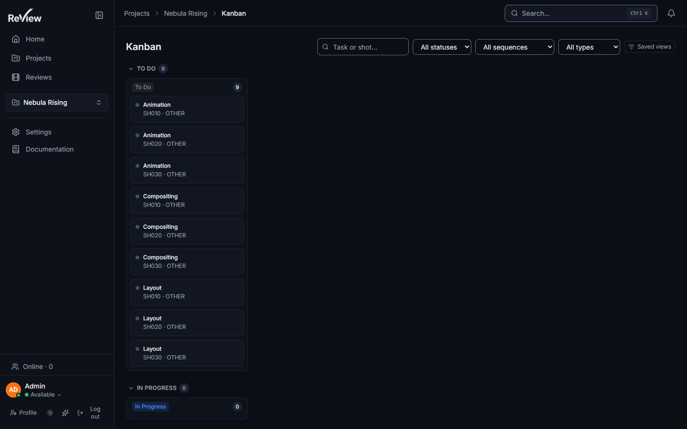
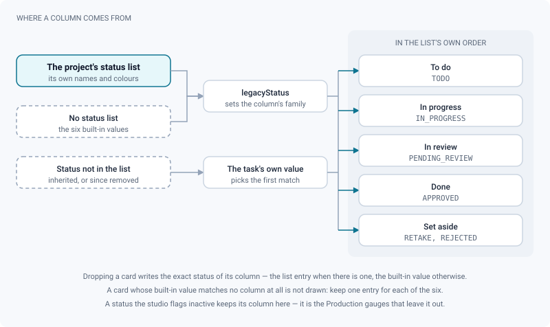
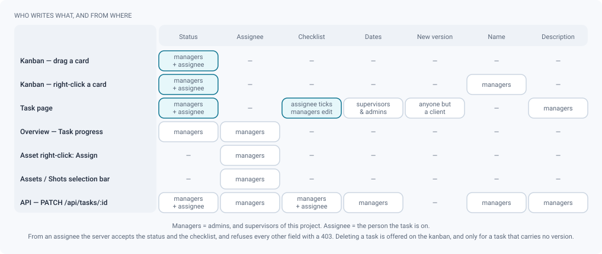

# Kanban & tasks

*Tasks as the unit of work: the studio's own statuses as columns, and the gestures that move a card.*

> Updated: 2026-08-23

A **task** is one stage of work on one entity — *lighting on SH020*, *modelling on the hero
prop*. It is the only pipeline entity that carries an owner, a status, a checklist and the
versions that get reviewed, which makes it the thing every production screen is really
counting.

The **kanban** is the screen where those tasks are moved by hand. Everything else — the
Production tab, the shot badges, the home page — reads the same statuses without writing
them.

## What a task carries

| Field | What it is | Set from |
|---|---|---|
| **Name** | Free text, 160 characters maximum | Task creation, CSV import, ShotGrid sync |
| **Type** | `MODELING`, `RIGGING`, `ANIMATION`, `FX`, `LIGHTING`, `COMPOSITING`, `LOOKDEV`, `LAYOUT`, `OTHER` | Task creation; derived from the pipe step on a ShotGrid project |
| **Parent** | Exactly one **shot** or one **asset**, never both | Fixed at creation |
| **Department** | The project's own pipe step, as a real entity | Task creation, bulk assign, CSV import |
| **Assignee** | One person, or nobody | Never from the task page — see [Which screen writes which field](#which-screen-writes-which-field) |
| **Status** | Two values that always move together — see below | Drag, right-click, API |
| **Dates** | An optional planned **start** and an optional **due** date | The *Schedule* row, or the Production calendar |
| **Checklist** | Up to **100** items of at most **200** characters, each ticked or not | The task page |
| **Versions** | `v001`, `v002`… each holding the media that is reviewed | The version timeline |

A task is also the **only** pipeline entity that can hold an assignee. An asset or a shot does
not have one: work is split by stage, and each stage has an owner. Assigning "Alice to this asset" is
shorthand for putting Alice on the asset's task in each department you named — and creating
that task if it is missing. See
[Projects & pipeline](projects-and-pipeline.md#assigning-work).

> [!NOTE]
> A task whose parent is in the trash disappears from the board rather than showing as an
> orphan. Restore the shot or the asset and its tasks come back with it.

## Two statuses on every task

Each task carries two values, written together by the server and never allowed to diverge:

- **`pipelineStatusId`** — the studio's own status, with its name, its colour and its order.
  This is what you see everywhere, and it is the vocabulary of the site on a project linked
  to ShotGrid.
- **`status`** — the built-in value: `TODO`, `IN_PROGRESS`, `PENDING_REVIEW`, `APPROVED`,
  `RETAKE`, `REJECTED`. It is what the kanban families, the gauges and the v1 API stand on.

Send either one and the server writes both. A project that has never defined a status list
falls back to those six values, and the board then shows six columns.

Beyond `isDone`, a status can carry **`isInactive`** — "neither to do nor done". The
ShotGrid synchronisation sets it on the codes `omt`, `dis`, `ign`, `na` and `dcl`
(*omitted*, *disabled*, *ignored*, *n/a*, *declined*); a studio with no ShotGrid link never
has one. Such a status still gets its own kanban column and its cards are still there — it
is the [Production gauges](production-reporting.md) that leave it out.

## The board

Each project has a board at `/projects/:id/kanban`. Four ways in:

| Way in | Gesture |
|---|---|
| Project header | The **Kanban** link, next to **Board** |
| Sidebar | The **Kanban** entry, while a project is in context |
| Command palette | `Ctrl+K` → *Kanban of the current project* |
| Keyboard | **`g` then `k`**, within one second, outside any text field |

The shortcut only fires when a project is in context, and it is rebindable — see
[Personalization](personalization.md#keyboard-shortcuts-configurable).

### Columns come from the project, families come from the code

A studio connected to ShotGrid commonly defines fifteen statuses; fifteen columns side by
side do not read. Columns are therefore grouped into five collapsible **families**, each on
its own horizontally scrollable band:

| Family | Built from | What it means on the board |
|---|---|---|
| To do | `TODO` | Nothing started |
| In progress | `IN_PROGRESS` | Somebody is on it |
| In review | `PENDING_REVIEW` | Waiting for a verdict |
| Done | `APPROVED` | Closed |
| Set aside | `RETAKE`, `REJECTED` | Came back, or was refused |

Within a family, columns keep the order of the project's own list. Each column header carries
the studio's colour behind its name — the text colour is picked for contrast, so a pale
status stays readable in the dark theme — and a count. Collapsing a family hides its columns,
**not** its cards: the count on the family header still says how many are in there.

A task whose status is not offered by this project — inherited from another site, or a status
that has since been removed — is filed under the **first column carrying the same built-in
value** rather than vanishing. The one case where a card is genuinely not drawn is a project
whose list has no column at all for that built-in value; keep one entry per value and it
cannot happen.

### Moving a card

**Drag a card into a column.** The pointer has to travel 5 px before the drag starts, so a
plain click still opens the task. Cards can also be moved from the keyboard, through the
drag-and-drop library's own keyboard handling.

Dropping writes the **exact status of the column** — `pipelineStatusId` when the column comes
from the project's list, the built-in value otherwise. That distinction is the whole point:
the old six-value board turned *On Hold* into *Waiting to Start* on the way through, and
pushed that mistake back to the studio's site.

The card moves the moment you let go, before the server has answered. If the server refuses,
the board reloads and a toast carries the reason it gave — *Could not move* when it gave none.

> [!IMPORTANT]
> Every card is draggable, whoever you are — the refusal happens on the server. It accepts a
> status change from a **project manager** (admin, or supervisor on this project) and from
> the **task's own assignee**, and from nobody else. An artist dragging somebody else's card
> sees it snap back.

### Setting a status by right-click

**Right-click a card → Status → pick a value.** It is the same submenu as everywhere else in
the application: a radio group carrying the studio's colour dots, the current value ticked,
and a **No status** entry at the end. Same rights as the drag — managers and the assignee —
which makes it the most useful gesture on this screen for an artist.

*No status* clears `pipelineStatusId` only; the built-in value stays, so the card falls back
to the first column of its family instead of leaving the board. On a project linked to
ShotGrid the entry is still offered, but the site cannot store an empty status: the next
synchronisation brings the old value back. Pick a real status instead.

When the current status is not offered by this project, the submenu ticks the entry with the
same built-in value rather than showing nothing ticked — you see where the task stands, not a
menu pretending it has no status.

### Filtering the board

The filter bar covers **text** (task name and parent label), **status**, **assignee**,
**sequence**, **department** and **task type**. Each list also offers its own negative entry —
*No status*, *Unassigned*, *Outside sequence*, *Without a department* — which is how you find
the holes. The assignee list is built from the people actually present on the board, not from
the whole directory.

A counter appears next to the filters as soon as one is active; clicking it clears them all.
Filtering runs client-side over the payload already loaded, so the board reacts to a keystroke
without a round trip. The field itself always answers the keyboard immediately, while the
re-filtering of a dense board is deliberately allowed to lag behind it — that is what keeps
typing smooth on a column of a thousand cards.

Named presets are saved server-side, per account and per project (scope `kanban:<projectId>`),
and share their mechanism with the Shots, Assets and Reviews lists. See
[Saved list views](personalization.md#saved-list-views).

### How much of the board you actually get

The whole board loads in a **single request** (`GET /api/tasks/board?projectId=`) — one call,
not one per shot and one per asset. It is capped at **2000 tasks**; past that the board says
*Showing n of N tasks — narrow the filters to see the rest* rather than showing a partial
board in silence.

Inside a column, the stack scrolls for itself and only the visible slice is mounted — past
**30 cards** the column switches to a virtualised list, which is what keeps a two-thousand-card
board usable. The drop zone stays the **whole column**, header included, so a card dropped on
a column whose stack you have not scrolled still lands correctly.

The kanban has **no multi-selection**. A batch goes through the selection bar of the **Shots**
or **Assets** tab, or through the API (`PATCH /api/bulk/tasks`). See
[Multi-selection and bulk actions](navigation-and-search.md#multi-selection-and-bulk-actions).

## The task page

A task opens at `/tasks/:id`. From top to bottom:

- the **location line** — project › sequence · shot, or project › asset — each part a link,
  with the breadcrumb above it;
- the **type** badge and the **status** badge;
- the **Original comment** chip, when the task was born from a review comment (right-click a
  comment in review → *Create a kanban task*). It reopens the review at the exact frame and
  annotation of that comment;
- the **Schedule** row — a planned **start** date and a **due** date. Supervisors and admins
  edit them; everybody else sees them read-only, and the row is hidden entirely when neither
  is set. These two dates are what feed the calendar and the Gantt of the
  [Production tab](production-reporting.md);
- the **checklist**, with its `done/total` count. The assignee (or a manager) ticks and
  unticks; managers add and remove items. It is hidden for a reader when it is empty, and
  always shown to a manager so there is somewhere to write the first item;
- the **version timeline**, newest first;
- **+ New version**, and a full-page drop zone — anyone but a `CLIENT`;
- **right-click anywhere on the page → Status**, with the same rights as on the kanban card.

The task page carries **no assignee picker**, deliberately: an assignee is written per
department, and the department belongs to the parent entity rather than to the task you have
open.

### Which screen writes which field

| Surface | Writes | Open to |
|---|---|---|
| Kanban — drag a card | Status | Managers, and the assignee |
| Kanban — right-click a card | Status | Managers, and the assignee |
| Task page — right-click | Status | Supervisors and admins, and the assignee |
| Task page — *Schedule* row | Start & due dates | Supervisors and admins |
| Task page — checklist | Ticks; items | Assignee ticks, managers edit the items |
| Project **Overview** → *Task progress* panel | Status **and** assignee, per row | Managers |
| Asset right-click → **Assign** | Assignee, per department | Managers |
| **Assets** or **Shots** tab → selection bar → **Assign** | Assignee, per department, for a whole batch | Managers |
| `PATCH /api/tasks/:id` | Everything a manager may set | Managers; an assignee only status and checklist |

> [!TIP]
> A shot has no per-card **Assign** submenu — only assets do. To hand out a shot, tick it in
> the **Shots** tab and use **Assign** in the selection bar; it works for one shot just as
> well as for forty.

One asymmetry is worth knowing: the board and the calendar read your **effective role on the
project**, so a supervisor by membership can act there, while the task page reads the account's
**global** role. If the *Schedule* row is read-only for you but the board lets you move cards,
that is why.

## Versions on a task

Versions live under the task, newest first, in a timeline. The latest is expanded by default;
each row opens onto its media, as cards or as a compact list.

- **Right-click a version card** → *Review decision…* (supervisors and admins) or *Decision
  history…* (everyone else), *Watch this version*, *Add to playlist…*.
- **Drop files on a version card** to add them to *that* version. Drop them on the zone above
  the list — or anywhere on the page — to create the **next** version and fill it.
- A version hosting a live review session shows a pulsing `LIVE` badge with its participant
  count; clicking it joins the room. See
  [Playlists & live review](playlists-and-live-review.md).
- The version row carries its publication state and, when there is one, the current
  [review decision](review-approvals.md) as a coloured badge.

## Use cases

### Clearing the morning board

You come in and want the day's picture in one screen.

1. `g` then `k` on the project.
2. Filter **assignee = me**, and collapse the *Done* and *Set aside* families — you are not
   interested in what is finished. Save that combination as a view; tomorrow starts in one
   click.
3. What is left is your day. Right-click each task you start → **Status** → the studio's
   *In progress* entry. You do not need a manager for that: the task is yours.
4. At the end of the day, drag the finished cards into the review column. The badge updates
   on the shot card and on the sequence page at the same time.

### Preparing a supervisor's pass

You want the list of everything waiting on you, across sequences.

1. Filter **status** on the studio's *Pending review* entry, leave the assignee empty.
2. Open each card, read its versions, and give a verdict from the version card right-click →
   *Review decision…*.
3. Send a shot back with a **retake** status: right-click the card → **Status** → the studio's
   retake entry. The card jumps to *Set aside*, and the artist sees it on their own board
   without a message being sent.

### Splitting a new batch of work

Forty new shots have just been generated and none of them has a task.

1. Go to the project's **Shots** tab (or **Assets**, if the batch is assets).
2. Tick the cards, **Assign** in the selection bar, pick the person and the departments.
   Departments left unticked mean "every task that already exists"; ticking them targets those
   steps and **creates the missing task** as `TODO`.
3. Open the kanban: the new cards are in the *To do* family, each carrying its department, its
   parent, and its owner.

On a ShotGrid-driven project step 2 refuses to create anything — the task must be born on the
remote site, otherwise the next synchronisation would see two of each. The refusal is per
entity: what could be assigned is, and the toast says how many were skipped. Departments with
no task are shown greyed out rather than hidden, so you can still see that the pipe plans for
them.

### Reading a board that says it is incomplete

On a feature-length project the banner appears: *Showing 2000 of 3417 tasks*.

Narrow with a filter — one sequence, or one department — rather than scrolling. Every filter is
applied client-side over the same single payload, so the board reacts instantly, and a named
preset saves the combination for tomorrow.

## Troubleshooting

**The card snapped back and a toast said *Could not move*.** The server refused the status
change. You are neither a manager on this project nor the task's assignee — or, on a linked
project, ShotGrid arbitrated differently.

**The Status submenu does not appear at all.** The project offers no status for tasks. That
happens on a linked project whose statuses have not been read yet; open the ShotGrid tab and
synchronise.

**A task is missing from the board.** Three causes, in order of likelihood: a filter is still
active (the counter next to the filters says so), the 2000-task cap has cut it off (the amber
banner says so), or its built-in value matches no column in the project's list.

**The card is in the wrong column after a ShotGrid import.** Its status is one the project does
not offer, so it was filed under the first column with the same built-in value. Add the status
to the project's list, or set a status the project does know.

**An "omitted" column is full but the Production tab ignores it.** That is intended: an
inactive status is displayed everywhere and counted in no gauge. See
[Production & reporting](production-reporting.md#what-a-gauge-refuses-to-count).

**I cannot change the dates but I can move cards.** The *Schedule* row reads your global
account role; the board reads your role on this project. Ask an admin for the global role, or
move the due date from the Production **calendar**, which reads the project role.

## Related pages

- [Projects & pipeline](projects-and-pipeline.md) — hierarchy, statuses, assignment
- [Production & reporting](production-reporting.md) — where the dates and the workload show up
- [Review decisions & approvals](review-approvals.md) — a separate axis from pipeline status
- [Navigation & search](navigation-and-search.md) — shortcuts, right-click, bulk actions
- [Personalization](personalization.md) — saved views and rebindable shortcuts
- [Project organization (admin)](../admin-guide/project-organization.md) — CSV import,
  checklists, per-project roles
- [ShotGrid integration (admin)](../admin-guide/shotgrid-integration.md)
