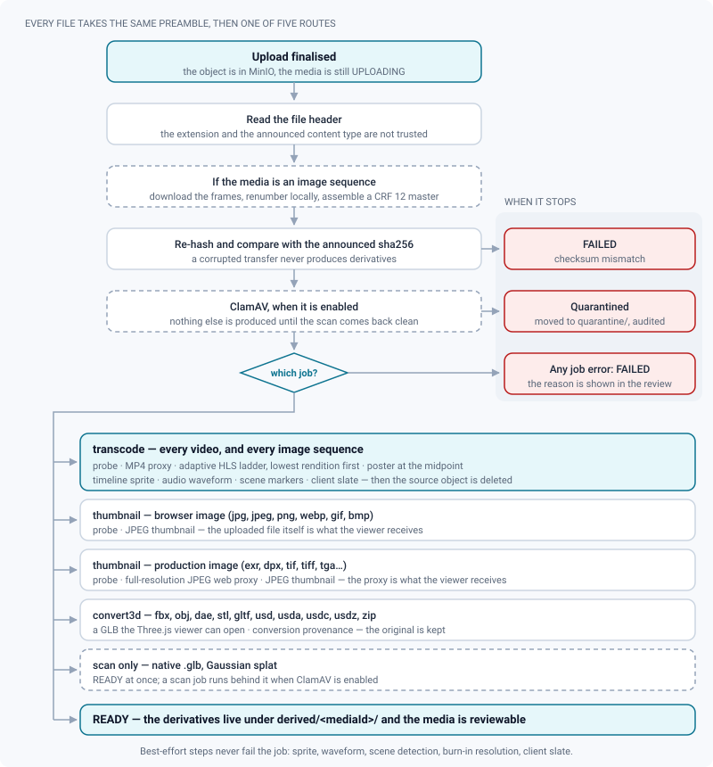
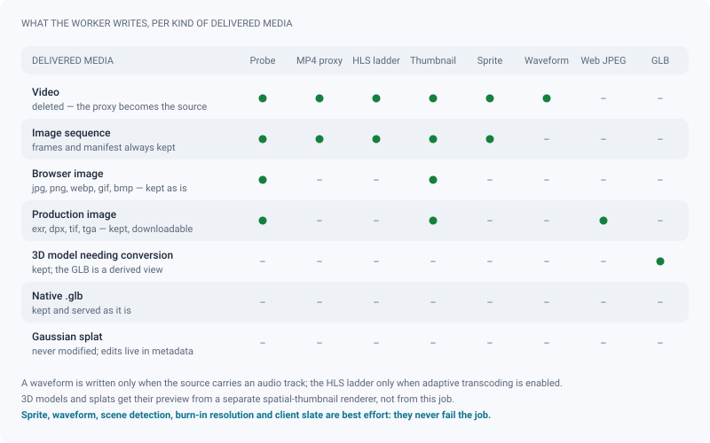

# Media processing

*What the worker makes of a file once it lands: proxies, HLS ladders, thumbnails, waveforms and GLBs — and what becomes of the original.*

> Updated: 2026-08-23

When an upload is finalised, the backend enqueues a job (BullMQ on Redis) and the media
worker picks it up. The media stays usable in the interface while processing runs, and its
status is pushed live over Socket.io — a video even becomes playable before its higher
qualities exist.

Nothing here is a matter of the file's name. The worker reads bytes, and what it finds
decides what it makes.

## The path a file takes

1. **Upload finishes.** The object is in MinIO but the media is still `UPLOADING`.
2. **The bytes are checked.** ReView reads the file header rather than trusting the extension
   or the content type the browser announced, and normalises the stored content type —
   objects are served from the application origin, so a file that claimed to be `text/html`
   must not stay that way.
3. **An image sequence is assembled first.** When the media is a sequence, its "source" is not
   an object but a prefix full of frames: they are downloaded, renumbered locally, and
   encoded into a CRF 12 master. Everything downstream then works on an ordinary video
   without knowing where it came from.
4. **The checksum is verified.** The worker re-hashes the file and compares it to the sha256
   the browser announced. A mismatch fails the media rather than producing derivatives from
   corrupted bytes.
5. **Antivirus** (ClamAV, when enabled) runs before anything is produced. A detection
   quarantines the media and records an audit entry; nothing else is written.
6. **A job is chosen** from the media kind and what was actually detected.
7. **The job runs**, writes its outputs under `derived/<mediaId>/…`, and the media becomes
   `READY`.

| Media | Job | What it produces |
|---|---|---|
| Video, and image sequences | `transcode` | Probe, MP4 proxy, adaptive HLS ladder, poster thumbnail, timeline sprite, audio waveform, scene markers, client slate |
| Image a browser can decode (`.jpg` `.jpeg` `.png` `.webp` `.gif` `.bmp`) | `thumbnail` | Probe (dimensions), JPEG thumbnail |
| Production image (`.exr` `.dpx` `.tif` `.tiff` `.tga`) | `thumbnail` | Probe, **full-resolution JPEG web proxy**, JPEG thumbnail |
| 3D model needing conversion | `convert3d` | A GLB the Three.js viewer can open, plus conversion provenance |
| Native `.glb`, Gaussian splat | *(none)* | Served as-is — `READY` immediately, with a `scan` job when ClamAV is on |

3D models and splats also get a **preview render** on a separate queue; see
[Previews for 3D and splats](#previews-for-3d-and-splats).

## Video: proxy, ladder, and everything alongside

Videos are transcoded to **HLS with multiple renditions** (1080p/720p/480p, for instance —
the ladder is configured by administrators, see
[Transcoding](../admin-guide/transcoding.md)). The renditions are produced lowest first and
published as they finish, so **playback starts on the first rendition** while the higher
qualities are still building.

Alongside the ladder, the worker writes:

- an **MP4 proxy** — the fallback when HLS is unavailable, and the source of the
  frame-accurate scrub;
- a **poster thumbnail**, taken at the midpoint of the clip (one second in when the duration
  cannot be probed) — far more representative than the first frame, which is often black;
- a **timeline sprite**, the strip of small frames that appears when hovering the scrub bar;
- an **audio waveform** — roughly eight peaks per second, stored in the media's metadata
  rather than as a file, which is why it costs a few hundred bytes and no presigned URL. It
  is what the transport draws under the timeline;
- **scene markers**, when scene detection is switched on by an administrator: automatic
  markers at the cuts;
- a **client slate derivative** (`client.mp4`), when burn-ins are configured — the proxy with
  an identification slate concatenated in front of it. Only client shares serve it.

**Post-production masters get two decisions of their own**, taken once from the probe and
applied identically to the proxy and to every rendition of the ladder: a source flagged as
interlaced (a broadcast MXF, typically) is **deinterlaced**, and a master carrying more than
two audio channels is **downmixed to stereo**. Applying them per rendition instead would put
a combed 720p next to a clean 1080p, and the quality switch would be visible on screen.

**Burn-ins** (shot name, version, frame counter, watermark) are composited during the
transcode from the project's effective configuration. Resolving them is best-effort: a
burn-in that cannot be resolved is logged and skipped rather than failing the job. See
[Secure distribution](../admin-guide/secure-distribution.md).

> [!IMPORTANT]
> **Once the derivatives exist, the original video object is deleted.** The MP4 proxy becomes
> the only remaining source file: later trims and reprocesses restart from it, not from the
> master you uploaded. This is a space decision, and it is why a version is published rather
> than corrected — the delivered master is not kept twice.
>
> An **image sequence is the exception**: its frames and manifest are never deleted. They are
> the reference deliverable, they stay served by their own route, and a reprocess always
> restarts from them.

### Trimming

Videos can be **trimmed** (in/out) before publication. The trim is non-destructive: a separate
trimmed proxy is rendered, so changing your mind costs one job and no re-upload.

Two consequences worth knowing:

- Changing or clearing the trim while its job is running is safe. The worker re-reads the trim
  before recording its output and discards the render if the values moved.
- A failed trim does **not** mark the media as failed — the untrimmed proxy is still served.

Trims are locked once the version is published (publish lock).

## Image sequences

A shot delivered as numbered frames is **one** media of kind `VIDEO`. The worker downloads the
frames, **renumbers them locally**, and assembles a CRF 12 master before running the ordinary
video pipeline on it.

The renumbering is not tidiness. FFmpeg's `image2` demuxer stops at the first missing number,
so a gapped delivery — a render relaunched on a handful of frames, which happens every week —
would silently produce a truncated shot. Renumbering removes the problem at the root, while
the delivered numbering (`1001`…) is kept in the manifest and is what the transport displays.

NTSC rates are written as exact fractions (`24000/1001`, not `23.98`), and EXR frames are read
through the sRGB transfer curve. Full details in [Image sequences](image-sequences.md).

## Images

There are two kinds of still image, and they are not treated alike.

**Images a browser decodes** — `.jpg`, `.jpeg`, `.png`, `.webp`, `.gif`, `.bmp` — are probed
for their dimensions, get a JPEG thumbnail, and are served directly to the viewer through
presigned URLs. No re-encoding: the reviewer sees the file that was uploaded. (`.gif` and
`.bmp` are in that list precisely so that a proxy is never made for them — for an animated
GIF, a JPEG proxy would keep only the first frame.)

**Production images** — `.exr`, `.dpx`, `.tif`, `.tiff`, `.tga` — no browser can display at
all. Without a derivative, image review would come down to a 640 px thumbnail, and the A/B,
the wipe and the difference would have no source. So the worker writes a **full-resolution
JPEG web proxy** at `derived/<mediaId>/proxy.jpg`, produced *before* the thumbnail because it
is what makes the image consultable at all, and **that proxy is what the viewer, the A/B, the
wipe and the diff receive**.

> [!NOTE]
> The original is never touched and never replaced: it stays in storage, and downloads, the
> public API and ShotGrid pushes all continue to hand over the file the artist delivered.
> Only the on-screen image is the proxy.

Two decoding decisions are worth knowing when a plate looks wrong:

- **EXR is linear**, and FFmpeg's decoder applies no curve by default. The proxy is therefore
  decoded through the sRGB transfer function — without it, a correct render would come out
  nearly black and a supervisor would judge a false image.
- **DPX exposes no such option** and is taken exactly as encoded. A log or Cineon DPX will
  look flat and milky in the proxy; converting it properly is the job of the review's display
  transform, not of this derivative. See [Image review](review-image.md) and
  [Colour management](../admin-guide/color-management.md).

A JPEG cannot exceed 65 535 pixels a side, so a scan panorama beyond 16 384 px is scaled down
rather than failing; everything below that is proxied at its native resolution.

## 3D models

The routing depends on the source format, and it is not one converter:

| Source | Handling |
|---|---|
| `.glb` | Served as-is |
| `.gltf` | Packed to GLB (resolves the `.bin` and relative textures) |
| `.usd` / `.usdc` / `.usda` / `.usdz` | Blender (OpenUSD), falling back to `guc`, then assimp |
| `.zip` | The main model inside; USD archives resolve their root layer |
| `.fbx` `.obj` `.dae` `.stl` | assimp |

The original file is always kept in storage — the GLB is a derived view, not a replacement.
Which converter produced it is recorded and shown in the review's technical sheet, together
with the USD scene description when there is one. Full details:
[USD & 3D conversion](../admin-guide/3d-usd.md).

Archives are validated **in full** before extraction: a single dangerous entry — a path
traversal, a symbolic link — invalidates the whole archive rather than being skipped.

## Gaussian splats

Splat files are served to the Spark viewer without a conversion pass, so they become
reviewable as soon as the upload lands. The **original file is never modified**: every edit
(selection mask, tint, transform…) is stored as non-destructive metadata and replayed
identically for every viewer — see [Splat review](review-splat.md).

## Previews for 3D and splats

Neither a native `.glb` nor a splat produces a thumbnail through the pipeline above, and the
`convert3d` job does not write one either. A shot page full of 3D assets would therefore show
empty tiles until somebody opened each review by hand. A **separate queue** fills them:
Blender renders the GLB, an in-house point rasteriser renders the splat.

Three properties make that queue safe to ignore:

- **it never touches the media's status** — no media is ever stuck in `PROCESSING` because of
  a preview, and a render that cannot happen (Blender absent from the image, a splat in a
  container the rasteriser cannot read) is a *successful* job with no image;
- **it never overwrites an existing thumbnail**, including one captured by hand from the
  viewer, so it is idempotent and replayable;
- **it is time-bounded**, and it waits politely when the GLB it needs is still being
  converted.

See [Spatial thumbnails](../admin-guide/spatial-thumbnails.md).

## What ends up in storage

Everything derived lives under one prefix per media, which makes a media's whole footprint
one listing away:

| Object | What it is |
|---|---|
| `derived/<id>/proxy.mp4` | The video proxy — and, after the source is deleted, the source |
| `derived/<id>/hls/…` | The adaptive ladder and its master playlist |
| `derived/<id>/proxy-trim.mp4` | The trimmed proxy, when a trim is set |
| `derived/<id>/client.mp4` | The slated derivative served to client shares |
| `derived/<id>/timeline-sprite.jpg` | The hover strip of the scrub bar |
| `derived/<id>/proxy.jpg` | The full-resolution web proxy of a production image |
| `derived/<id>/thumbnail.jpg` | The card thumbnail |
| `derived/<id>/model.glb` | The converted 3D model |
| `derived/<id>/splat-mask.bin` | The non-destructive splat deletion mask |

> [!TIP]
> Several steps are **best-effort and never fail the job**: the timeline sprite, the audio
> waveform, scene detection, burn-in resolution and the client slate. If one of them is
> missing you lose that feature alone — a video with no hover preview is still a perfectly
> good review.

## Failures & retries

A failed job marks the media `FAILED` **and keeps the reason**: the message is stored on the
media and shown in the review, so a USD scene that failed because a texture was missing from
the archive says so instead of showing a mute error. The same message is in
`docker compose logs worker`.

Processing can be retried without re-uploading — the 3D viewer offers a **Reconvert** button
next to the stored error, and the API exposes the same route. Reprocessing is blocked on
published versions (publish lock); publish a new version instead.

Two job kinds deliberately never mark a media as failed:

- `trim`, because the original proxy is still perfectly playable;
- `scan`, because an unreachable ClamAV daemon is an infrastructure problem, not a bad file.
  BullMQ retries; only an actual detection quarantines the media.

### What to check first

| Symptom | Look at |
|---|---|
| Media stuck in `PROCESSING` | The worker is down or the queue is backed up — [Jobs & workers](../infrastructure/jobs-and-workers.md) |
| `FAILED` with a message about a converter | The USD toolchain may not be installed in the worker image — [USD & 3D conversion](../admin-guide/3d-usd.md#troubleshooting) |
| Video plays but has no quality selector | The HLS ladder is disabled or still building — [Transcoding](../admin-guide/transcoding.md) |
| Video plays but the quality switch shows combing | The source was not flagged interlaced by the probe; re-deliver with the field order declared |
| No preview when hovering the scrub bar | The sprite failed; the rest of the transcode is fine |
| No waveform under the timeline | The source has no audio track, or the extraction failed — best-effort, and harmless |
| An EXR looks nearly black | Its proxy predates the sRGB decode, or it is not scene-linear as EXR assumes. Reprocess it, then use the display transform in review |
| A DPX looks flat and milky | Expected on log or Cineon encoding: the proxy is taken as encoded. Grade it with the review's display transform |
| The image viewer stays blank on an EXR or a DPX | The media has no web proxy — it was ingested before the derivative existed, or lost the key. Reprocess it: without a proxy the viewer is handed the original, which no browser decodes |
| A 3D or splat card shows an empty tile | The preview renderer had nothing to render, or Blender is absent from the worker image — [Spatial thumbnails](../admin-guide/spatial-thumbnails.md) |
| Media disappeared right after upload | It was quarantined by the antivirus; the audit log records it |

## Related pages

- [Upload & publishing](upload-and-publishing.md)
- [Image sequences](image-sequences.md)
- [Jobs & workers](../infrastructure/jobs-and-workers.md)
- [Transcoding (admin)](../admin-guide/transcoding.md)
- [USD & 3D conversion (admin)](../admin-guide/3d-usd.md)
- [Spatial thumbnails (admin)](../admin-guide/spatial-thumbnails.md)
