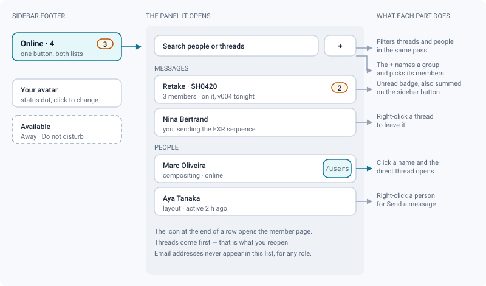
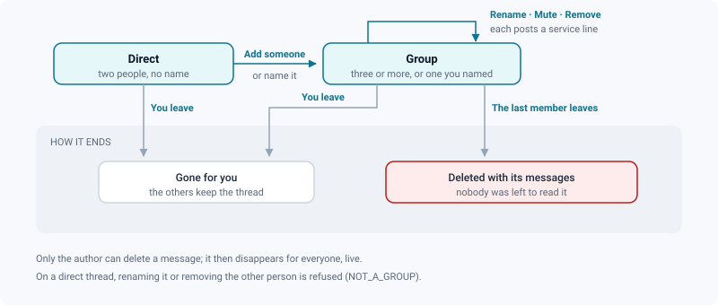

# Messaging & member profiles

*Look colleagues up, open a thread and keep talking without leaving the review you are in.*

> Updated: 2026-08-23

Studio members can find each other and talk directly inside ReView — no side channel, no
context switch, no second address book to keep up to date. It all hangs off **one button in
the sidebar footer**, and the conversation window follows you from page to page.

## The People & messages panel

The footer button is itself a status line: it reads `Online · 4` and carries the **total
unread badge** of all your threads, capped at `9+`. Click it and a single panel opens beside
the sidebar.

Inside, top to bottom:

| Part | What it does |
|------|--------------|
| Search field | Filters **threads and people at the same time** — one field, both lists |
| `+` | Opens the people picker: an optional group name, then the members |
| **Messages** | Your threads, most recently active first, each with its unread badge |
| **People** | The accounts you may see, online first, then alphabetical, with status dot and last-seen |

The gestures on a row are deliberately short:

- **Click a person's name** — the direct conversation opens straight away, created if it
  does not exist yet. There is no intermediate menu.
- **Click the icon at the end of a person's row** — their member page (`/users/<id>`).
- **Right-click a person** — *Send a message*.
- **Click a thread** — the conversation window opens, anchored above the sidebar footer.
- **Right-click a thread** — *Leave this conversation*.

When nothing matches what you typed, the panel says so (*Nothing matches this search.*)
rather than showing an empty box; on a one-person studio it says *Nobody else.*

> [!NOTE]
> Threads sit above people because a thread is what you reopen: the panel is optimised for
> "back to the conversation I was having", not for browsing the studio. To browse, use the
> command palette — see [Who you can see](#who-you-can-see).

Your own presence lives just below, on your avatar: the coloured dot mirrors the status you
picked, and clicking the status line switches between **Available**, **Away** and **Do not
disturb**. That choice is manual and stays until you change it — online/offline, on the
other hand, is observed (the tab reports activity roughly once a minute).

## Who you can see

The People list is not the raw user table; it is filtered by what your role is entitled to
see, and the same rule applies when you try to *write* to someone.

| Reader | Appears in the list | Sees | Contact details on a member page | Ctrl+K search by email |
|--------|--------------------|------|----------------------------------|------------------------|
| Administrator, supervisor, artist | Yes | The whole studio | Yes | Yes |
| **Client** (external) | Yes | Only people from the projects you share | No | No |
| Service account (render farm, bot) | **Never** | — | — | — |

A machine has nobody to talk to, so service accounts are excluded from the directory
entirely — and cannot be picked as recipients either.

The restriction on a **client** account is enforced on the way out as well as on the way in:
opening a thread with someone outside your shared projects, or adding them to an existing
thread, is refused **by name** (`RECIPIENT_OUT_OF_SCOPE`) rather than silently trimmed from
the recipient list. You always know who did not get in.

People are also findable from the **command palette** (`Ctrl/⌘ + K`): type a name, a
username, a first or last name — or, for an internal account, an email address — and the
result carries the person's job title. Selecting it opens their member page. Service and
deactivated accounts are excluded from those results.

> [!IMPORTANT]
> **Email addresses are stripped from the People list for everyone, administrators
> included.** The list exists to start a conversation, not to export the studio's address
> book; contact details are shown on the member page, and only to internal accounts.

## Member profiles

A member page (`/users/<id>`) is short on purpose: the avatar, the display name, the **job
title**, the role, the current status and the last-seen time, then a **bio** if there is
one, the **contact** block, and the **shared projects**.

- **Contact details (email, phone)** are served to internal accounts only. A client sees who
  it is talking to, not how to reach them outside ReView.
- **Shared projects** never leak: for an artist or a client the list is the *intersection* of
  your projects and theirs, so it cannot reveal a project you could not already open. An
  administrator or a supervisor — who can see every project anyway — gets the full list of
  the person's projects, capped at twenty and sorted by name.
- The block is hidden on **your own** page, where the button reads *Edit my profile* instead
  of *Send a message*.

The displayed name falls back through what is filled in — **username**, then the stored full
name, then first + last name, then the email address — so a half-filled account still shows
something readable rather than a blank. Initials for the avatar follow the same cascade.

Your own fields are edited in **Profile** (`/profile` → *Identity*): first name, last name,
username, email, job title, phone, and a bio of up to 500 characters. They are kept across
reloads and are what colleagues see on your member page — see
[Personalization](personalization.md#your-identity-and-what-others-see).

## Conversations: direct messages and groups

Two shapes, and one rule that keeps histories whole.

- **Direct message** — one recipient, no title. Writing to the same person again **reopens
  the existing thread** instead of splitting the history: without that, two people who
  message each other regularly end up with as many threads as clicks, each holding a
  fragment of the conversation.
- **Group** — the `+` button, or the picker's group-name field. Naming a thread makes it a
  group even with a single recipient; picking two people or more makes one regardless.

Adding someone to a direct message **turns it into a group**, and the newcomers can read the
whole history. That is what opening up a thread means, and a **service line** in the thread
records it — as it does for departures, removals and renames. Service lines carry a key, not
a sentence, so each member reads them in their own language.

In the conversation window you can:

| Gesture | Detail |
|---------|--------|
| Write | `Enter` sends, `Shift+Enter` adds a line; 4000 characters maximum |
| Add people | Opens the picker, already excluding the current members |
| Rename | Groups only — a direct thread has no name to change |
| Mute | Silences the push notifications, keeps the thread and its unread count |
| Leave | Shown on groups; a direct thread is left by right-clicking it in the panel |
| Delete a message | Your own only — it then disappears for everyone, live |
| Load earlier messages | 50 at a time, walking back from the oldest line on screen |

Removing **someone else** is a group gesture and is refused on a direct thread
(`NOT_A_GROUP`); it is not exposed in the interface today, only on the API
(`DELETE /api/chat/conversations/:id/members/:userId`).

> [!WARNING]
> Leaving a group removes your access to it, history included. When the **last** member
> leaves, the thread is deleted with all its messages — a thread nobody can read is only
> orphaned data, so nothing is kept "just in case".

## When you are not looking

Messages arrive in real time over the socket, in every tab you have open: the thread scrolls,
the unread badge moves, and the sidebar total follows. Opening a thread marks it read for all
your tabs at once.

When you are **not connected**, a browser push notification is sent instead. It is skipped
in three cases, on purpose:

- you wrote the message yourself,
- you muted that thread,
- you are connected somewhere already — the live message is the notification.

A service line pushed to you is translated into **your** language before it leaves the
server; a message somebody typed is pushed exactly as typed. Clicking the notification
focuses ReView. Enabling push at all is a per-browser gesture described in
[Personalization → Notifications](personalization.md#notifications).

> [!CAUTION]
> A thread is private to its members, whatever their role: a non-member asking for it is
> **refused** (`NOT_A_MEMBER`), not merely shown an empty view. There is no administrator
> read-through, and no export.

## Everyday situations

- *Reaching the person who left the note.* Open the comment, click the author's avatar to
  land on their member page, then **Send a message** — the thread reopens if you have
  written before, so the context is already there.
- *A group for one retake.* Create a group named after the shot with the artist, the
  supervisor and the coordinator. When it is delivered, everyone leaves and the thread
  disappears on its own.
- *Reviewing with an external client.* The client only sees the people from the shared
  project, so they cannot accidentally address the whole studio — and a mistyped recipient
  is refused rather than delivered.
- *Focusing.* Mute a busy group rather than leaving it: you keep the history and the unread
  count, and stop getting push notifications for it.
- *Handing a shot over.* Add the incoming artist to the existing thread instead of starting
  a new one; they read everything that was said, and the service line dates the handover.

## Related pages

- [Personalization](personalization.md) — status, notifications, language of the interface
- [Annotations & comments](annotations-and-comments.md) — the other conversation, the one
  anchored to a frame
- [Navigation & search](navigation-and-search.md) — the command palette, where people are
  searchable too
- [Users & roles (admin)](../admin-guide/users-and-roles.md) — who exists, and with which role
