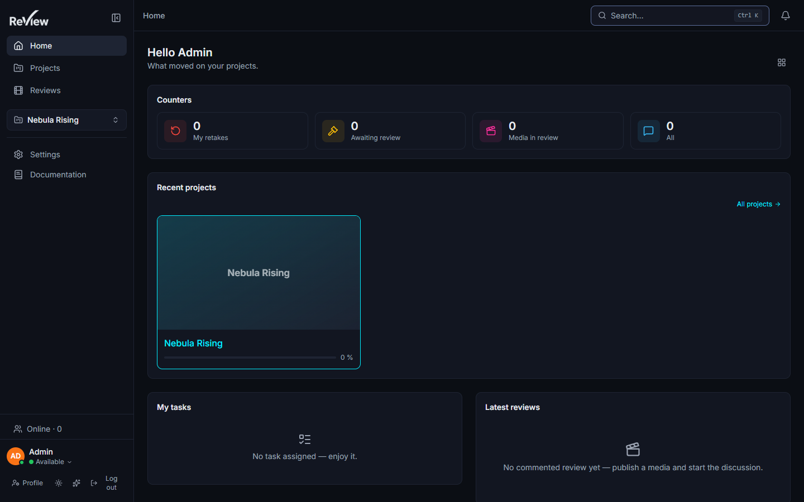

# Navigation & search

*The palette, the shortcuts, the right-click menu and the bulk gestures that get you anywhere fast.*

> Updated: 2026-08-23

A studio project is two thousand shots and a thousand assets. Nothing here is meant to be
found by scrolling: you type two characters, or you right-click the thing itself. This page
is the map of those gestures — where the interface puts them, what they reach, and where
they stop.

## Where things are

Three screens sit above the projects, and one rail carries you between them.

| Screen | Path | What it is |
|--------|------|-----------|
| **Home** | `/` | A personal dashboard of configurable widgets |
| **Projects** | `/projects` | Every project you can see, in an **Active** and an **Archived** tab |
| **Reviews** | `/reviews` | Every published media of your projects, plus your own drafts |

The **sidebar** carries three things, in this order: where you go (Home, Projects,
Reviews), what you are looking at (the **project switcher**, then direct links to the
sections of the project in context — Sequences, Shots, Assets, Playlists, Production,
Kanban, Board), and what you pinned. **Settings** (administrators) and **Documentation**
close it at the bottom. There is no expandable tree: the old one cost one request per open
sequence to display a list of codes.

The project in context is sticky. Opening a shot, a task or a review resolves its project
from the breadcrumb, and the sidebar keeps showing that project's sections even when you
step out to Home or to the Reviews list.

> [!NOTE]
> The sidebar collapses itself in two situations, without touching your preference: inside
> a review (`/review/…`), where the viewer takes the space, and in a narrow window, where
> a 240 px rail leaves nothing to read. Unfold it for the length of the visit with the
> panel button; you get your own setting back on the next page.

The **header** is the same everywhere: the page title or breadcrumb on the left, then the
**Pending drafts** pill (only when you have drafts), the search button, and the
notification bell. The sidebar has **no** search field — search lives in that header.

## The command palette

At the top right of every page sits a wide button that looks like an input, with a
`Ctrl K` hint. It is a button: clicking it opens the palette. In a narrow window it shrinks
to a magnifier so it does not eat the breadcrumb.

**Ctrl+K** (or **Cmd+K**) opens the palette; pressing the shortcut again closes it. It wins
over whatever has focus, including text inputs.

### What it searches

One keystroke fires ten queries in parallel, and each family has its own cap. The order
below is the order they appear in.

| Family | Matches on | Rows | Enter opens |
|--------|-----------|-----:|-------------|
| Projects | name | 5 | The project page |
| Sequences | name **or** code | 5 | `/sequences/:id` |
| Shots | name **or** code | 8 | `/shots/:id` |
| Assets | name | 5 | `/assets/:id` |
| Tasks | name | 5 | `/tasks/:id` |
| Versions | name | 8 | Its most recent visible media, else the task or the asset |
| Media | file name | 8 | `/review/:id` |
| Playlists | name | 5 | `/playlists/:id` |
| Review notes | **full text of the note** | 8 | The player, positioned on that note |
| People | name, username, email | 5 | The member's profile |

Matching is case-insensitive and anywhere in the value — `0120` finds `SH0120`. Trashed
entities are excluded everywhere.

Review notes are the odd one out, and the most useful: `enlever le reflet`, `remove the
flare`, a word half-typed — the note index is a Postgres full-text index built without a
language dictionary (a studio comments in fourteen languages), and the **last word you
typed is treated as a prefix**, so results appear before you finish it. Up to eight words
are used; the rest of the phrase is ignored. A result carries an excerpt around the term
and its author, and selecting it opens `/review/<mediaId>?comment=<id>`.

### Its limits, and what they mean for you

| Limit | Value | What you see |
|-------|-------|--------------|
| Minimum length | **2 characters** | A single character shows *type more* and queries nothing; the route itself refuses it |
| Debounce | **200 ms** | The query leaves after you stop typing |
| In-flight request | Aborted | Typing a third letter cancels the search for the second |
| Rate limit | **120 searches per minute, per account** | Beyond that the server answers `429` until the window rolls |

There is **no prefix or filter syntax** — no `shot:`, no `is:draft`. The text is sent as
is. Access is written into each query rather than applied afterwards: you see the projects
you are a member of (administrators and studio supervisors see everything), an unpublished
media only if you uploaded it, and a `CLIENT` account never sees other people's drafts,
internal review notes, or the studio directory outside the projects it shares.

### With the field empty

Two groups replace the results:

- **Go to** — *Projects*, which opens `/projects`; *Kanban* and *Board* of the current
  project, which are absent when there is no project in context; *Documentation*.
- **Actions** — copy the current page link, refresh the data on screen (only the queries
  actually mounted, not the whole cache), toggle the sidebar, toggle the theme, open the
  shortcut help.

Inside a review, the palette also lists the **viewer's own commands**, filtered as you
type; with an empty field it lists them all. They are contextual: they exist only while a
viewer is mounted, and the server search knows nothing about them.

## Filtering a list is not searching

Three surfaces let you narrow things down, and they are three different mechanisms. Mixing
them up is what makes people say the search "missed" something.

**The filter bar** of the **Shots**, **Assets** and **Kanban** lists is shared, and so is
its preset mechanism. An empty criterion means "everything"; the explicit **None** entry
means "without" — no status, outside a sequence, no department — which is an answer in its
own right.

| List | Criteria offered |
|------|-----------------|
| Shots | text (code and name), status, sequence, department |
| Assets | text (name), department, asset type |
| Kanban | text (task name and parent), status, assignee, sequence, department, task type |

The filtering itself happens in the browser, but the list is not truncated under it: as
soon as one criterion is active the list switches to eager mode and pulls **every remaining
page** before filtering. Filtering a hundred rows out of two thousand would answer "no
result" for a shot that plainly exists.

**The Reviews list** has no free-text field at all. It has four dropdowns — project, media
type, *published / my drafts*, review decision — and every one of them is sent to the
server as a query parameter. To find a media by its name, use the palette.

**Saved views** are stored on your account, per scope (`shots:<projectId>`,
`assets:<projectId>`, `kanban:<projectId>`, `reviews`), so a preset built on the Shots tab
of one project never leaks into another. A counter next to the bar shows how many criteria
are active and clears them all in one click. See
[Projects & pipeline](projects-and-pipeline.md#filters-and-saved-views).

> [!TIP]
> Lists load one page at a time. A line under the filter bar reads *n of N loaded*, and a
> sentinel fetches the next page as you approach the bottom — it also carries a
> **Load more** button, which is the one that works without a mouse. The tab badge on a
> project counts the whole project, not what is on screen.

## Keyboard shortcuts

These are the shortcuts the application registers globally.

| Keys | Action |
|------|--------|
| **Ctrl / Cmd + K** | Open (or close) the command palette |
| **`g` then `p`** | Go to Projects |
| **`g` then `k`** | Kanban of the current project |
| **`g` then `b`** | Board of the current project |
| **`?`** | Open the shortcut help panel |
| **Escape** | Clear the current multi-selection |

Notes on the `g` sequences:

- the leader key is `g` and cannot be changed; you have **one second** to press the second
  key before the sequence is forgotten;
- `g k` and `g b` do nothing when no project is in context;
- shortcuts are inert while you are typing in a text field and while a dialog is open —
  `Ctrl+K` is the exception, and is handled separately so it works from anywhere.

**The second key of each shortcut is reconfigurable.** Open the help panel with `?`, click
a key in the **Navigation** section, and press the new one. A key already taken by another
shortcut of the same kind is refused with a toast, and `g` itself is never accepted;
`Escape` cancels the capture. A small revert arrow appears next to any key you have
changed. The mapping is stored on your account, so it follows you between machines.

The help panel also lists the contextual review shortcuts, which are handled by the viewers
and are **not** reconfigurable — transport (`Space`, `←`/`→`, `Shift+←/→`, `J`/`K`/`L`,
`I`/`O`, `M`), the tools shared by every viewer, and the splat editor's own set. See
[Review workspace](review-workspace.md) and [Review splat](review-splat.md).

## Right-click

Most cards — projects, sequences, shots, assets, versions, media, comments, playlist items
— expose their actions through a **context menu**. That is the primary way of acting on an
entity: the interface stays uncluttered and every action lives where the thing is.

Right-clicking somewhere the application has nothing to offer opens **nothing at all**: the
browser's own menu is suppressed on purpose. Three exceptions, in order:

1. a component that served its own menu is left alone (a Radix menu, the 3D viewer that
   orbits on right-drag);
2. **holding Shift while right-clicking** hands the browser menu back, anywhere;
3. inside inputs, text areas and editable zones the native menu always works — otherwise
   pasting into a comment and reaching the spell-checker would become a chore.

The **Home** page is the one place where empty space has a menu of its own: edit the
layout, add a widget you had hidden, reset the layout, refresh the data.

## Multi-selection and bulk actions

Lists that support it show a **checkbox** on each card, invisible until you hover or
select. Clicking the card body still navigates — selection is the checkbox's job.

| Gesture | Effect |
|---------|--------|
| Click a checkbox | Toggle that card |
| **Shift-click** a checkbox | Extend the range from the last anchor, in display order |
| **Ctrl / Cmd-click** | Same as a plain click — toggle |
| **Escape** | Clear the selection |

A floating **selection bar** then appears at the bottom of the screen with the count and
the actions available.

| List | Actions offered | Who | Reversible? |
|------|-----------------|-----|-------------|
| **Projects** (Active tab) | Delete | managers | Yes — to the admin trash |
| **Reviews** | Add to playlist, Delete | playlist: admin, supervisor, artist | Yes — to the project trash |
| **Project → Sequences** | Delete | managers | Yes |
| **Project → Shots** | Assign, Delete | managers | Yes |
| **Project → Assets** | Assign, Delete | managers | Yes |
| **Project → Trash** | Restore, Delete | managers | **No — this Delete is the permanent purge** |
| **Admin → Trash** | Restore, Delete permanently | administrators | **No** |
| **Kanban** | — | — | Bulk changes on tasks go through the API |

The two trash lists work slightly differently from the others: the project trash groups its
rows by entity type, each group carrying its own header checkbox that selects the whole
group, and its own inline **Restore** / **Delete** buttons rather than a floating bar.

> [!CAUTION]
> In the project **Trash** tab, **Delete** is not a second trip to the bin. It calls the
> purge, behind a confirmation whose button reads *Delete permanently*, and the objects go
> with it. Restore first if there is any doubt — a purge has no undo, at any level.

Selection only ever covers what is displayed: a bulk action can never reach rows a filter
has hidden, and one refusal never sinks the batch — the server counts what it changed and
what it skipped, and the toast says both.

## Favourites, recents and the Home page

Star any **project, sequence, shot or asset** to pin it in the sidebar. Two gestures:

- the **star button** in the header of a project, sequence, shot or asset page;
- **right-click a card → Pin / Unpin**, on all four card types. A pinned card also carries
  a small star badge.

The sidebar lists favourites flat, without a heading, and the whole block disappears when
you have none. Removing one is optimistic — the card leaves the rail at once, and comes
back if the server refuses.

Recently visited entities are recorded **in your browser**, not on the server: the last
**five**, deduplicated, newest first. They are captured from the breadcrumb, so a page
without one records nothing, and the `live` parameter is stripped — a recent must never
drop you back into somebody's live session. They are not shown in the sidebar; Home uses
the most recent **media** entry for a compact *resume* chip in its header.

Home itself is a 12-column grid of five widgets: **statistics**, **projects**, **my
tasks**, **latest reviews** and **activity**. Right-click the page background to enter edit
mode, add a widget you had hidden (the entry appears only when one is), reset the layout,
or refresh the data. In edit mode each widget can be resized (the allowed widths differ per
widget), given a height, a density and a variant (list, grid or KPI), or stripped of its
frame; widgets are reordered by drag-and-drop. The layout is stored on your account. See
[Personalization](personalization.md).

## Use cases

### Getting to a shot you half-remember

You know it is `SH0120`, somewhere in the film.

Press **Ctrl+K**, type `0120`. The palette matches shot codes as well as names and shows up
to eight shots. Enter opens it. No need to know which sequence it lives in, or which
project — the search spans everything you are a member of.

### Finding the note, not the shot

The supervisor asked for something about a reflection, three weeks ago, and nobody wrote it
down anywhere else.

Press **Ctrl+K**, type `reflect`. The **Review notes** group lists up to eight matching
comments with an excerpt and their author; the last word is matched as a prefix, so
`refle` already works. Enter opens the player at the exact note — right frame, right
annotation.

### Living on one project for a week

1. Open the project once. The sidebar switches to it and shows its sections as direct
   links, and keeps them even when you wander to Home or Reviews.
2. Star it (the star next to the title). It is now pinned above the fold whatever page you
   are on.
3. Use `g k` for the kanban and `g b` for the board — both act on the project in context,
   so you never go back to the project page just to change screen.

### Rebinding a shortcut that clashes with your habits

Your other tools use `g t` for the board.

Press **`?`**, click the key shown next to *Board of the current project*, press `t`. The
change is saved to your account immediately. If `t` were already used by another `g`
shortcut the panel would refuse it and say so. The revert arrow next to the key restores
the default.

### Clearing forty trashed assets

1. Project → **Trash** tab.
2. Tick the header checkbox of the **Assets** group to select it whole, or tick the first
   row and **Shift-click** the last.
3. **Restore** puts them back. **Delete** destroys them — the confirmation says *Delete
   permanently*, and it means it.
4. **Escape** at any point drops the selection without touching anything.

## Related pages

- [Projects & pipeline](projects-and-pipeline.md) — filters, saved views, right-click
  status and assignment
- [Kanban & tasks](kanban-and-tasks.md)
- [Review workspace](review-workspace.md) — the viewer's own shortcuts
- [Annotations & comments](annotations-and-comments.md) — the notes the palette searches
- [Personalization](personalization.md) — theme, language, Home layout, notification
  preferences
