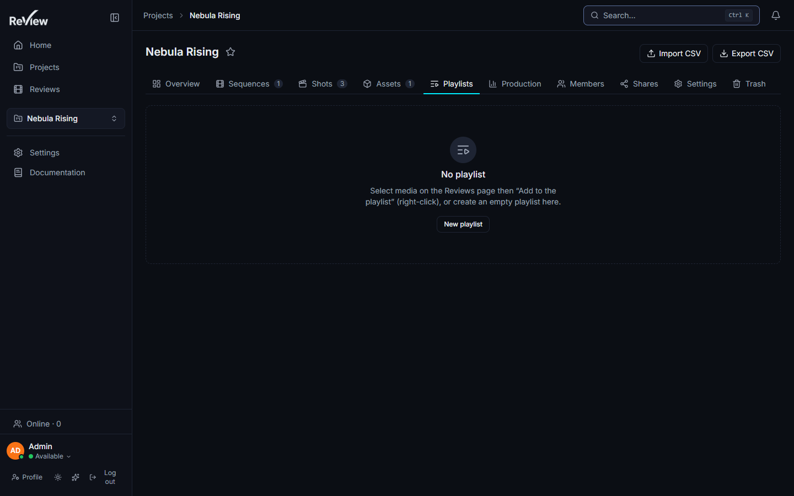
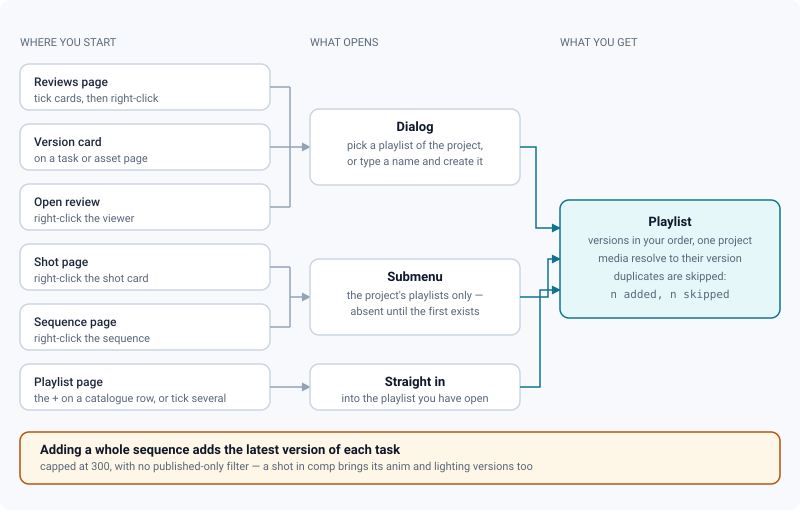
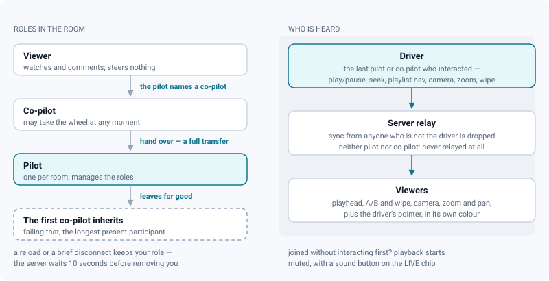

# Playlists & live review sessions (dailies)

*Build a dailies playlist, play it end to end, and drive one synchronized room from a single screen.*

> Updated: 2026-08-23

ReView supports the classic **dailies** workflow in two halves that fit together: a
**playlist** is the running order, and a **live session** is the room watching it. You can
use either alone — a playlist screened by one person, or a live session on a single media —
but the pair is what a screening actually looks like.

## What a playlist is

A playlist belongs to a **project** and contains **versions** — not media files — in a
custom order, freely mixed across shots and assets. Names are unique inside a project; a
duplicate name is refused with a `409`.

| Role | May create, add, remove, reorder, rename, delete |
|---|---|
| `ADMIN`, `SUPERVISOR` | Yes, on any playlist of the project |
| `ARTIST` | Yes to create and add; renaming, reordering, removing and deleting also require being the **creator** |
| `CLIENT` | Read only |

Deleting a playlist removes references only — the versions and their media are untouched.
Item media follow the usual draft visibility rule: an unpublished media is only playable by
the person who uploaded it, and everybody else sees the item without being able to open it.

## Filling a playlist

Six places in the application can push a version into a playlist, and which picker you get
depends on where you started.

| From | Gesture | What is added |
|------|---------|---------------|
| **Reviews** page | Tick cards (Shift-click for a range), then right-click a selected card → *Add to playlist…*, or the same action in the selection bar | The version behind each selected media |
| **Version card** (task or asset page) | Right-click → *Add to playlist…* | That version |
| **Open review** | Right-click the viewer → *Add to playlist…* | The current media's version |
| **Shot page** | Right-click → *Add to a playlist* → a playlist | The shot's latest version, at the furthest stage it has reached |
| **Sequence page** | Right-click → *Add to a playlist* → a playlist | See the warning below |
| **Playlist page** | The `+` on a catalogue row, or tick several and add them at once | The chosen versions, into the playlist you have open |
| **Project → Playlists** tab | *New playlist* | An empty playlist |

The first three open a **dialog**: pick an existing playlist of the project, or type a name
and create it on the fly. The selection has to belong to a single project — a playlist is
scoped to one, and a mixed selection is refused with a clear message.

The shot and sequence pages use a **submenu** listing the project's playlists. That submenu
is absent when the project has no playlist yet; create the first one from the Playlists tab
or from the dialog.

Media are resolved to their version server-side, and duplicates are skipped: adding reports
*n added, n skipped*, so running the same pass twice costs nothing.

> [!WARNING]
> **What a sequence-level add really adds.** It fetches the sequence's candidate list with
> *latest only* on, capped at **300**. "Latest only" keeps the most recent version of **each
> task**, so a shot carrying animation, lighting and compositing tasks contributes **three**
> versions, not one. Versions attached directly to an asset are always kept, and there is no
> published-only filter at that step — review the result on the playlist page before the
> screening.

## The playlist page

Clicking a playlist opens `/playlists/:id`, in two panels.

**Left — the project catalogue**, shown only to people who can edit the playlist: every
version of the project, with a free-text search, a sequence filter, a department filter and
a **Latest only** switch, on by default. Dailies show the current state of the work, not the
history of each task. Results are capped at **100**; narrow the search rather than
scrolling. What the playlist already holds is marked, not offered twice. Add one with the
`+`, or tick several and add them in one go.

**Right — the playlist itself**: numbered items with thumbnail, location
(`SQ010 · SH020 › comp`), version name and review decision. Right-click an item to open it
in review, **move it up**, **move it down**, or remove it. Reordering is arrow-based —
there is no drag-and-drop here.

Renaming happens inline in the header: click the pencil, type, Escape cancels and blur
saves. **Play** jumps to the first item that has a playable media.

> [!TIP]
> Right-click the playlist header to export the whole screening's notes — CSV, printable
> sheet, and because a playlist is a sequence of clips, **EDL (CMX3600)** and
> **OpenTimelineIO** as well. That is how a round of dailies notes gets back to the cutting
> room. See [Exporting review notes](exporting-notes.md).

## Chained playback

Opening an item adds `?playlist=<id>` to the review URL. The review header then shows a
**playlist navigator**: playlist name, position (n/N) and previous/next buttons that jump to
the closest playable neighbouring version. Versions whose media you cannot see are skipped.
There is no keyboard shortcut for playlist navigation — those two buttons are the manual
way through the list.

You rarely need them, because the list walks itself:

| Behaviour | Detail |
|---|---|
| **Auto-advance** | When a clip reaches its end, the next playable item opens on its own |
| Where it is | Right-click the **transport bar** → the *Auto-advance* checkbox, next to the audio waveform toggle |
| Default | **On** — that is what a dailies session expects |
| Memory | Remembered per browser, not per playlist or per user |
| When it stands down | When the review is also driven by a cut (`?timeline=`) — two chains reacting to the same end-of-clip event would navigate twice |
| History | Navigation **replaces** the current entry, so twenty clips do not leave twenty entries in the browser's Back button |

Auto-advance skips the same items the buttons skip: a version whose media you are not
allowed to see is passed over rather than opened onto an error.

## Live review session

Any review can become a **synchronized room**. It was built for dailies, alongside the
playlist navigator, but it works on a single media just as well.

The **antenna button** in the review header joins — or starts — the session for the current
playlist (`?playlist=` present) or media. The session key is literally `playlist:<id>` or
`media:<id>`. The first participant becomes the **pilot**; the URL gains `?live=1` and is
shareable. Anyone opening it joins the same room, subject to project access, which the
server re-checks at join.

### Who may steer

- **Pilot** (crown). The first participant. The pilot manages roles by right-clicking a
  participant's avatar, or by right-clicking the **LIVE chip** — two submenus, one to hand
  over the pilot seat, one to name co-pilots. Handing over is a full transfer: the new pilot
  leaves the co-pilot list and becomes the driver.
- **Co-pilots** (lightning icon). Named by the pilot, they may take the wheel without any
  ceremony.
- **The driver** — highlighted with a ring — is simply the last pilot or co-pilot who
  interacted: play/pause, seek, playlist navigation, camera click, image zoom/pan, wipe
  drag. Whoever acts first takes the wheel. Sync from anyone who is not the current driver
  is dropped by the server; sync from someone who is neither pilot nor co-pilot is never
  relayed at all.
- **Refreshing keeps your role.** A page reload or a brief disconnect keeps pilot and
  co-pilot roles: the server waits a **10-second grace period** before removing a
  disconnected participant. Navigating between playlist items inside the application is also
  covered, by a shorter client-side delay.
- If the pilot leaves for good, the **first co-pilot** inherits — failing that, the
  longest-present participant. The session disappears when the last person leaves. Leaving
  is a click on the LIVE chip; closing the tab works too, after the grace period.

### What crosses the wire

| What the driver broadcasts | Rate |
|---|---|
| The current media — navigation follows automatically, playlist prev/next included | Immediate |
| Video playhead and play/pause | `2 Hz` by default |
| A/B comparison, including side-by-side, wipe and diff modes, plus the wipe bar position and angle | `4 Hz` on an image |
| 3D and splat camera, followed continuously — including while the driver holds a right-click fly or look-around drag | `10 Hz` |
| Image zoom and pan | With the media's rate |
| The driver's **pointer**, as `{ userId, x, y }` | About `20 Hz`, on its own cadence |

Broadcast rates are configurable per media type in *Admin → Settings*, clamped between
**1 and 30 Hz**. Raise the 3D and splat rates for smoother camera following: at 10 Hz the
camera glides, at 2 Hz it stutters.

> [!NOTE]
> **Autoplay.** If a viewer joined without interacting with the page first, the browser may
> block sound: playback starts muted, and a sound button appears on the LIVE chip.

### The shared pointer

"There, that thing" needs something to point at. In the video viewer, the driver's cursor is
drawn on every participant's screen, in the driver's own colour — the same colour as their
avatar and their annotations, so you know who is pointing without reading the name.

- Positions are **normalised to the media frame**, so the cursor lands on the same pixel of
  the image whatever the size of your window, and it follows the viewport zoom because it
  lives in the same transformed layer.
- The cursor is sent at its own cadence, deliberately decoupled from the broadcast rate: a
  pointer at 2 Hz designates nothing.
- A cursor that has gone quiet for **2.5 seconds** disappears, and leaving the frame removes
  it at once — otherwise the image slowly fills with abandoned arrows.
- **Taking the wheel clears the cursors you were receiving**: from that moment it is you who
  points.

### Seeing that a session is running

Ongoing sessions are surfaced wherever the content appears, refreshed in real time over the
project socket room:

- **Review header** — if a session already runs on the current media or playlist, the
  antenna becomes a pulsing **LIVE · n** badge whose tooltip names the pilot. One click
  joins.
- **Version cards** on task and asset pages show the same clickable badge when one of their
  media hosts a session.
- **Playlists tab** — a playlist with a live session shows the badge; clicking it opens the
  first playable item and joins the room.
- **Notification** — when someone starts a live session **on a playlist**, every other
  project member gets an in-app notification that opens the room directly. A session started
  on a single media sends nothing: it is usually a one-to-one look, not a screening.

`GET /api/live/sessions?projectId=` returns the project's ongoing sessions: key, project id,
media / playlist / version ids, participant count and pilot. The version id is present only
for sessions started on a media — a playlist session does not carry one.

Review decisions stay available throughout: the clipboard button in the review header works
in a live room like anywhere else, so approvals and retakes are dispatched as the room walks
the list. See [Review decisions & approvals](review-approvals.md).

## Use cases

### Building tonight's dailies in three minutes

Eighteen shots went out today and the screening is at 18:00.

1. Open the **Reviews** page, filter **project** and set the status filter to
   **Published**. Sort is newest first by default.
2. Tick the first card, **Shift-click** the last one of today's batch.
3. Right-click a selected card → *Add to playlist…* → type `2026-08-23 dailies` →
   **Create**. Duplicates are skipped, so a second pass costs nothing.
4. Open the playlist and reorder with the right-click *move up / move down* so the sequence
   reads in cut order.
5. Open the first item. The header shows `1/18`, and with auto-advance on you only touch the
   keyboard to pause.

### Screening a whole sequence, whatever stage it is at

The supervisor wants to look at SQ040 end to end.

1. Open the sequence page, right-click → **Add to a playlist** → the review playlist.
2. Check the result: you got the latest version of **each task** of each shot, so a shot in
   compositing brings its animation and lighting versions too. Remove what you do not want
   to screen — that pass is quicker than adding shot by shot.

If you want the sequence as an edit rather than as a list, use its **cut** instead: it is
already ordered, already up to date, and it plays without interruption. See
[Auto-updating cut timelines](auto-cut-timelines.md).

### Running the room

Six people, one screen each, one conversation.

1. The supervisor opens the playlist item and clicks the **antenna**. They are pilot and
   driver; the URL now carries `?live=1`.
2. They paste the URL in the studio chat. Everyone who opens it lands on the same frame.
3. The supervisor right-clicks the LIVE chip → co-pilots → the lead compositor. The lead can
   now take the wheel simply by scrubbing — no handover ceremony.
4. On a splat or 3D shot, raise the broadcast rate for that media type in *Admin → Settings*
   beforehand.
5. The supervisor pauses on a halo and moves the mouse over it. Everyone sees the cursor land
   on the same pixel, whatever the size of their window.
6. As each version is discussed, the supervisor issues the decision from the review header.
   The board and the artist's notifications update while the room moves on.
7. Someone's browser hiccups and they reload: they come back with the same role, in the same
   room, on the same frame.
8. Afterwards, right-click the playlist header → *Review notes* → **EDL**, and the
   screening's notes reach the cutting room as markers on a timeline.

### Reviewing without a room

A single media works too: click the antenna on any review. Nobody is notified — that is
deliberate — so send the `?live=1` link to the one person you want on the call.

## Troubleshooting

**The next clip does not open by itself.** Auto-advance is a checkbox in the right-click
menu of the transport bar, and the setting is remembered per browser: a different machine,
or a private window, starts from the default. It also stands down when the review is opened
from a cut rather than a playlist.

**The submenu *Add to a playlist* is missing on a shot or a sequence.** The project has no
playlist yet. Create the first one from the Playlists tab, or from the dialog offered by the
Reviews page.

**An item cannot be opened.** Its media is a draft, and drafts are visible only to the
person who uploaded them. Publish it, or drop the item from the playlist.

**The room does not follow me.** You are not the driver. The driver is the last pilot or
co-pilot who interacted; if you are only a viewer, the server drops your sync silently. Ask
the pilot for a co-pilot seat.

**The camera lags on a 3D or splat shot.** The broadcast rate for that media type is too
low. Raise it in *Admin → Settings*, up to 30 Hz.

**I can see the driver's cursor on video, but not elsewhere.** The shared pointer is drawn
in the video viewer. On the other viewers the room still follows the camera, the zoom and
the comparison.

## Related pages

- [Review workspace](review-workspace.md) — the review chrome, A/B and wipe
- [Video review](review-video.md) — the transport this page reuses
- [Review decisions & approvals](review-approvals.md)
- [Exporting review notes](exporting-notes.md)
- [Auto-updating cut timelines](auto-cut-timelines.md)
- [Navigation & search](navigation-and-search.md)
