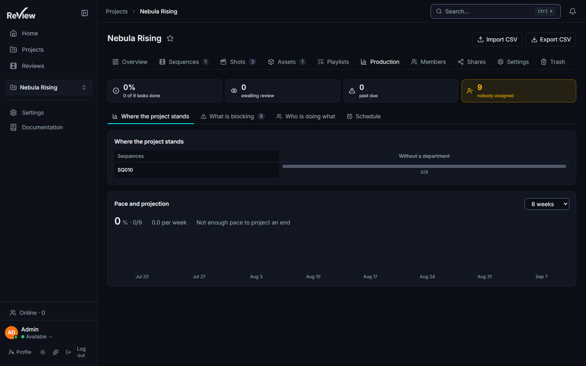
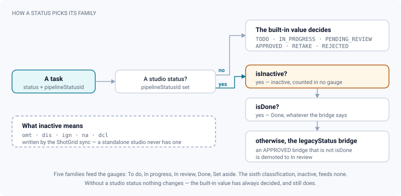
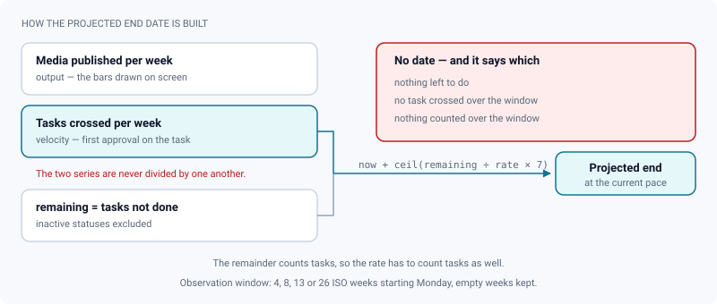

# Production & reporting

*Where the show stands, what is late, who carries it, and how fast it is going — all derived, nothing typed.*

> Updated: 2026-08-23

The **Production** tab answers four questions about a project — where it stands, what is
blocked, who is carrying it, at what rhythm — and then adds a lightweight schedule. It is
read-only reporting: every figure is derived from tasks, versions, review decisions and
comments that already exist. The only thing anyone types in is the two optional task dates.

## Reading the tab

Open a project and select **Production** (`?tab=production`). It is one scrolling page in a
fixed order — there are no sub-views to switch between:

1. **Where the project stands** — the sequences × departments matrix
2. **What is late or blocked** — three short lists side by side
3. **Who is doing what** — the load per person
4. **Pace and projection** — deliveries per week, and the end date they imply
5. **Deadline calendar** — appears only once a task carries a date
6. **Sequence Gantt** — same condition

**Every project member can read the tab.** Editing is narrower: only supervisors and admins
move a date, from the calendar or from a task page.

Blocks 1 to 4 come from one call (`GET /api/projects/:id/production?weeks=`), blocks 5 and 6
from another (`GET /api/projects/:id/schedule`). Everything in the first four is **counted by
Postgres** — one aggregate row per crossing, and at most fifty named tasks per attention list.
The tab used to load every task of the project into memory to count them in JavaScript, which
is exactly what stopped working on a feature-length show.

> [!NOTE]
> The observation window selector offers 4, 8, 13 and 26 weeks. The API itself accepts any
> value from 2 to 52 weeks, for a script that wants a different slice.

## What a gauge refuses to count

Every block on this tab reasons in **families**, not in raw statuses — that is what lets a
studio with fifteen ShotGrid statuses and a studio with the six built-in values read the same
page.

| Family | With no studio status | With a studio status |
|---|---|---|
| To do | `TODO` | bridge on `TODO` |
| In progress | `IN_PROGRESS` | bridge on `IN_PROGRESS` |
| In review | `PENDING_REVIEW` | bridge on `PENDING_REVIEW`, **and** any bridge on `APPROVED` that is not flagged `isDone` |
| Done | `APPROVED` | `isDone` — whatever the bridge says |
| Set aside | `RETAKE`, `REJECTED` | bridge on `RETAKE` or `REJECTED` |
| *inactive* | — | `isInactive` |

Two rules deserve to be spelled out. **`isDone` is the only authority on "finished"**: a
status that merely bridges onto `APPROVED` without being terminal is demoted to *In review*,
because a non-terminal status can never count as done. And **an inactive status counts
nowhere**:

| Block | Done | inactive |
|---|---|---|
| Sequences × departments matrix | counted, in the `done` share | not counted |
| Past due / Nobody assigned / Waiting for review | removed | removed |
| Who is doing what | removed | removed |
| Overall progress (`done/total`) | counted on both sides | not counted at all |

> [!IMPORTANT]
> A task set to *omitted*, *n/a* or *declined* is **invisible on every gauge of this tab** — it
> is not late, nobody carries it, and it neither advances nor holds back the percentage.
> Counting such tasks as remaining work would inflate the backlog forever; counting them as done
> would flatter the show. They remain perfectly visible on the
> [kanban](kanban-and-tasks.md#two-statuses-on-every-task), in their own column, and on the
> calendar and the Gantt below, which schedule rather than count.

Inactive statuses come from the ShotGrid synchronisation, which flags the site codes `omt`,
`dis`, `ign`, `na` and `dcl`. A studio with no ShotGrid link never has one.

## Where the project stands

A **sequences × departments matrix**.

- **Rows** are the project's sequences in their own order, plus a final *Outside sequence* row
  when tasks belong to assets or to shots with no sequence. Each row header links to its
  sequence.
- **Columns** are the departments actually used, **sorted alphabetically** — not in pipeline
  order — plus a *Without a department* column when some tasks carry none. The column list is
  read from every crossing, **inactive ones included**, so a department whose only tasks were
  written off keeps a column of dashes rather than vanishing from the map.
- **Each cell** is a stacked proportional bar plus a `done/total` count, and its tooltip spells
  out every family present with its count, in the order Done, In review, In progress, Set
  aside, To do. An empty crossing shows a dash.

If no task carries a department yet, the block says so instead of drawing an empty grid.

> [!TIP]
> The matrix is a map, not a workbench. When a column is clearly behind, go to the
> [kanban](kanban-and-tasks.md) with the department filter on — that is where things actually
> move — and come back a week later to see whether the column shifted.

## What is late or blocked

Three short lists rather than one aggregate number: **Past due**, **Nobody assigned**,
**Waiting for review**. Each line shows the parent, the task name and its due date, and opens
the task.

- **A finished task is never listed**, and neither is an inactive one: both families are
  removed before anything else happens. Tasks in *Set aside* stay — a retake past its due date
  is still late.
- **Past due** compares the due date to now, so a task due today is late only once its
  timestamp has passed.
- **Waiting for review** is the *In review* family, reached through the studio's own statuses
  as well as the built-in one.
- The three lists are **not exclusive**: an unassigned, overdue task waiting for review appears
  in all three.
- Each list is bounded **in the database** at **50** tasks, ordered by due date with undated
  ones last. The badge next to the heading counts what came back, the list shows the **first
  8**, and an *and n more* line closes it.
- A list with nothing in it says *Nothing here — good.*

## Who is doing what

The load per person, **counting only what is left** — done and inactive tasks are excluded.
Each row shows the split across to-do / in-progress / in-review / set-aside, the total, and how
many of those are **late**. The late count overlaps the others; it is not a sixth bucket, and it
is computed by the database alongside the totals.

Rows are sorted by total, descending, with the **unassigned** row always last regardless of its
size — it is a gap to fill, not a person to compare against. The bars are scaled against the
largest total, so one glance shows who is carrying the batch. Each name links to that person's
profile.

When nothing is left anywhere, the block says *Nothing left to do.* rather than drawing an
empty chart.

## Pace and projection

Deliveries per week over an observation window you choose — **4, 8, 13 or 26 weeks**, defaulting
to 8. A delivery is a **published media created inside the window**; weeks are ISO weeks starting
Monday, counted in UTC, and empty weeks are kept so a gap reads as a gap.

Above the bars, three figures printed together: the overall progress (`done/total` tasks and a
percentage), the observed rate as *n.n per week*, and the **projected end date**.

The projection is `now + ceil(remaining ÷ rate × 7)` **days** — the rounding up is to the day,
not to the whole week. Ten tasks left at three per week puts the marker 24 days out, not 28.
`remaining` is what the matrix says is not done, inactive statuses already excluded.

When there is nothing left, or the observed rate is zero, the panel says *Not enough pace to
project an end* rather than inventing a date.

> [!WARNING]
> The rate counts **published media** while the remainder counts **tasks**. The two units differ
> on purpose — one measures output, the other measures backlog — so read the projection as an
> order of magnitude and never quote the date without the rate beside it. That is why the panel
> prints them on the same line.

## The schedule: two dates, a calendar and a Gantt

Both bottom blocks are fed by the same thing: two optional dates on a task, a planned **start**
and a **due** date. Set them in the **Schedule** row of a task page — supervisors and admins
edit, everybody else reads, and the row is hidden entirely when neither date is set. Neither
block appears at all until at least one task in the project carries a date.

Unlike the gauges above, the schedule shows **every dated task**, done and inactive included: it
answers "when", not "how far along".

### Deadline calendar

A monthly calendar placing each task on its **due date**.

- Navigate with the arrows; **Today** jumps back to the current month, and the current day is
  highlighted. Weeks start on Monday, with weekday names in the reader's language.
- Each day shows up to **three** tasks — a coloured dot for the status, the location and the
  name — then a `+n` overflow marker. Click one to open the task.
- **Supervisors and admins can drag a task from one day to another.** The drop writes the new
  **due** date only; the start date is untouched. A toast confirms *Due date moved*, and the
  Gantt and the rest of the tab refresh with it. The date is stored at **midday UTC** so it does
  not slip a day for readers west of Greenwich.
- Everyone else sees the same calendar without the drag, and edits dates from the task page.

The drag reads your **effective role on this project**, so a supervisor by membership can move a
deadline here even when the *Schedule* row of the task page — which reads the account's global
role — stays read-only for them.

### Sequence Gantt

A read-only timeline grouping dated tasks **by sequence**, alphabetically, with tasks that have
no sequence last. Each bar links to its task and is coloured by status.

| Scale | Window | When to use it |
|---|---|---|
| *Month* | 30 days ahead, starting a week in the past | The current push |
| *Quarter* | 90 days ahead, starting a week in the past — **the default** | The usual planning horizon |
| *Everything* | Every dated task, whatever its date | A short project, or an overview you already know will be dense |

The windowed scales start a week in the past so that what has just finished stays visible. On a
feature-length project, *Everything* squeezes a year into one screen width and no bar stays
readable — which is exactly why the choice exists.

A bar spans **start date → due date**. With only one of the two it collapses to a marker at that
date; if the due date precedes the start date the two are swapped rather than drawing backwards.
A single vertical line marks today, drawn once across the whole chart rather than per row.

## The weekly production report

Supervisors and admins can subscribe to a **weekly production report** in
**Profile → Notifications**. It is a per-account subscription, opt-in: an unset preference means
no mail.

- **Sent on Monday**, at the studio's digest hour (`DIGEST_HOUR`, default 07:00, in the server's
  time zone). The daily digest uses the same hour and is a separate subscription.
- **Content**: one studio-wide table, identical for every recipient — one row per active project,
  with versions published, approvals, retakes and open notes. The first three cover the **last 7
  days**; open notes are a running total of unresolved root comments. A "version published" is a
  version with at least one media published inside the window. Archived and deleted projects are
  left out.
- **It is not sent** when SMTP is not configured, when nobody has subscribed, or when there was no
  activity anywhere in the week. A project with nothing to report is dropped from the table; if
  every project is dropped, no mail goes out at all. There is no "quiet week" email.
- Service accounts never receive it, every message carries an unsubscribe link, and each recipient
  gets it in their own language.

## Use cases

### The Monday production meeting

You have ten minutes and need to know what to talk about.

1. Open **Production**. The matrix gives the shape of the film: which sequence is dragging, in
   which department.
2. Read the three attention lists in order. *Nobody assigned* is the one you can fix on the spot —
   note the tasks, then assign them from the Shots or Assets tab selection bar.
3. *Who is doing what* tells you whether the load is one person's problem or the batch's.
4. Set the observation window to **13 weeks** if the project has been running a while: 4 weeks
   reacts to a single good fortnight, 13 does not.

### Following a single department

Lighting is behind and you want to know by how much.

The matrix column gives the ratio; the useful screen is the kanban with the department filter on.
Save that filter as a view, and the weekly check is two clicks: the column in the matrix, then the
board.

### Planning a delivery window

1. Open a handful of tasks and fill their **Schedule** rows — start and due dates. Only dated
   tasks appear in the calendar and the Gantt.
2. Look at the Gantt on the **Quarter** scale: overlaps within a sequence show up as stacked bars
   around the same week.
3. When editorial moves a deadline, drag the task in the **calendar** rather than opening its page.
   The Gantt follows immediately.

### Explaining the projected end date

Someone asks when the film lands.

Never quote the date without the rate next to it — that is why the panel prints the two together.
Say "at eleven deliveries a week we land around the 12th"; if the rate is a recent accident, widen
the observation window and quote the slower figure instead.

## Troubleshooting

**The percentage jumped and nobody finished anything.** Somebody set tasks to an inactive status.
They left `total` as well as `done`, so the ratio moved without any work being delivered.

**A task I know is late is not in *Past due*.** It is either done, inactive, or past the fiftieth
task of that list — the lists are bounded in the database, not truncated on screen.

**The matrix has a column full of dashes.** Every task of that department is inactive. The column
is kept on purpose, so the pipe step does not silently vanish from the map.

**A shot marked *Final* on the site is not counted as done.** Its status bridges onto `APPROVED`
but is not flagged terminal, so it is classified *In review*. Set `isDone` on that status.

**No projected end date is shown.** Either nothing is left, or no media was published inside the
observation window. Widen the window before concluding the show has stopped.

**The calendar and the Gantt are missing entirely.** No task in the project carries a start or a
due date yet. Fill one *Schedule* row and both appear.

**I can move a card on the kanban but the Schedule row is read-only.** The two surfaces read
different roles — the board and the calendar read your role on this project, the task page reads
your global account role.

**The weekly report never arrives.** Check the subscription in *Profile → Notifications*, that your
account is `SUPERVISOR` or `ADMIN`, and that SMTP is configured. A week with no activity anywhere
sends nothing at all.

## Related pages

- [Kanban & tasks](kanban-and-tasks.md) — where dates, assignees and statuses are actually set
- [Review decisions & approvals](review-approvals.md) — the decisions that feed approvals and retakes
- [Projects & pipeline](projects-and-pipeline.md) — sequences, departments and the two status vocabularies
- [Personalization](personalization.md) — notification subscriptions and saved views
- [ShotGrid integration (admin)](../admin-guide/shotgrid-integration.md) — where inactive statuses come from
- [SMTP & announcements (admin)](../admin-guide/smtp-and-announcements.md) — mail setup and the digest hour
