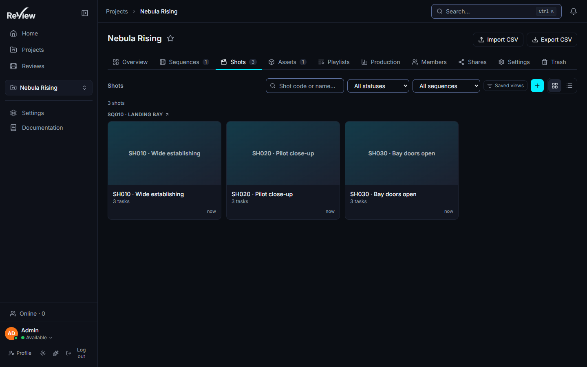

# Projects & pipeline

> Updated: 2026-08-21



## Hierarchy

```
Project
├── Sequence → Shot → Task → Version → Media
└── Asset            → Task → Version → Media
```

- **Projects** hold everything and carry a status (`ACTIVE`, `ON_HOLD`, `COMPLETED`,
  `ARCHIVED`).
- **Sequences** group **shots** (shot-based work); **assets** (`CHARACTER`, `PROP`,
  `ENVIRONMENT`, `VEHICLE`, `FX`, `OTHER`) live directly under the project
  (asset-based work). An asset can also be linked to sequences and shots.
- **Tasks** are typed pipeline steps (`MODELING`, `RIGGING`, `ANIMATION`, `FX`,
  `LIGHTING`, `COMPOSITING`, `LOOKDEV`, `LAYOUT`, `OTHER`) attached to a shot or an
  asset. A task carries a **department** (the project's own pipe step), an assignee
  and a status.
- **Versions** (V01, V02…) belong to a task — or directly to an asset — and hold the
  actual **media** to review: video, image, 3D model, or Gaussian splat.

Only tasks and assets can own a version. A shot never holds one directly: dropping a
file on a shot page asks which task should receive it first, and the picker can create
the task if it is missing.

## Statuses: two vocabularies

Two status models coexist and are kept in sync by the server.

- **The project's own status list** (`pipelineStatusId`) — the vocabulary the studio
  actually uses. A site connected to ShotGrid commonly defines fifteen entries, each
  with a name and a colour. This is what every menu, badge and kanban column displays.
- **The built-in enum** (`status`) — `TODO`, `IN_PROGRESS`, `PENDING_REVIEW`,
  `APPROVED`, `REJECTED`, `RETAKE`. It is the *family* each custom status belongs to,
  and it is what the application falls back on when a project has never defined its own
  list.

Never send both at once: the server derives the enum from the custom status, and its
derivation wins. Sequences and shots accept **only** `pipelineStatusId` — a project
without a status list therefore shows no status menu on them at all, which is honest,
rather than a menu that would fail on every click.

See [Approval workflow](review-approvals.md) for review decisions, which are a separate
axis from pipeline status.

## Changing a status by right-click

Setting a status used to mean opening the entity and then its settings panel — the most
frequent gesture in production was the longest one. It is now a context menu away,
everywhere the entity is visible.

**Right-click → Status → pick a value.** The submenu is a radio group: the current value
is ticked, each entry carries the colour dot of the studio's status, and a final
**No status** entry clears it.

| Where | Scope | Who can |
|-------|-------|---------|
| Project → **Sequences** tab, a sequence row | sequence | project managers |
| Sequence page (`/sequences/:id`), anywhere on the page | sequence | project managers |
| Project → **Shots** tab, a shot card | shot | project managers |
| Shot page (`/shots/:id`), anywhere on the page | shot | project managers |
| **Kanban** card | task | project managers, **and the assignee of that task** |
| Task page (`/tasks/:id`), anywhere on the page | task | supervisors/admins, **and the assignee** |

Three behaviours worth knowing:

- **The change shows before the server answers**, then the server has the last word. If
  it refuses — or derives a different family — the card snaps back and a toast explains
  why.
- **On a project linked to ShotGrid, the *No status* entry is hidden.** The remote site
  cannot store an empty status, and the next synchronisation would bring the old value
  back; offering the gesture would promise what cannot be kept.
- **An unknown status still shows a tick.** An entity carrying a status inherited from
  another site is matched by family, so you see roughly where it stands instead of a
  menu that pretends nothing is set.

Toasts confirm with the studio's own wording: *Status set to Ready to Start*, or
*Status removed*.

## Assigning work

### The rule: an asset has no assignee, its tasks do

"Assign Alice to this asset" is production shorthand. What is actually written is one
assignment **per task**, one task per department. ReView models it that way because the
work is split by stage — and because ShotGrid does the same (`task_assignees` lives on
`Task`). Giving the asset its own assignee field would make the two models diverge on
the first round trip.

So the **Assign** submenu has two levels: first the department, then the person.

### By right-click, one entity at a time

**Right-click an asset → Assign → *department* → *person*.** Available on asset cards in
the project's **Assets** tab and on the asset page, for project managers.

- The department list is what the asset declares; an asset that declares nothing is
  offered the project's whole pipe instead of an empty menu.
- A department in which the asset already has a task shows that task's assignee ticked.
- A last **Nobody** entry unassigns.
- Picking a department that has no task yet **creates the task** (named after the
  department, status `TODO`) and assigns it.
- **On a project driven from ShotGrid**, departments without a task are listed but
  greyed out: the task has to be born on the remote site, and hiding the entry would
  suggest the pipe does not plan for that step. The server returns `TASK_MISSING` if you
  force it through the API.

Three people can never receive work, and the server says so instead of failing silently:
a **service account** (a machine identity does not open Maya), a **`CLIENT`** account,
and anyone who is **not a member of the project**.

The API also exposes the same gesture on a shot (`POST /api/shots/:id/assign`), but the
shot cards and the shot page do not currently offer the submenu.

### The Departments submenu

**Right-click an asset page → Departments** ticks the pipe steps the asset goes through,
without opening its settings. It is a targeted add/remove toggle, not a replacement of
the whole list, so two quick clicks do not cancel each other. Assigning someone in a
department also attaches that department to the entity, so you never declare it twice.

### In bulk, from the selection bar

The context menu is enough for one asset; splitting a whole batch at the start of a lot
is not — that would be thirty right-clicks.

1. In the project's **Assets** tab, tick the cards (click a checkbox, **Shift-click**
   for a range, **Escape** to clear).
2. The floating **selection bar** appears at the bottom. Click **Assign**.
3. Pick the **person** (or *Nobody*), then optionally pick **departments**.
4. **Assign**.

Leaving the department chips empty targets **every existing task** of each asset — the
common case, because "give me this batch" means "everything left to do on it". Picking
departments targets those, and creates the missing task where allowed.

The result is counted, not asserted: *n tasks updated*, plus a warning
*n items skipped: nothing to assign, or not allowed* when the server refused an entity
(rights, archived project, no task). One refusal never sinks the batch — losing fifty
assets because of one would be absurd. Access is re-checked entity by entity, because a
selection can span projects.

Bulk assignment is wired to the Assets tab. Shot cards do not offer multi-selection, so
the shot equivalent (`PATCH /api/bulk/shots/assign`) is API-only for now.

## Inherited pipeline settings

Delivery settings — **resolution, framerate and frame ranges** — cascade down the
hierarchy: **studio → project → sequence → shot**. Each level either inherits from its
parent or overrides a value; the review viewer uses the resolved values (for example the
letterbox frame guide at the delivery aspect ratio). Colorspace is deliberately **not**
part of these settings; video transcoding is configured studio-wide by administrators
only (see [Transcoding](../admin-guide/transcoding.md)).

Assets have no resolution or framerate of their own — they are not delivered as a shot
is — so the settings panel does not offer those fields on an asset.

## Versions & publication

A version starts as a **draft** (`DRAFT`). Its media are strictly private to the person
who uploaded them: nobody else on the project — supervisors included — sees a draft
media until it is published. Publishing makes it visible to the project and
**permanently locks its content**:

- locked after publish: splat edits & masks, video trim, reprocessing, 3D transform
  (any structural write returns `403 PUBLISHED_LOCKED`);
- still editable: splat *presentation* (staging: camera framing, DoF…) and the
  thumbnail;
- corrections are delivered as a **new version**, and the history keeps every iteration
  side by side for A/B comparison in review.

A version also has an intermediate `REVIEW` state, used by the API publishing flow when
an artist submits work without the right to publish the version itself. Full details in
[Upload & publishing](upload-and-publishing.md).

## The project page

The project page opens at `/projects/:id` (the URL rewrites itself to a readable slug)
and the active tab is carried by `?tab=`. Tabs follow the pipe, from the whole to the
detail:

| Tab | Content | Visible to |
|-----|---------|-----------|
| **Overview** | project summary | everyone |
| **Sequences** | the whole-film cut, then one row per sequence | everyone |
| **Shots** | shot cards grouped by sequence, with a badge count | everyone |
| **Assets** | asset cards, with a badge count | everyone |
| **Playlists** | the project's dailies playlists | everyone |
| **Production** | statistics, calendar, Gantt | everyone |
| **Members** | project memberships and roles | managers |
| **Shares** | client share links | managers |
| **Settings** | departments, nomenclature, pipeline, naming rule | managers |
| **Trash** | soft-deleted entities, restore or purge | managers |
| **ShotGrid** | synchronisation panel | managers, **only on a linked project** |

**Kanban** and **Board** sit as links in the page header, next to the CSV import/export
actions.

### Filters and saved views

The **Shots**, **Assets** and **Kanban** lists share one filter bar and one preset
mechanism. An empty criterion means "everything"; the explicit **None** entry means
"without" (no status, outside a sequence, no department) — an answer in its own right.

| List | Criteria offered |
|------|-----------------|
| Shots | text (code and name), status, sequence, department |
| Assets | text (name), department, asset type |
| Kanban | text (task name and parent), status, assignee, sequence, department, task type |

The department criterion is only meaningful on the kanban, where the filtered rows are
tasks and therefore carry a department; on the Shots and Assets lists the cards
themselves have no department field.

**Saved views** are stored server-side per account and per scope (`shots:<projectId>`,
`assets:<projectId>`, `kanban:<projectId>`, `reviews`), so a preset built on the Shots
tab of one project does not leak into another. A counter next to the bar shows how many
criteria are active and clears them all in one click.

Selection only ever covers what is displayed: a bulk action can never reach rows the
filter has hidden.

## Creating sequences and shots in bulk

Managers get a **batch generator** at the top of the Sequences and Shots tabs:
prefix, start number, step, number of digits, count (up to 200) and — for shots — a
destination sequence. The generated codes are previewed (first thirty, then a count)
before anything is written. The defaults come from the project's **nomenclature**
setting, so a studio that numbers `SH010, SH020, …` gets exactly that without retyping
it.

On a project driven from ShotGrid the generator is locked: entities are created on the
remote site, and creating them locally would produce duplicates at the next
synchronisation.

Longer lists come from [CSV import](../admin-guide/project-organization.md).

## Sequence page

A sequence opens at `/sequences/:id`: its **cut** first — kept up to date at every
publish — then its shots as a grid with thumbnail, status and task count, then the
assets linked to it. The whole-film cut sits at the top of the **Sequences** tab.

A shot marked as cut from the edit is flagged in that grid with an eye-off badge; it
stays fully browsable. See [Auto-updating cut timelines](auto-cut-timelines.md).

Right-click a sequence **row** in the tab to open it, set its status, open its settings
or move it to the trash. Right-click the sequence **page** to set its status, open its
settings, or push **the latest published version of each of its shots** into a playlist.

## Entity settings

Sequences, shots and assets share one settings panel, opened by right-click →
**Settings** or by the gear in the page header (managers only). The panel shows
only the fields the entity actually has, and sends only what changed — on a linked
project, resending the whole form would republish untouched values to ShotGrid and
overwrite whatever moved in the meantime.

| Field | Sequence | Shot | Asset |
|-------|:--------:|:----:|:-----:|
| Name | yes | yes | yes |
| Code | yes | yes | — |
| Type label (as the studio names it) | — | — | yes |
| Description | yes | yes | yes |
| Frame range (start / end) | — | yes | — |
| Status | yes | yes | — |
| Resolution & framerate override | yes | yes | — |
| Thumbnail | yes | yes | yes |
| Departments | yes | yes | yes |

The thumbnail accepts PNG, JPEG or WebP; without one, the first published media is used.
The name is the only field that cannot be left empty (plus the code, where the entity
has one).

## Use cases

### Opening a 40-shot sequence

A sequence has just been cut and you have the shot list from editorial.

1. Project → **Sequences** → batch generator: prefix `SQ`, start `10`, step `10`,
   3 digits, count `1`. Create.
2. Project → **Shots** → batch generator: prefix `SH`, start `10`, step `10`, 3 digits,
   count `40`, destination = the sequence you just made. The preview shows
   `SH010 … SH400`; create.
3. Open the sequence page, right-click → **Settings** and set the departments
   the sequence goes through, plus a resolution or framerate override if this sequence
   is delivered differently from the rest of the film.
4. Frame ranges arrive shot by shot: open a shot, right-click → **Settings**,
   fill start and end. Everything else — resolution, framerate — is inherited and does
   not need to be typed forty times.

### Handing a batch of assets to an artist

The environment pack for the third act has just been created and nobody is on it.

1. Project → **Assets**, filter on type `ENVIRONMENT`.
2. Tick the first card, **Shift-click** the last one. The selection bar shows the count.
3. **Assign** → person: the artist → departments: **Modeling** and **Lookdev** →
   **Assign**.
4. The toast reports how many tasks were updated. Missing modeling and lookdev tasks
   were created along the way, and both departments are now attached to each asset.

If some of those assets already have a texturing task you did not target, it is
untouched — you asked for two stages, not for the whole pipe.

### Moving a shot forward at the end of the day

A compositing shot is finished and the supervisor wants the board to say so.

- From the **Shots** tab: right-click the card → **Status** → the studio's *Final*
  entry. The badge changes immediately.
- From the **Kanban**: drag the card into the *Final* column, or right-click →
  **Status**. Both write the same thing — the exact status of the studio's list, not an
  approximate family.
- From the artist's own screen: the assignee can set the status on their own task from
  the kanban card or the task page, without a manager present.

### Catching up on a status list that changed mid-project

The studio renamed and reordered its statuses on the ShotGrid site. Shots keep showing
a tick even though their old status is gone from the menu: the family fallback matches
them to the nearest equivalent, so nothing looks unset. Setting the new value is one
right-click per shot — and the department order in
[Pipeline settings](../admin-guide/pipeline-settings.md) is what decides which version
counts as "latest" in every cut, so check it after a reorder.

## Related pages

- [Upload & publishing](upload-and-publishing.md)
- [Kanban & tasks](kanban-and-tasks.md)
- [Auto-updating cut timelines](auto-cut-timelines.md)
- [Navigation & search](navigation-and-search.md)
- [Pipeline settings (admin)](../admin-guide/pipeline-settings.md)
- [Project organization (admin)](../admin-guide/project-organization.md)
