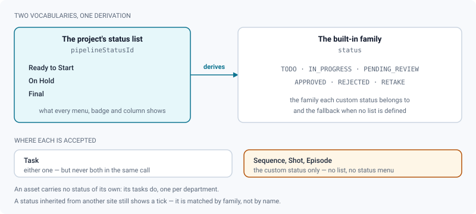
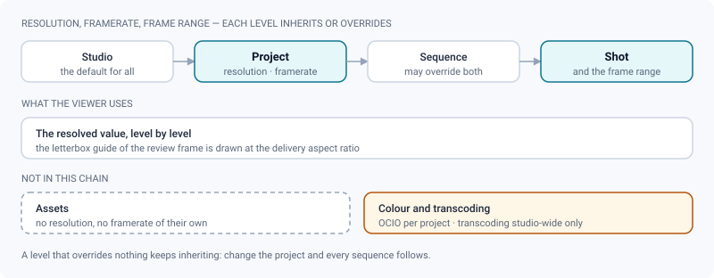

# Projects & pipeline

*The shape of a show in ReView — episodes down to media, the two status vocabularies, and who may change what, where.*

> Updated: 2026-08-23

One ReView instance is one studio, and inside it a **project** is one show. Everything a
production needs to say about that show — how it is broken down, who is on which step, what
resolution it is delivered at, what "Final" means this year — is carried by the objects on
this page. Most of it is one right-click away from wherever you already are; the settings
panels exist for the rest.

Throughout this page, **project managers** means administrators and supervisors — either
studio-wide, or through the role they hold on that one project. A studio administrator is a
manager everywhere; a supervisor named on a single project is a manager there and an artist
elsewhere.

## The shape of a show

- **Projects** hold everything and carry a status of their own: `ACTIVE`, `ON_HOLD`,
  `COMPLETED`, `ARCHIVED`. An archived project is read-only — uploads are refused rather
  than half-accepted.
- **Episodes** group **sequences**. This level is **optional and switched off by default**
  (see [Episodes (series)](#episodes-series)). A feature film never sees a trace of it.
- **Sequences** group **shots** — shot-based work, the left branch of the figure.
- **Assets** (`CHARACTER`, `PROP`, `ENVIRONMENT`, `VEHICLE`, `FX`, `OTHER`) hang directly
  off the project — asset-based work, the right branch. An asset can *also* be linked to
  sequences and shots, which is how "this set appears in SQ040" gets said without moving it.
- **Tasks** are the pipeline steps, typed (`MODELING`, `RIGGING`, `ANIMATION`, `FX`,
  `LIGHTING`, `COMPOSITING`, `LOOKDEV`, `LAYOUT`, `OTHER`) and attached to a shot or an
  asset. A task carries the **department** (the studio's own name for that step), the
  **assignee**, and the **status**.
- **Versions** (`v001`, `v002`…) belong to a task — or directly to an asset — and hold the
  **media** that is actually reviewed: video, image sequence, still image, 3D model or
  Gaussian splat.

> [!IMPORTANT]
> Only a **task** or an **asset** can own a version. A shot never holds one directly.
> Dropping a file on a shot page therefore asks which step receives it first, and the picker
> can create the missing task on the spot. Filing a compositing render "on the shot" would
> lose the step that produced it — and, on a project linked to ShotGrid, deprive the pushed
> version of its `sg_task`.

A shot delivered as a folder of numbered frames is still one media: see
[Image sequences](image-sequences.md).

## Two status vocabularies, one derivation

Two status models coexist, and the server keeps them in step.

- **The project's own status list** (`pipelineStatusId`) — the vocabulary the studio
  actually speaks. A site connected to ShotGrid commonly defines fifteen entries, each with
  a name and a colour. This is what every menu, badge and kanban column displays.
- **The built-in family** (`status`) — `TODO`, `IN_PROGRESS`, `PENDING_REVIEW`, `APPROVED`,
  `REJECTED`, `RETAKE`. It is the *family* each custom status belongs to, and the fallback
  when a project has never defined a list of its own.

Never send both at once through the API: the server derives the family from the custom
status, and its derivation wins. A **task** accepts either form. **Sequences, shots and
episodes** accept `pipelineStatusId` only — so a project without a status list shows no
status menu on them at all, which is honest, rather than a menu that would fail on every
click. An **asset** carries no status of its own: its tasks do, one per department.

Pipeline status is a different axis from the review decision taken in front of a media —
see [Review decisions & approvals](review-approvals.md).

### Setting a status by right-click

Setting a status used to mean opening the entity, then its settings panel: the most frequent
gesture in production was the longest one. It is now a context menu away, everywhere the
entity is visible.

**Right-click → Status → pick a value.** The submenu is a radio group: the current value is
ticked, each entry carries the colour dot of the studio's status, and a final **No status**
entry clears it.

| Where | What it sets | Who can |
|-------|--------------|---------|
| Project → **Sequences** tab, a sequence row | sequence | project managers |
| Sequence page (`/sequences/:id`), anywhere on the page | sequence | project managers |
| Project → **Shots** tab, a shot card | shot | project managers |
| Shot page (`/shots/:id`), anywhere on the page | shot | project managers |
| **Kanban** card | task | project managers, **and the assignee of that task** |
| Task page (`/tasks/:id`), anywhere on the page | task | project managers, **and the assignee** |

Three behaviours worth knowing:

- **The change shows before the server answers**, then the server has the last word. If it
  refuses — or derives a different family — the card snaps back and a toast explains why.
- **On a project linked to ShotGrid, the *No status* entry is hidden.** The remote site
  cannot store an empty status, and the next synchronisation would bring the old value back;
  offering the gesture would promise what cannot be kept.
- **An unknown status still shows a tick.** An entity carrying a status inherited from
  another site is matched by family, so you see roughly where it stands instead of a menu
  that pretends nothing is set.

Toasts confirm in the studio's own wording: *Status set to Ready to Start*, or
*Status removed*. Episodes display the same badge, drawn from the sequence status list, but
have no status submenu of their own.

## Assigning work

### The rule: an asset has no assignee, its tasks do

"Assign Alice to this asset" is production shorthand. What is actually written is one
assignment **per task**, one task per department. ReView models it that way because the work
is split by stage — and because ShotGrid does the same (`task_assignees` lives on `Task`).
Giving the asset its own assignee field would make the two models diverge on the first round
trip.

So the **Assign** submenu has two levels: first the department, then the person.

### By right-click, one entity at a time

**Right-click an asset → Assign → *department* → *person*.** Available on asset cards in the
project's **Assets** tab and on the asset page, for project managers.

- The department list is what the asset declares; an asset that declares nothing is offered
  the project's whole pipe instead of an empty menu.
- A department in which the asset already has a task shows that task's assignee ticked.
- A last **Nobody** entry unassigns.
- Picking a department that has no task yet **creates the task** (named after the department,
  status `TODO`) and assigns it.
- **On a project driven from ShotGrid**, departments without a task are listed but greyed
  out: the task has to be born on the remote site, and hiding the entry would suggest the
  pipe does not plan for that step. The server answers `TASK_MISSING` if you force it
  through the API.

Three people can never receive work, and the server says so instead of failing silently: a
**service account** (a machine identity does not open Maya), a **`CLIENT`** account, and
anyone who is **not a member of the project**. None of the three is even offered in the menu.

### The Departments submenu

**Right-click an asset page → Departments** ticks the pipe steps the asset goes through,
without opening its settings. It is a targeted add/remove toggle, not a replacement of the
whole list, so two quick clicks do not cancel each other. Assigning someone in a department
also attaches that department to the entity, so you never declare it twice.

### In bulk, from the selection bar

The context menu is enough for one entity; splitting a whole batch at the start of a lot is
not — that would be thirty right-clicks. **Both the Assets tab and the Shots tab** carry
multi-selection and the same dialog.

1. Tick the cards (click a checkbox, **Shift-click** for a range, **Escape** to clear).
2. The floating **selection bar** appears at the bottom. Click **Assign**.
3. Pick the **person** (or *Nobody*), then optionally pick **departments**.
4. **Assign**.

Leaving the department chips empty targets **every existing task** of each entity — the
common case, because "give me this batch" means "everything left to do on it". Picking
departments targets those, and creates the missing task where allowed.

The result is counted, not asserted: *n tasks updated*, plus a warning *n items skipped:
nothing to assign, or not allowed* when the server refused an entity (rights, archived
project, no task). One refusal never sinks the batch — losing fifty assets because of one
would be absurd. Access is re-checked entity by entity, because a selection can span
projects.

> [!NOTE]
> The **single-entity** Assign submenu is offered on assets only. The API exposes the same
> gesture on a shot (`POST /api/shots/:id/assign`), and the Shots selection bar uses its
> bulk twin (`PATCH /api/bulk/shots/assign`), but a lone shot card has no Assign submenu —
> select it and use the bar.

## Delivery settings, and what they do not cover

**Resolution, framerate and frame ranges** cascade down the hierarchy: **studio → project →
sequence → shot**. Each level either inherits from its parent or overrides a value, and the
review viewer uses the resolved result — that is what the letterbox frame guide is drawn
from, at the delivery aspect ratio.

Assets have no resolution or framerate of their own — they are not delivered as a shot is —
so the settings panel does not offer those fields on an asset.

The **Settings** tab opens on an *Inheritance* panel that answers the question the fields
themselves cannot: for each section — format and framerate, numbering, departments, file
naming, default lighting, colour, burn-ins — it says **inherited** or **overridden**, shows
the studio value behind it, and offers a one-click **revert** that hands the section back to
the studio. Saving the tab only sends the sections you actually touched: re-sending the whole
form would freeze into the project everything it was merely inheriting.

Two things are deliberately outside that chain:

- **Video transcoding** is configured studio-wide by administrators only, never per project
  — see [Transcoding](../admin-guide/transcoding.md).
- **Colour management (OCIO)** is *not* part of the resolution/framerate cascade, but it is
  very much a project setting: the Settings tab carries an OCIO section (config, then display
  and view), inherited from the studio like the others. It is what the review's display
  transform is built from. See [Colour management](../admin-guide/color-management.md) and
  [Image review](review-image.md).

## The project page

The project page opens at `/projects/:id` (the URL rewrites itself to a readable slug) and
the active tab is carried by `?tab=`. Tabs follow the pipe, from the whole to the detail.

| Tab | Content | Visible to |
|-----|---------|-----------|
| **Overview** | counts, and the project's latest published media | everyone |
| **Episodes** | episodes and their sequences | everyone, **only where the level is on** |
| **Sequences** | the whole-film cut, then one row per sequence | everyone |
| **Shots** | shot cards grouped by sequence, with a badge counting the project total | everyone |
| **Assets** | asset cards, with a badge counting the project total | everyone |
| **Playlists** | the project's dailies playlists | everyone |
| **Production** | statistics, calendar, Gantt | everyone |
| **Members** | project memberships and roles | managers |
| **Shares** | client share links | managers |
| **Settings** | inheritance, start frame, format and framerate, numbering, Episode level, departments, file naming rule, default 3D lighting, OCIO colour, storage quota, burn-ins, ShotGrid link | managers |
| **Trash** | soft-deleted entities, restore or purge | managers |
| **ShotGrid** | synchronisation panel | managers, **only on a linked project** |

**Kanban** and **Board** sit as links in the page header, next to the CSV import/export
actions.

### Filters and saved views

The **Shots**, **Assets** and **Kanban** lists share one filter bar and one preset
mechanism. An empty criterion means "everything"; the explicit **None** entry means
"without" (no status, outside a sequence, no department) — an answer in its own right.

| List | Criteria offered |
|------|-----------------|
| Shots | text (code and name), status, sequence, department |
| Assets | text (name), department, asset type |
| Kanban | text (task name and parent), status, assignee, sequence, department, task type |

The department criterion reads differently depending on the list. On the kanban a row is a
task, which belongs to exactly one department, so the filter matches that one. A shot or an
asset does not belong to a single department — it goes through several, one task per step —
so on the Shots and Assets lists the filter keeps every card that goes through the chosen
department. **None** therefore means "goes through no department at all", and never matches
a card that goes through one.

**Saved views** are stored server-side per account and per scope (`shots:<projectId>`,
`assets:<projectId>`, `kanban:<projectId>`, `reviews`), so a preset built on the Shots tab of
one project does not leak into another. A counter next to the bar shows how many criteria are
active and clears them all in one click.

Selection only ever covers what is displayed: a bulk action can never reach rows the filter
has hidden.

### Long lists load as you scroll

Shots and Assets are paginated by cursor, a hundred rows at a time, and the list grows as you
reach its end. Three consequences you will see on a two-thousand-shot feature:

- the **tab badge** counts the project total, not what is loaded — otherwise it would say
  `100` all day;
- a line under the batch generator reads **`n of N loaded`**, so a short list is visibly
  short rather than ambiguously truncated;
- **setting any filter pulls the whole list down first.** Filtering a hundred loaded rows out
  of two thousand would answer "no shot" for a shot that exists, which is worse than the
  wait.

## Creating sequences and shots in bulk

Managers get a **batch generator** at the top of the Sequences and Shots tabs: prefix, start
number, step, number of digits, count (up to 200) and — for shots — a destination sequence.
The generated codes are previewed (first thirty, then a count) before anything is written.
The defaults come from the project's **numbering** setting, so a studio that numbers
`SH010, SH020, …` gets exactly that without retyping it.

On a project driven from ShotGrid the generator is locked: entities are created on the remote
site, and creating them locally would produce duplicates at the next synchronisation.

> [!TIP]
> Longer lists — and everything a spreadsheet already knows about them: names, statuses,
> frame ranges, tasks, assignees, dates — come from [CSV import](importing-a-project.md).

## Episodes (series)

Series work adds one level above the sequence. Because a feature film has no use for it, the
level is **optional per project and off by default**: until it is switched on, nothing about
it appears anywhere — no tab, no filter, no breadcrumb entry, no creation form — and the
server refuses every episode request with `409`.

**Switching it on.** Project → **Settings** → *Episode level*, for project managers. The
panel states what the switch does and what it will hide.

**Switching it off destroys nothing.** Episodes and the sequences attached to them are kept
as they are; they simply stop being displayed, and come back untouched when the level is
switched on again. Deletion is a separate, explicit action.

**Using it.** An **Episodes** tab appears next to Sequences:

- create episodes in bulk with the same generator as sequences and shots (default prefix
  `EP`);
- right-click an episode to open it, move it up or down, or move it to the trash;
- right-click a sequence to **attach it to an episode** or **detach it**;
- sequences that belong to no episode are listed in their own group — an in-progress
  breakdown always leaves some, and hiding them would hide live work.

An episode page (`/episodes/:id`) lists its sequences and, under each, their shots. A
sequence that belongs to an episode shows a link back to it on its own page.

**Deleting.** Moving an episode to the trash — or purging it — never touches its sequences:
they survive, simply detached. Trashed episodes are restorable from the project **Trash** tab
like any other entity.

**ShotGrid.** On a linked project with the level switched on, episodes are imported from the
site's `Episode` entity and sequences are attached from their `sg_episode` field. The remote
field is only ever requested for projects that switched the level on. If local creation is
locked, the *New episode* action points at the site's own Episode form. See
[ShotGrid integration](../admin-guide/shotgrid-integration.md).

## Sequence and shot pages

A sequence opens at `/sequences/:id`: its **cut** first — kept up to date at every publish —
then its shots as a grid with thumbnail, status and task count, then the assets linked to it.
The whole-film cut sits at the top of the **Sequences** tab.

A shot cut from the edit is flagged in that grid with an eye-off badge and stays fully
browsable. Marking it is a **checkbox in the right-click menu** — *Omitted from the cut* — on
the shot card and on the shot page, for project managers. It is a checkbox rather than an
action with a final-sounding name because omitting destroys nothing: the shot keeps its
tasks, its versions, its media and its comments, and only the automatic cuts skip it. See
[Auto-updating cut timelines](auto-cut-timelines.md).

Right-click a sequence **row** in the tab to open it, set its status, open its settings or
move it to the trash. Right-click the sequence **page** for its status, its settings, or
*Add to a playlist*.

> [!WARNING]
> **What a sequence-level playlist add really adds.** It asks the project catalogue for the
> sequence's candidates with *latest only* on, capped at **300** — which keeps the most recent
> version of **each task**, not one version per shot. A shot carrying animation, lighting and
> compositing tasks contributes three versions. There is no published-only filter at that
> step either. Review the result on the playlist page before the screening. The shot page's
> own *Add to a playlist*, by contrast, pushes exactly one version: the furthest step of that
> shot that has something published to show. See
> [Playlists & live review sessions](playlists-and-live-review.md).

## Entity settings

Sequences, shots and assets share one settings panel, opened by right-click → **Settings** or
by the gear in the page header (managers only). The panel shows only the fields the entity
actually has, and sends only what changed — on a linked project, resending the whole form
would republish untouched values to ShotGrid and overwrite whatever moved in the meantime.

| Field | Sequence | Shot | Asset |
|-------|:--------:|:----:|:-----:|
| Name | yes | yes | yes |
| Code | yes | yes | — |
| Type label (as the studio names it) | — | — | yes |
| Description | yes | yes | yes |
| Frame range (start / end) | — | yes | — |
| Status | yes | yes | — |
| Resolution & framerate override | yes | yes | — |
| Thumbnail | yes | yes | yes |
| Departments | yes | yes | yes |

The thumbnail accepts PNG, JPEG or WebP; without one, the first published media is used. The
name is the only field that cannot be left empty (plus the code, where the entity has one).

## Versions & publication

A version starts as a **draft** (`DRAFT`). Its media are strictly private to the person who
uploaded them: nobody else on the project — supervisors included — sees a draft media until
it is published. Publishing makes it visible to the project and **permanently locks its
content**:

- locked after publish: splat edits and masks, video trim, reprocessing, 3D transform (any
  structural write answers `403 PUBLISHED_LOCKED`);
- still editable: the splat **presentation** (staging: camera framing, depth of field,
  reveal) and the thumbnail;
- corrections are delivered as a **new version**, and the history keeps every iteration side
  by side for A/B comparison in review.

A version also has an intermediate `REVIEW` state, used by the API publishing flow when an
artist submits work without the right to publish the version itself. Full details in
[Upload & publishing](upload-and-publishing.md).

## Use cases

### Opening a 40-shot sequence

A sequence has just been cut and you have the shot list from editorial.

1. Project → **Sequences** → batch generator: prefix `SQ`, start `10`, step `10`, 3 digits,
   count `1`. Create.
2. Project → **Shots** → batch generator: prefix `SH`, start `10`, step `10`, 3 digits, count
   `40`, destination = the sequence you just made. The preview shows `SH010 … SH400`; create.
3. Open the sequence page, right-click → **Settings** and set the departments the sequence
   goes through, plus a resolution or framerate override if this sequence is delivered
   differently from the rest of the film.
4. Frame ranges arrive shot by shot: open a shot, right-click → **Settings**, fill start and
   end. Everything else — resolution, framerate — is inherited and does not need to be typed
   forty times.

### Handing a batch of assets to an artist

The environment pack for the third act has just been created and nobody is on it.

1. Project → **Assets**, filter on type `ENVIRONMENT`.
2. Tick the first card, **Shift-click** the last one. The selection bar shows the count.
3. **Assign** → person: the artist → departments: **Modeling** and **Lookdev** → **Assign**.
4. The toast reports how many tasks were updated. Missing modeling and lookdev tasks were
   created along the way, and both departments are now attached to each asset.

If some of those assets already have a texturing task you did not target, it is untouched —
you asked for two stages, not for the whole pipe.

### Moving a shot forward at the end of the day

A compositing shot is finished and the supervisor wants the board to say so.

- From the **Shots** tab: right-click the card → **Status** → the studio's *Final* entry. The
  badge changes immediately.
- From the **Kanban**: drag the card into the *Final* column, or right-click → **Status**.
  Both write the same thing — the exact status of the studio's list, not an approximate
  family.
- From the artist's own screen: the assignee can set the status on their own task from the
  kanban card or the task page, without a manager present.

### Catching up on a status list that changed mid-project

The studio renamed and reordered its statuses on the ShotGrid site. Shots keep showing a tick
even though their old status is gone from the menu: the family fallback matches them to the
nearest equivalent, so nothing looks unset. Setting the new value is one right-click per shot
— and the department order in [Pipeline settings](../admin-guide/pipeline-settings.md) is
what decides which version counts as "latest" in every cut and every playlist push, so check
it after a reorder.

## Related pages

- [Upload & publishing](upload-and-publishing.md)
- [Image sequences](image-sequences.md)
- [Kanban & tasks](kanban-and-tasks.md)
- [Auto-updating cut timelines](auto-cut-timelines.md)
- [Playlists & live review sessions](playlists-and-live-review.md)
- [Navigation & search](navigation-and-search.md)
- [Pipeline settings (admin)](../admin-guide/pipeline-settings.md)
- [Project organization (admin)](../admin-guide/project-organization.md)
