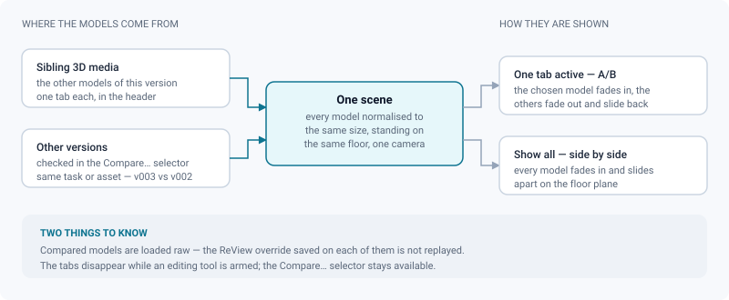
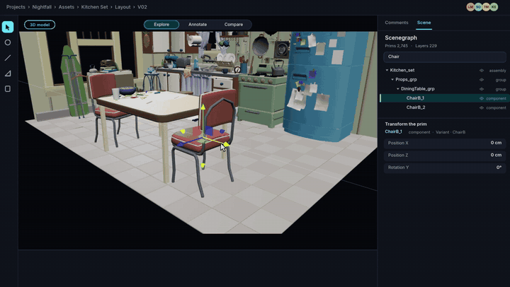
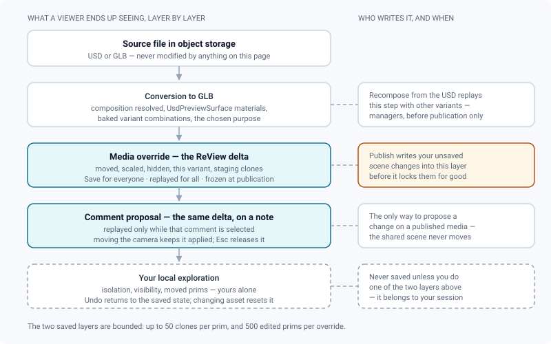
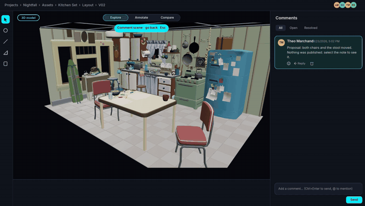

# 3D review

*A DCC-style viewport for models and USD scenes: navigation, scene graph, ReView overrides, inspection, comparison and lighting.*

> Updated: 2026-09-24

3D media open in a Three.js viewer built to feel like a DCC viewport rather than a web
preview: you orbit and fly, you select a prim, you switch a variant, you put a gizmo on
something and move it. Nothing you do here touches the delivered file — every change is a
delta ReView stores next to the media and replays.

All four media types share the same five places — mode switch, tool rail, options bar,
inspector dock, bottom row. See [The review workspace](review-workspace.md) for the layout,
the modes and the keyboard map; this page covers what is specific to 3D models.

The mode switch is short here, because a mode that already had a switch of its own does not need
a second command in the header:

| Mode | How you enter it |
|---|---|
| **Explore** | the first segment, `1` — the resting state, and the only mode a client is served |
| **Clean up** | the second segment, `2`, or any of `T` / `R` / `S`. The segment appears only when the gizmos have somewhere to write: the right to edit the version transform, or a USD scene graph to override |
| **Staging** | the **Staging** switch of the *Camera* panel (*Framing* group), which arms the whole camera workshop |
| **Annotate** | the *Annotate* button of the comment composer, or a tool letter (`P`, `X` or `I`) |

## Opening a 3D media

GLB is served directly. **glTF**, **FBX**, **OBJ**, **COLLADA**, **STL** and **USD**
(`.usd`, `.usdc`, `.usda`, `.usdz`, plus zipped folders) are converted to GLB at upload. USD
goes through Blender, so composition, `UsdPreviewSurface` materials, variants and `UsdSkel`
animation are preserved — see [USD & 3D conversion](../admin-guide/3d-usd.md) for the
worker-side setup.

Three ways to hand over a USD scene:

- **Single file** — drop a `.usd`, `.usdc`, `.usda` or `.usdz`. A `.usdz` already carries its
  textures, so nothing else is needed.
- **Scene with external assets** — zip the whole folder (root layer, referenced layers,
  textures) **keeping the relative paths intact**, and upload the `.zip`. ReView finds the
  root layer on its own, even when the archive holds several `.usd*` files; the *Info* panel
  then shows which one it opened.
- **Missing textures** — anything the scene references but the archive does not contain is
  simply not applied. The model still displays, and the *Info* panel warns about it: the
  **unresolved references** are counted and the first paths are listed, so you can see which
  texture or layer was left out instead of guessing why the asset looks grey. Re-upload a
  complete archive to fix the look.

A 3D media also gets a **thumbnail rendered server-side**, right after upload or right after
the GLB conversion finishes — a headless Blender render on a fixed three-quarter view. Lists,
kanban cards, playlists and dailies therefore show the asset without anyone having to open
the review first. The job never touches the media status and never delays publication; when
the worker image ships without Blender, the tile is filled by the first person who opens the
review instead. See [Spatial thumbnails](../admin-guide/spatial-thumbnails.md).

## Navigating the viewport

Orbit by dragging, zoom with the wheel, pan with the middle button. **Hold the right mouse
button** for free flight: the mouse looks around, `W`/`A`/`S`/`D` move (physical key
positions, so `Z`/`Q`/`S`/`D` on an AZERTY keyboard), `E` goes up and `Q` down, the wheel
sets the flight speed and `Shift` multiplies it by five. Releasing the button hands the orbit
back with the target placed in front of the camera. While you fly, the keyboard belongs to the
flight: no tool letter arms anything, so `S` moves you backwards instead of arming the scale
gizmo. A **brief** right-click — pressed and released on the spot, under a quarter of a second —
is not a flight: it opens the prim menu on the object you aimed at.

Every model is **normalised** on load — its largest dimension is brought to a common size and
the bottom of its bounding box is put on the floor plane, so whatever rested on the ground in
the source scene rests on the ground here, and two assets of very different scales are
comparable side by side. The **ground grid** that materialises that plane is a switch in the
*Scene* panel (*Guides → Ground grid*); the choice is remembered in your browser, for every
spatial media.

| Key | Action |
|---|---|
| `H` | Home view — facing the model, target at its centre |
| `F` | Fit the selection, or the whole model when nothing is selected, keeping the view direction |
| `Alt`+`1` … `Alt`+`9` | Recall a saved view |
| Right mouse button held | Free flight |

- **Saved views** — the *Camera* panel keeps up to **nine shared camera poses**. The bookmark
  button stores the current view and the `×` on a chip removes it (managers only); anyone
  recalls one by clicking its chip, or with `Alt`+`1` to `Alt`+`9`. The bare number keys
  belong to the mode switch in every viewer, so the recall sits under `Alt` and all nine views
  stay reachable from the keyboard. As with free flight, the key is read by its **position**,
  so the digit row works whatever the layout. Saved views are persisted with the media and
  replayed for everyone.
- **Turntable** — auto-rotation around the target, with an axis and a speed in °/s (1 to 180),
  in the *Scene* panel. A session-only inspection preview: nothing is saved, the model is
  untouched.
- **Section plane** — also in the *Scene* panel: clip the model along an axis, type or drag
  the plane position, flip which side is kept. Session-only and non-destructive — but it is
  captured with a comment, so a colleague opening your note sees the same cut.

> [!TIP]
> Numeric values (exposure, focal length, plane position, angles) all use the same field:
> drag the label horizontally to scrub the value, or click and type it. There are no sliders
> anywhere in the dock.

## Comparing models, inside and across versions

When more than one model is in play, the header grows a row of **tabs** — one per model, plus
**Show all** — and comparison happens inside a single scene with a single camera, so turning
around one model turns around all of them.

Two things feed that row:

| Source | How it gets there |
|---|---|
| The other 3D media of the **current version** | automatically, as soon as they are `READY` |
| Models of **other versions** of the same task or asset | you check them in the **Compare…** selector at the right of the header — up to three |

The selector hides itself when the task or asset carries a single version. Checking a version
resolves its first 3D media and loads it straight away, so `v003` against `v002` — the most
common review gesture there is — costs one click.

- **One tab active** cross-fades to that model; the others fade out and slide back to the
  origin.
- **Show all** fades everyone in and slides them apart along the floor, evenly spaced.

> [!IMPORTANT]
> Compared models are loaded **raw**: the ReView override saved on each of them (moved prims,
> variants, hidden branches) is *not* replayed. The comparison is about the geometry as
> delivered, not about someone else's staging. The tabs also disappear while an editing tool
> is armed, so a gizmo can never act on a model you only meant to look at.

## The scene graph, and the ReView override

USD media open with a **scene graph** in the *Scene* panel: the real prim tree of the scene,
read from the analyser rather than from the glTF nodes. Prims that exist but are not rendered
(inactive variant, filtered purpose) appear greyed out; prims carrying variant sets show a
`var` badge; a very large scene shows a *Tree truncated* notice at the bottom.

### Selecting

- **Click** a prim in the tree, or click the object in the viewer. The selection is outlined —
  every mesh under the selected prim, so selecting a group highlights the whole branch.
  Clicking empty space clears it. Dragging orbits as usual: only a click that does not move
  selects.
- Clicking in the **viewer** selects the **component**, not the single mesh under the cursor:
  the ray hits `.../ChairB_1/Geom/seat`, and what gets selected is the chair — the nearest
  ancestor whose USD `kind` is `component`. That is the level a set dresser thinks in. Click a
  row in the **tree** and you get exactly that row, as always.
- **`Alt`+click in the viewer** goes finer: it selects the exact prim under the cursor, for
  when the note is about one part of the object. A scene with no model hierarchy (no `kind`
  authored), a tree truncated before the component, or a component that carries no geometry of
  its own all fall back to the exact prim — a click never comes back empty.
- **`Ctrl`/`⌘`+click** (tree or viewer) toggles a prim in the selection; **`Shift`+click** in
  the tree selects a range. The gizmo then transforms the **whole group** around its common
  centre, as one undo step.
- The **padlock** on a row makes a prim unpickable in the viewer — the tree still selects it,
  and unlocks it. Locking a component protects it whichever of its meshes you aim at. Objects
  that are not currently drawn are never picked and never outlined.
- The **search field** at the top of the tree matches **prim names** and unfolds only the path
  leading to each match — searching `table` shows the table, not everything bolted to it. A
  query containing a `/` is read as a path instead, and then matches whole paths. The rest of
  the tree keeps the folds you gave it, and so does the query: both survive a trip to another
  dock panel, and are cleared only when you move to another media.

### Acting on a prim

| Gesture | What it does |
|---|---|
| Eye on the row | Hide or show the prim — its children go with it; a prim hidden by a parent is greyed and cannot be re-shown on its own |
| `Alt`+click the eye | **Isolate** — everything else is hidden, DCC style |
| `F` with a prim selected | Fly the camera to it and frame it |
| `F` with the pointer **over the scene graph** | **Reveal** the selected prim instead: the tree unfolds down to it, lifting the search if it was hiding it. The camera does not move |
| Right-click a row, **or the object in the viewer** | The prim menu below (a *brief* right-click: dragging or holding the button stays flight) |
| `T` / `R` / `S` | Move, rotate or scale the selected prims — the letters reach the **Clean up** gizmos from any mode, the gizmo appears on the geometry, and the delta goes into the ReView override |
| `Delete` | **Hide** the selected prims, as many as are selected, in one step. It hides exactly what is outlined — the component when you picked in the viewer, the exact prim after an `Alt`+click or a click in the tree — and writes it into the ReView override. Nothing is removed from the USD file, which is never rewritten; a staging clone is not hidden this way, it is deleted from its own menu |
| `Ctrl`/`⌘`+`Z`, `Ctrl`+`Y`, `Ctrl`+`Shift`+`Z` | Undo and redo what you just did to the scene — a hide, a gizmo move, a group transform — in the order you did it. One keystroke reaches one history: a drawing in progress takes it first, the viewer's own history otherwise, and the curve editor keeps `Delete` for its selected keys while it is open |

The prim menu carries the **variant sets** of the prim *and of its ancestors* — you click a
mesh, but the variant is authored higher up, and that is where it has to be written — then
*Duplicate*, *Align* (with two or more prims selected: min, centre or max on a world axis,
plus *Distribute* from three), *Hide* / *Show*, *Isolate* and *Reset this prim*. Opened from
the viewer rather than from the tree, it also offers *Fit the view to it* — there, the camera
is the context. A clone row gets its own short menu: *Duplicate*, *Delete*.

**Switching a variant is instant**: every option baked into the converted file is already
there, so nothing is reconverted and it works on published media too. An option that was not
baked is disabled and says why — *Option not baked in the conversion* — as is a combination
that exists only on paper, because the conversion composes each option with the defaults
rather than with every other option. Both point at the same fix: recompose the scene.

**Duplicate** creates a **staging clone** — a copy of the prim's geometry handled entirely by
the override, with no reconversion. Clones appear as child rows with a `clone` badge, are
selectable and movable like prims, can be deleted from the row or the menu, and travel with a
comment or the saved override like any other scene change.

### Where a change is written

Everything you change is a **ReView override** — a lightweight delta applied when the scene
loads (moved here, scaled, hidden, this look, this clone). The USD or GLB file itself is
never modified. The delta can live at three levels:

1. **The media's override.** Saved before publication by someone who can manage the media:
   the footer of the scene graph shows *Undo* and *Save for everyone* as soon as something is
   pending. It is frozen at publication and replayed for every viewer as the default scene.
2. **A proposal attached to a comment.** Whatever you changed travels with the comment and is
   replayed only when that comment is selected — this is how a reviewer suggests a change on a
   published asset without altering the shared scene. Moving the camera hides the comment's
   drawing but **keeps its scene applied**, so you can inspect the proposal from any angle; a
   floating button, or `Esc`, returns to the default scene. After publication the footer of
   the scene graph says so plainly: *Attached to the next comment*.
3. **Your local exploration.** Never saved unless you do one of the two above. *Undo* returns
   to the saved state, and switching to another asset of the version resets it.

An override holds at most **500 edited prims**, and **50 clones per prim** — enough for
set-dressing notes, not for instancing a crowd.

> [!WARNING]
> Pressing *Publish* writes your unsaved scene changes into the media's override, and then
> locks them. Check the tree before you publish: variants, hidden branches and moved prims
> that were only meant to be an experiment become the scene everyone opens.

## Inspecting the model

### Render modes

The **Render** popover in the **top-left corner of the viewer** offers five modes, as a row of
icons (hover for the name): **Shaded**,
**Wireframe**, **Normals**, **Matcap** and **UV checker**. Matcap replaces every material
with a neutral clay ball, which is how you judge a silhouette without the textures arguing
about it; the UV checker maps a coloured chequerboard so stretched or badly oriented UVs show
up as distorted squares. The override is non-destructive whatever the mode: the original
materials are restored when you return to Shaded, and the file is never touched.

A **Rig skeleton** switch overlays the bones, drawn through the geometry, to debug skinning;
it follows the animation. The row only appears on rigged models.

These settings used to be a *Display* tab of the dock — at the far side of the window, behind a
fold, for switches you try in bursts (shaded → wireframe → matcap → shaded) while your eyes are
on the geometry. The tab is gone; the popover holds the same content, rendered by the same
component as the splat viewer's own **Render** popover, so a setting added to one arrives in
both or in neither.

### File variants and embedded cameras

When the converted file declares them, the *Render* popover adds a *File variants* group — the
group is hidden entirely when the model has neither:

- **Material variants** (`KHR_materials_variants`) — a dropdown switches the whole model
  between authored looks (colour options, for instance). The swap is non-destructive.
- **Embedded cameras** — cameras authored in the file are offered as a list; picking one moves
  the review camera to that viewpoint, with its position, aim and field of view.

### The technical sheet

The *Info* panel opens with the **live render** counters — meshes, triangles, vertices,
materials — then the **technical sheet**: the file name, the **source format**, the
**conversion** that produced the displayed GLB, the UV sets and the glTF extensions. A
`native` badge next to the conversion means the full USD toolchain was used, so
`UsdPreviewSurface` materials and variants were preserved rather than approximated.

A **Textures** group follows, one row per texture channel of the file (base colour, normal,
roughness, metalness, AO, emissive, alpha, bump, displacement) with a thumbnail, the material
carrying it and its pixel dimensions. This is where a 64×64 base colour, or a normal map that
is really a colour map, becomes obvious. Models without textures — a sculpt, a blocking pass —
simply do not get the group.

The *Scene* panel carries the **performance** counters instead: fps, draw calls, triangles
drawn and estimated texture memory, with a warning above the triangle budget. They are only
measured while that panel is open, so an idle dock costs nothing.

### When nothing moves, nothing is redrawn

The viewport used to redraw sixty times a second for as long as it was open — identical frame
after identical frame. A model left on screen during a meeting kept a laptop's fan running for
an image nobody was changing. It now draws **on demand**: an orbit, a zoom, a pan, a resize, a
flight, a playing animation clip, a turntable, a camera animation, a gizmo, any change you make
from the dock. Damping is included, so a released orbit still coasts to its stop.

With the scene genuinely still, the viewport settles to a heartbeat of **eight frames a
second**. That heartbeat is what makes the saving safe rather than clever: anything arriving
late — an HDRI finishing its download, a baked variant, the model you are comparing against —
appears within an eighth of a second instead of waiting for you to touch something.

The **performance counters of the *Scene* panel are the deliberate exception**. While they are
on screen the viewport is put back to full rate, because a frame counter that lowers the rate
it measures ends up measuring its own presence. The fps you read there is what the machine can
do with this model, which is the only number worth comparing between two versions or two
workstations.

### How big is it?

Normalisation makes framing consistent and sizes meaningless, so the *Info* panel answers the
question separately, in a **Dimensions** group:

| Row | What it says |
|---|---|
| Width (X) · Height (Y) · Depth (Z) | The bounding box **of the file**, converted with the scene's `metersPerUnit` |
| **Real size** | Puts the model back at the scale of its own file instead of the normalised size — the preference survives a change of media and is re-applied to the next model you open |
| **Measure between two points** (the ruler button) | Click two points on the surface; the distance appears in the panel. A third click starts a new segment |

The measured length reads the scale actually applied to the model, so measuring in real size
or in normalised size gives the same answer — as it should.

## The USD scene sheet, and recomposing from it

On a USD media the *Info* panel adds a **USD scene** group describing what the converter
actually opened and composed:

| Row | Why it is there |
|---|---|
| **Unresolved references** | The count, then the first paths that were missing from the archive. Without it, a model arrives grey with no explanation |
| **USD root layer**, **Default prim** | Which layer of the archive was opened, and where the scene starts |
| **Up axis**, **Scene unit** | Metre, centimetre, millimetre, or the raw `metersPerUnit`. The viewer normalises anyway — this is what you quote back to whoever exported the scene |
| **Layers**, **Prims** | The size of the composed stage |
| **Purpose** | Render, Proxy or Guide — what the conversion kept |
| **Animation** | `start → end`, with the fps when the file declares one |
| **Rig** | Present when the scene carries `UsdSkel` skinning |
| **Variant sets** | Each set with the value currently in place; when the converter could not apply the selection that was asked for, the group says so |

**Recomposing** re-runs the conversion through an overlay layer with another **purpose**
(Render, Proxy or Guide) and a different option for each variant set. The original USD file is
never modified — that is why it stays available after publication; only someone who can manage
the media sees it.

It lives in the *Scene* panel, in a **Recompose the USD scene** group right under the scene
graph: pick the purpose, pick an option per variant set, then press **Recompose from the USD**.
The variant list scrolls on its own, so the button stays where you left it however many sets the
scene exposes. *Recompose from the USD* at the bottom of the *Info* panel is a shortcut to that
group, next to the sheet that describes the same variants.

This used to be a modal dialog. It was centred with no height limit and no scrolling, so a
production scene with dozens of variant sets ran off both edges of the window — half the lists
and the submit button out of reach, by wheel or by keyboard — and its overlay made the viewer
untouchable, exactly when you want to orbit the scene you are recomposing. In the dock it sits
beside the viewport instead: you change a setting, you fly around, you look.

## Lighting & environment

The *Lighting* panel exists on 3D models only — a splat carries its own baked light.

| Control | Range / default |
|---|---|
| **HDRI environment (image lighting)** | The studio library, or *None* — see [HDRI library](../admin-guide/hdri-library.md) |
| **Exposure** | EV, −5 to +5 |
| **Y rotation** | 0° to 360° |
| **HDRI as background** | Off — the environment lights the model without appearing behind it |
| **Shadow ground** | An invisible plane under the model that catches its shadows and grounds it visually |

A reviewer's adjustments are **session-only**. Someone who can manage the media saves them
with **Default lighting of the project**, and from then on they are replayed for everyone who
opens that media; the bin button next to it clears the saved lighting. When a media has no
lighting of its own, the **project default** applies — set in *Project → Settings → Default 3D
lighting*. Failing that, the viewer falls back to neutral studio lighting.

The panel also repeats the project's OCIO **Display** and **View** as a read-only badge:
colour management is inherited from the project, never set per review. See
[Colour management](../admin-guide/color-management.md).

## Camera, frame and animation clips

- Review cameras use a **focal length in millimetres on a fixed 36 mm sensor**, adjustable
  from 7 to 400 mm in the *Camera* panel, with a **tilt** around the view axis. The tilt holds
  while you fly: hold the right button and walk with `ZQSD`/`WASD`, the horizon stays where you
  set it.
- The viewer fills the space and a **letterbox guide** shows the delivery aspect resolved from
  the pipeline settings. Annotations are anchored to that frame, so they line up for every
  reviewer whatever their window size. The aspect itself is a read-only readout.
- A **camera object** can be placed in the scene, oriented with a gizmo and animated in the
  **Staging** mode, which the switch of the same name in the *Camera* panel arms; a
  picture-in-picture window shows its point of view. Everything about it
  is on [Camera animation](camera-animation.md).
- A **whole-model transform** — `T` move, `R` rotate, `S` scale in the **Clean up** mode, with
  undo and redo, and numeric fields for the three Euler angles and a uniform scale — orients
  and scales the asset before publication. That transform is stored on the *version* and is
  locked by the publish lock. With prims selected, the same gizmo writes into the ReView
  override instead.

Models that carry **animation clips** (skeletal rigs, morph targets, transforms) get their own
track in the bottom transport — a track switch on the left chooses between the *Camera* track
and the file's clips:

| Control | Detail |
|---|---|
| Play / pause | Disabled when the file carries no clip (*This file carries no animation.*) |
| Scrubber | Click anywhere to jump; `←` / `→` step by 5 % of the clip |
| Readout | `time / duration`, in seconds |
| Speed | 0.1× to 4× |
| Loop | On or off |
| Clip selector | Shown from two clips; switching **cross-fades** while playing |

Skinning is reliable: rigs are normalised without their animation fighting the framing, and
skinned or morphed meshes stay visible throughout the motion, with no culling pop.

## Painting on the surface

An area is not a point. The **surface brush** (`P`) paints a stroke that sticks to the geometry,
in **Annotate**, next to the **stroke eraser** (`X`) that takes one stroke back per click. It is
the same tool the splat viewer carries, with the same options bar — four ink colours, a thickness
from 1 to 32 px, undo, redo and clear — and the same gesture, described in full on
[Splat review](review-splat.md#annotating-brush-pin-camera). Two things are proper to a model:
the ray follows the **mesh**, so a stroke lands on the face you can see rather than on a bounding
box, and a stroke sitting flat on a surface is drawn slightly in front of it so it cannot flicker
in and out of the geometry it describes.

Strokes are stored in **object space**: they follow the prim if it is moved, and they replay for
every viewer of the comment. They are an annotation, never an edit — the model is not touched.

> [!NOTE]
> The *Annotate* button of the composer now arms the **mode**, not just the flat pencil. Before
> this, clicking it on a scene armed a 2D drawing layer over the whole frame with its default
> pencil and nothing else: the rail stayed in *Explore*, so the brush, the eraser, the pin and
> their settings were nowhere to be found, and the layer swallowed the clicks meant for the
> surface. Arming a scene tool puts the flat pencil away for the same reason — one of them has
> to have the pointer.

## Pinning a point, and what a comment replays

The **pin** answers "which face exactly?", and it answers it several times over: one comment
can carry a whole list of numbered points.

Arming the tool **is** placing. It sits on the rail in **Explore** (as *Point of interest*) and
in **Annotate** (as *Pin*), both under `I`; the moment it is armed the viewer takes over — a
banner reads *Click the surface to place the point*, the cursor becomes a crosshair, and the
point lands where you click. There is no second button to press. A click in empty space places
nothing and says so; a drag stays an orbit; `Esc` hands the rail back to the resting tool.

Keep clicking and the points stack up, numbered in the order you placed them. While the comment
is still being written, each badge is live: drag one to move its point, click one to jump to its
row, and the row's cross removes it. Every point takes a remark of its own, and images of its
own — the same thumbnails and carousel as any comment attachment.

Sending produces **one** comment carrying the whole set. Its remarks are copied into the body,
numbered, so the client portal, the note export and the ShotGrid bridge need no special case.
Reading it back, the numbered rows sit under the text: click a number and the camera flies to
that point. Points are stored in **object space**, so the replay holds for every viewer, and
follows the object if it is moved.

The same tool, the same badges and the same rows work on a gaussian splat: there is one
implementation, not two.

Selecting the comment later brings everyone back to those points — and to the rest of what you
were looking at:

| A 3D comment carries | Replayed when the comment is selected |
|---|---|
| The camera view | The viewpoint you were on |
| The **display mode** | Shaded, wireframe, normals, matcap or UV checker |
| The **section plane** | Active or not, axis, position, flip |
| The **HDRI lighting** | Environment, exposure, rotation, background, shadow ground |
| The surface pins | The numbered points on the geometry |
| The **surface strokes** | What the brush painted, on the faces it was painted on |
| A scene proposal | The prim override described above |
| A camera animation | Played back, from Staging |
| 2D drawings | Anchored to the delivery frame |

That list is the point of the feature: "look at what I see" used to land the reader on the
right camera in front of a different render — shaded instead of wireframe, section closed,
another HDRI.

## The dock, panel by panel

| Panel | What is in it |
|---|---|
| **Camera** | Focal length in mm (7–400) · tilt · saved views with their `Alt`+*n* chips · delivery aspect (read-only) · fit and home · the **Staging** switch · Orbit preset · Clear the presentation |
| **Lighting** | HDRI, exposure, Y rotation, HDRI as background, shadow ground · save or clear the project default · OCIO display and view |
| **Scene** | USD scenegraph (search, eye, padlock, right-click, *Undo* / *Save for everyone*) · **Recompose the USD scene** · ground grid · section plane · turntable · performance counters |
| **Info** | Live render counters · technical sheet · dimensions, real size and the measure tool · USD scene sheet · textures · a shortcut to **Recompose from the USD** |
| **Export** | Original file · **Import an animation** (glTF/GLB, or an Alembic camera exported to JSON samples) · **Camera animation (glTF)** · **Capture the view** |

Camera import and export are detailed on [Camera animation](camera-animation.md) and
[Alembic camera import](../admin-guide/3d-alembic.md).

*Capture the view* takes a render of its own rather than a picture of your window: it renders the
delivery frame — the area the letterbox guide draws, without the bands — at the delivery
resolution, at least 1920 px wide, and writes a lossless PNG. The ground grid is hidden for that
one frame, so the image carries the asset and not the orientation helper. This is unrelated to the
media thumbnail, which stays a small JPEG (see
[Spatial thumbnails](../admin-guide/spatial-thumbnails.md)).

> [!NOTE]
> The *Review notes* group of the Export panel — the CSV and the printable sheet described in
> [Exporting review notes](exporting-notes.md) — is not wired on 3D media, nor on splats. To
> get the thread of a 3D asset out of ReView today, export it from a video or image media of
> the same shot, or from the playlist that carries it.

## Use cases

### A modelling review on a hero asset

Open the model, `H` for the home view, and go around it by dragging. Open the **Render** popover
at the top left of the viewer and take it to **Wireframe** to check the topology density on the
silhouette, then to **Normals** to catch the inverted face nobody noticed in the DCC, then to
**Matcap** to look at the shape alone once the textures stop flattering it. Nothing you do here is written to the file — the
mode override is restored the moment you go back to Shaded. Arm the **Pin** with `I`, click
the bad face, and the modeller lands on it from the comment, in the same render mode you were
using.

### Is v003 actually better than v002?

Open `v003`, take **Compare…** in the header and check `v002`: its model is loaded into the
same scene and shown straight away. Flick between the two tabs to cross-fade on a fixed
camera — that is the comparison that shows a silhouette change. Then take **Show all** and
orbit around both at once to compare proportions. Remember that both are shown as delivered:
no override, no staging.

### The texturing does not hold up close

Switch to the **UV checker**: a chequer that stretches into rectangles on the sleeve tells you
the unwrap is the problem, not the map. Then open the *Info* panel and read the **Textures**
list — a 4K normal map next to a 128×128 base colour explains the softness without opening the
source file, and the thumbnails show at a glance which channel was plugged where.

### "How tall is this prop, actually?"

Open *Info*, read **Width / Height / Depth**: they are the bounding box of the file, converted
with the unit the USD declares. If the numbers are absurd, the export used the wrong unit —
that is the conversation to have, and the *Scene unit* row of the USD sheet is your evidence.
Turn on **Real size** to see the asset at its own scale next to the grid, and use the **ruler**
to measure the door frame it is supposed to fit through.

### The prop is in the wrong place, and you can prove it

The set dressing puts a crate through a wall. Select the crate in the scene graph, press `T` —
which arms the move gizmo and the Clean up mode with it — and drag it where it should be. If the
media is not published yet, *Save for everyone* makes that the scene everybody opens. If it is published, do not fight the
lock: send the move as a **comment proposal** — the delta travels with your note and is
replayed only when someone selects it, so the published asset stays exactly as delivered.

### Choosing between two authored looks

The USD carries a `lookVariant` with *clean* and *dirty*. Right-click the prim in the tree —
or the object itself in the viewer — and switch: the option is already baked into the
converted file, so the change is instant and works on published media. If the combination you
want was not baked, the menu says so; recompose from the *Scene* panel, just under the tree.

### Lighting a whole show the same way

Set the HDRI, the exposure and the rotation once on a representative asset, then put the same
values in *Project → Settings → Default 3D lighting*. Every 3D media of the project that has
no lighting of its own opens with it. Reviewers can still tweak their own session without
disturbing anyone.

### Checking an animated rig

Switch the bottom transport to the model's clip track, play, and turn on the **rig skeleton**
in the *Render* popover: the bones are drawn through the geometry, so a shoulder that collapses
at frame 40 is visible rather than deduced. Cross-fading between clips while playing lets you
check a transition without reloading.

## Troubleshooting

**"3D conversion in progress…"** The worker has not finished converting the file to GLB.
Reload in a moment.

**"3D model cannot be displayed: the file could not be converted to GLB."** The conversion
failed. The reason reported by the worker — a missing USD asset, a refused archive, a missing
tool — is printed underneath, and anyone who is not a `CLIENT` gets a *Restart the conversion*
button. If the reason points at your file, fix it and re-upload; a GLB or glTF always loads.

**Nothing renders and the viewer stays black.** The viewer needs WebGL. Check that hardware
acceleration is enabled in the browser and that the tab has not lost its GL context after a
long session; reloading the page rebuilds the scene.

**The model is grey, or a texture is obviously missing.** Open the *Info* panel: the **USD
scene** group lists the unresolved references, that is, the files the scene points at but the
archive did not carry. Zip the folder again with the relative paths intact and re-upload it.
When there is no unresolved reference and the model is still grey, look at the **conversion**
row instead — without the `native` badge, materials were approximated.

**A variant option is greyed out or marked as not baked.** The conversion only bakes the
combinations it was asked for. Recompose the scene from the *Scene* panel with that selection —
the original file is untouched, so this works on published media too. If the USD scene group says
the selection was not applied, the converter that ran does not handle variants at all.

**Moving a prim is refused, or nothing saves.** Saving the media's override needs both the
right to manage the media and an unpublished version. After publication the override is
frozen; the scene graph footer says *Attached to the next comment*, which is exactly what you
should do.

**The model floats above or sinks into the grid.** Models are normalised with the bottom of
their bounding box at ground level. A stray helper object or a wide bounding box in the source
scene will therefore shift what "the ground" means — clean the export, or hide the offending
prim in the scene graph.

**There is no Compare… selector in the header.** The task or asset carries a single version.
The tabs for the models of the *current* version appear on their own as soon as there are two.

**The comparison tabs vanished.** An editing tool is armed. Go back to Navigate (`V` or `Esc`),
or leave the Clean up mode, and they come back.

**The mode switch has only one segment, or none at all.** *Clean up* is drawn only when its
gizmos have somewhere to write — the right to edit the version transform, or a USD scene graph
to override — and a switch with a single segment switches to nothing, so it is not drawn. There
is no *Staging* segment in any case: that mode is armed by the switch of the same name in the
*Camera* panel.

**A number key changes mode instead of recalling a saved view.** The bare digits are the mode
switch, in every viewer and with nothing else on them. Saved views answer to `Alt`+`1` to
`Alt`+`9`, and only for a slot that actually holds a view: with two views saved, `Alt`+`3` and
beyond stay silent.

**The bookmark button is greyed out.** The nine slots are all taken. Remove a view with the `×`
on its chip to free one.

**The pin does not land where I click.** It lands on the first surface the click hits: a click
past the silhouette, or on a prim that is hidden or not currently drawn, places nothing and
keeps the previous point. `Esc` disarms the tool if you changed your mind.

**The asset tile is empty in the project lists.** The server-side thumbnail is rendered on its
own queue and skipped rather than retried forever when the worker image has no Blender — see
[Spatial thumbnails](../admin-guide/spatial-thumbnails.md). Opening the review once fills the
tile from your own viewport.

## Related pages

- [The review workspace](review-workspace.md)
- [Camera animation](camera-animation.md)
- [Splat review](review-splat.md)
- [Annotations & comments](annotations-and-comments.md)
- [Upload & publishing](upload-and-publishing.md) — the publish lock
- [USD & 3D conversion (admin)](../admin-guide/3d-usd.md)
- [Alembic camera import (admin)](../admin-guide/3d-alembic.md)
- [HDRI library (admin)](../admin-guide/hdri-library.md)
- [Spatial thumbnails (admin)](../admin-guide/spatial-thumbnails.md)
