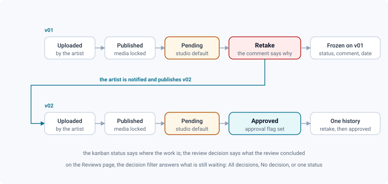

# Review decisions & approvals

*Recording what a review concluded on a version — customisable statuses, and a history that never changes.*

> Updated: 2026-08-23

A **review decision** is the studio's answer to one question: what did we conclude about
this version? It is deliberately distinct from the task's kanban status. The kanban says
*where the work is*; the decision says *what the review concluded*. A shot can sit in
`In progress` on the board while its v01 carries a retake and its v02 an approval — those
are two different facts, and conflating them loses both.

Decisions drive the approval circuit — pending, retake, new version, approved — and every
one of them is kept. Nothing overwrites anything.

## The studio's vocabulary of statuses

Decision statuses are **customisable per studio**, in *Admin → Review contexts →
Statuses*. A fresh instance creates the classic set on first access:

| Status | Colour | Flags | Meaning in the shipped set |
|---|---|---|---|
| **Pending** | `#F5A623` amber | *default* | Nothing has been concluded yet |
| **Approved** | `#2ECC71` green | *approval* | Good to go |
| **Retake** | `#E74C3C` red | *retake* | Back to the artist |
| **CBB** | `#3498DB` blue | — | Could be better: accepted, with reservations |

Each status carries a name (**40 characters maximum**), a hex colour `#RRGGBB`, an order
in the list, and up to three flags:

| Flag | What it controls | Constraint |
|---|---|---|
| *default* | The status pre-selected when a version has no decision yet | **One at a time** — setting it on one status clears it everywhere else |
| *approval* | What downstream integrations read as "good to go" | Any number of statuses may carry it |
| *retake* | What downstream integrations read as "do it again" | Any number of statuses may carry it |

The approval and retake flags are what leaves the application — the webhook payload, the
ShotGrid push, the badge colouring logic. Put them on the statuses that really mean those
two things, whatever you decided to call them. A studio that renames *Approved* into
*Final delivery* keeps every integration working, as long as the flag travels with the
name.

> [!IMPORTANT]
> Creating, editing, reordering and deleting statuses is reserved to `ADMIN` — the routes
> behind the Statuses tab require that role, not merely supervision of a project. Reading
> the list is open to everyone: it feeds badges and filters for the whole studio.

A status that has already been used by a decision **cannot be deleted**. The request is
refused with *This status is used by N decision(s) — it cannot be deleted*, and the count
tells you how much history depends on it. Rename it instead, or move it to the end of the
list to take it out of circulation; existing decisions keep pointing at it and stay
readable.

### On a project linked to ShotGrid

The picker only offers the statuses that have a **mapping** on the site. Posting a
decision the remote site does not know would go nowhere, and mixing two vocabularies gives
you two "approved" and three "retake" in the same list. The restriction applies when the
connection is active *and* a version status mapping exists; a standalone project, or a
connection with no mapping yet, keeps the full set. See
[ShotGrid integration](../admin-guide/shotgrid-integration.md).

## Taking a decision

Two surfaces, and no button anywhere else — the interface stays uncluttered by putting the
gesture where the version already is:

| Where | Gesture | Notes |
|---|---|---|
| A **version card**, on a task or asset page | Right-click → *Review decision…* | The entry reads *Decision history…* if you cannot decide |
| The **review header**, while reviewing a media | The clipboard button | It carries the version's current decision as a badge |

Both open the same dialog:

- the **current decision** at the top, as a coloured badge, or *No decision yet*;
- the available statuses as **coloured chips**, pre-selected on the current decision, or
  on the studio default when there is none;
- an optional **comment**, up to **2000 characters**, kept visible in the history;
- *Set the decision*, and below it the full history, newest first.

Deciding is reserved to supervision. The chips are shown to `SUPERVISOR` and `ADMIN`;
everyone else opens the same dialog and reads the history — which is the point, the record
is public even though the act is not. On the API side the check is finer: it uses your
**effective role on that project**, so a member promoted to supervisor on this project
alone is allowed to decide there. See
[per-project roles](../admin-guide/project-organization.md#per-project-roles).

> [!TIP]
> During a live review session the clipboard button stays available, so decisions can be
> dispatched as the room walks the playlist. See
> [Playlists & live review sessions](playlists-and-live-review.md).

## What one decision sets off

Recording a decision is not a badge change. In a single gesture it does all of this:

- appends to the version's **history**, kept forever — who, when, which status, which
  comment — newest first;
- updates the version's **current decision**: the badge you see on version cards, in the
  review header, and in the Reviews list;
- writes an entry in the **audit log**, under the action `version.decision`, carrying the
  status name and the comment;
- **notifies the version's author**, unless they took the decision themselves;
- **notifies the watchers** of the version, its shot or its asset — excluding both the
  person who decided and the version author, who already has their own notification;
- publishes the `review.decision` **event** with the status name and its approval/retake
  flags;
- posts a line in the **team messaging** channel;
- **queues a push to ShotGrid** on a linked project. It is queued rather than awaited on
  purpose: an artist should not wait for a remote site, and an outage there must not fail
  the review.

None of that modifies an earlier version. The retake you put on v01, its comment and its
date stay on v01 forever — three months later you can still read why it came back.

## Where a decision goes after that

A decision is one of the few facts in ReView that several other systems consume. It leaves
the application through three doors.

| Door | What carries the decision | Who reads it |
|---|---|---|
| **Notes export** | The `decision` column of the CSV, next to every note of the media — the version's current decision at export time | Production, in a spreadsheet |
| **Event feed** | The `review.decision` event, stored per project and delivered to subscribed webhooks | Integrations, the v1 API |
| **ShotGrid** | The `version-status` push, translated through the project's version status mapping | The show's own tracker |

The event is stored **scoped to its project**, which is what makes a per-project
subscription possible: an integration can follow one show rather than the whole studio. The
webhook payload contains the version id and name, the project id, the status name, the
`isApproval` and `isRetake` flags, the comment and the user who decided. See
[which events actually fire](../admin-guide/identity-and-api.md#which-events-actually-fire)
and [Exporting review notes](exporting-notes.md).

> [!NOTE]
> Integrations should branch on the **flags**, never on the status name. Names are the
> studio's vocabulary and change with the show; `isApproval` and `isRetake` are the stable
> part of the payload.

## Finding what is still waiting

The Reviews page carries a **decision filter** — *All decisions*, *No decision*, or any
single status — which combines with the project, media type and published/draft filters.
It is the fastest way to answer "what is still waiting on me" (*No decision*) or "what did
we retake this week" (the retake status).

A filter combination worth keeping can be saved from the **Saved views** menu next to the
filters, and reapplied in one click on your next pass.

## API

Decisions are first-class in both APIs, for a studio that drives approvals from a pipeline
tool rather than by hand:

| Call | Purpose | Who |
|---|---|---|
| `POST /api/versions/:id/decision` | Record a decision — body `statusId`, optional `comment` (2000 characters max) | Effective supervisor or admin on the project |
| `GET /api/versions/:id/decisions` | The full history of a version | Any project member |
| `GET /api/review-statuses?projectId=` | The status list, narrowed to the ShotGrid mapping when the project has one | Any authenticated user |
| `POST /api/v1/versions/:id/decision` | The same act from a service token | Token with the `versions:write` scope, `SUPERVISOR` or `ADMIN` |

See [v1 integration](../api/v1-integration.md).

## Use cases

### The normal circuit

1. The artist uploads a version and publishes it.
2. The supervisor reviews the media, puts **Retake** from the clipboard button, and writes
   what has to change in the decision comment. The artist is notified.
3. The artist uploads **v02** and publishes.
4. The supervisor puts **Approved**. The badge turns green everywhere the version appears,
   the watchers hear about it, and the approval flag propagates to whatever is plugged in
   downstream.

Nothing in that circuit modifies the earlier version, which is what makes the history worth
reading later.

### Clearing the queue on Monday morning

Open the Reviews page, filter on *No decision*, and go down the list. Every media you open
already has the clipboard button in its header, so deciding never means going back to a
task page. What is left in the filter at the end of the pass is exactly what you did not
get to. Save that filter as a view and the next pass starts in one click.

### A studio that does not say "CBB"

Some studios work with *Pending / Approved / Retake*, others with a five-step ladder,
others in their own language. Rebuild the list in *Admin → Review contexts → Statuses*, put
the *approval* flag on whatever you call "final" and the *retake* flag on whatever you call
"back to the artist", and order them the way the pipeline reads. Existing decisions keep
pointing at their status, which is why a used status can be renamed but not deleted.

### A show run from ShotGrid

Link the project, map the ReView statuses onto the site's version statuses, and the picker
narrows to that mapping. From then on the decision travels: the supervisor decides in
ReView, the queue pushes it to ShotGrid, and production reads the show's usual vocabulary.

### Handing the week's decisions to production

Export the notes of the playlist, the shot or the cut you screened. The CSV carries a
`decision` column beside every note, so the spreadsheet that lands in the production
meeting says both what was said and what was concluded, without a second pass in the
application.

## Troubleshooting

**The status list is shorter than what the admin configured.** The project is linked to
ShotGrid, and only the mapped statuses are offered. Add the mapping on the site, or in the
project's ShotGrid settings.

**"This status is used by N decision(s) — it cannot be deleted".** History wins. Rename or
reorder it; if you want it out of circulation, move it to the end of the list.

**I can open the decision dialog but not the chips.** Deciding is restricted to
`SUPERVISOR` and `ADMIN`. Everyone else gets the read-only history — which is the point:
the record is public, the decision is not.

**Two statuses both look like the default.** Only one can be. Setting the *default* flag on
a status clears it on every other one, so if the list still shows two, reload — the screen
is stale, not the data.

**The badge did not change on the task page.** The badge shows the *latest* decision on the
version. Reload the page if you decided from the review header in another tab.

**The author was not notified.** They are not notified when they decide themselves, and
watchers exclude both the actor and the author, to avoid sending the same person two
notifications for one event.

**ShotGrid still shows the old status.** The push is queued, not awaited. Give the queue a
moment; if it stays behind, the ShotGrid page explains how to read a refused write.

## Related pages

- [The review workspace](review-workspace.md)
- [Annotations & comments](annotations-and-comments.md)
- [Exporting review notes](exporting-notes.md)
- [Playlists & live review sessions](playlists-and-live-review.md)
- [Projects & pipeline](projects-and-pipeline.md)
- [Kanban & tasks](kanban-and-tasks.md)
- [ShotGrid integration (admin)](../admin-guide/shotgrid-integration.md)
- [Identity, API & audit (admin)](../admin-guide/identity-and-api.md)
- [Admin overview](../admin-guide/overview.md)
