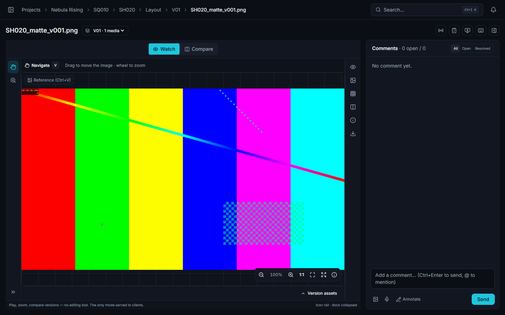

# Image review

> Updated: 2026-08-22

> All four media types share the same workspace — mode switch, tool rail, options bar,
> inspector dock, bottom row. See **[The review workspace](review-workspace.md)** for the
> layout, the modes and the keyboard map; this page covers what is specific to images.

Image media open in a pan-and-zoom viewer with pixel-anchored annotations, pinned reference
images and version comparison. An image has two modes in the switch — **Watch** (`1`) and
**Compare** (`2`) — plus the Annotate mode, armed from the comment composer, the viewer's
right-click menu or any drawing tool letter.

## Viewer

- **Zoom** with the wheel, centred on the cursor, from 0.1× to 20×. The percentage is shown
  in the control cluster at the bottom-right of the picture.
- **Pan** by dragging: the left button pans whenever you are not annotating, and the middle
  or right button always pans, so you can move the picture without dropping the drawing
  tool.
- The control cluster carries **zoom out**, the current percentage, **zoom in**, **`1:1`**
  (one image pixel = one screen pixel), **fit** (the image contained in the viewport, the
  state it opens in) and **fullscreen**. There is no double-click shortcut for fit, and the
  rail's `F` / `H` keys are a 3D and splat feature.
- A small **info** panel folds out with the image's native resolution and its format.
- The background is a grid that follows the pan and the zoom, so you can tell transparent
  areas from white ones and judge how far you have zoomed.

## Annotations

Drawing tools work like in video review (see
[Annotations & comments](annotations-and-comments.md)) — freehand, rectangle, ellipse,
arrow, polygon, text, move a shape, eraser, with ink, thickness and opacity in the options
bar.

Annotations are anchored to the **image pixels**: they share the picture's zoom and pan
transform, so they stay exactly on the detail they were drawn on however far you zoom, and
they survive a window resize or a fullscreen switch. There is no delivery-aspect letterbox
guide on images — that is a 3D and splat feature. You can draw up to half an image width
beyond each edge, which is what makes an arrow pointing in from outside possible.

## Reference images

An image review can carry reference pictures pinned **inside** the picture plane — they
zoom and pan with it, so "this corner should look like that" holds at any zoom level.

- **Paste with `Ctrl+V`** anywhere outside a text field, or use the *Add / paste* button at
  the top-left of the viewer. Up to twelve per comment.
- While the comment is still being written, a reference is outlined in the accent colour
  and can be **dragged** by its body and **resized** by the handle at its bottom-right
  corner.
- Sending the comment freezes them: from then on they are shown **only when that comment is
  selected**, at the place you put them. Historical references that carry no comment stay
  visible all the time.
- Anyone who can manage the media can delete a persisted reference with the bin icon.

Pasting inside the comment composer instead attaches the image to the comment as a normal
attachment — the two gestures are distinct on purpose.

## Comparison

The **Compare…** selector in the header lists the other versions of the same task or asset.
An image comparison is exclusive: checking a version replaces the current B, it does not
build a grid (the 2×2 grid is a video feature).

Three modes, chosen from the *Wipe bar* tool (`W`) options or the *Comparison* panel of the
dock:

- **Side by side** — the two versions in two panes, with the zoom and the pan replicated
  between them, so both stay on the same detail.
- **Wipe** — the two pictures superimposed, split by a bar. The round grip at the centre of
  the bar slides it, the smaller handle further along rotates it (the angle is shown next to
  it), and a double-click on the centre grip snaps it back to vertical and centred.
- **Diff** — |A − B| computed in the browser. Click the `×n` chip to amplify the result
  (×1 → ×2 → ×4 → ×8 → ×16), and the flame icon for a false-colour heatmap running from
  dark where nothing changed to red where the difference is largest.

Wipe and diff take over the whole viewer, which is why zoom and pan are suspended in those
two modes: go back to side by side to inspect a detail.

## Colour management

The **Image** panel of the dock is the colour panel, and on a still image it changes the
pixels you see:

| Control | What it does |
|---------|--------------|
| **Display** / **View** | The couple taken from the project's OCIO config. It defaults to the project setting; picking another one here only affects your screen. |
| **Exposure** | A gain in stops, applied in linear light **before** the display transform. Drag the `EV` label to scrub, or type a value. |
| **Gamma** | A viewing gamma applied **after** the display transform, to read into the shadows. |
| **Display transform** | The on/off switch. Turn it off to see the raw file and compare. |
| **Reset** | Back to the project's display and view, exposure 0, gamma 1. |

**These are reading preferences.** Nothing is sent to the server, the media file is never
rewritten, and other reviewers keep their own settings — the panel says so under the
controls. The settings follow you from one media to the next in this browser.

What is actually applied, and what is not:

- **Still images only.** Video, 3D and Gaussian splat keep their own display; the panel
  says so when you open it on those media.
- The transform runs on the GPU (WebGL) over the image you are looking at, so zoom, pan,
  annotations and pinned references are unaffected.
- **Exports keep the original.** *Export the view as PNG*, *Download the image* and the
  contact sheet all use the untransformed file.
- The **comparison overlays** (wipe, difference, side by side) show raw images: comparing
  two versions means looking at both in the same state.
- The panel reports where the transform comes from — *LUT baked from the studio OCIO
  config* (exact) or *Colorimetric conversion only* (gamut and transfer function, without
  the rendering curve). If it says no LUT is baked, exposure and gamma still work, but the
  display/view itself is not applied; see
  [Colour management (admin)](../admin-guide/color-management.md).

## Right-click in the viewer

- *Annotate* / *Finish the annotation*, and *Hide the annotation* when one is displayed.
- *Copy the image*, *Download the image*, and *Download the annotated image* when
  annotations are visible.
- *Image → thumbnail* for anyone who can manage the media.
- *Add to playlist…* for every role except `CLIENT`.

## Fullscreen & viewing modes

The unified fullscreen keeps the header, the viewer and the comments panel visible, so you
can keep annotating. **Theatre mode** (the screen icon in the review header) hides the app
shell and the comments and fills the window; `Esc` leaves it. The comparison panes have
their own fullscreen control.

## Use cases

### A matte painting note the artist can act on

The client says the sky is "too heavy". Open the plate, press `E` to arm the ellipse — that
alone switches you into Annotate — circle the cloud bank, then `A` for an arrow pointing at
the horizon line, and write the note. Before sending, paste the reference frame from the
edit with `Ctrl+V` and drag it next to the area concerned. The artist opens the comment and
gets the circle, the arrow and the reference exactly where you left them.

### Checking a texture fix at 1:1

Zoom straight to `1:1` from the control cluster: one image pixel is now one screen pixel, so
what you are judging is the actual resolution rather than a browser resample. Pan with the
middle button while keeping the eraser armed if you are cleaning up a previous note.

### Before / after on a retouch

Check the previous version in *Compare…* and start in **side by side** — the two panes share
zoom and pan, so you inspect the same 300 % detail in both. When the difference is too fine
to see, switch to **Diff** and push the amplification: a two-pixel edge shift that is
invisible side by side shows up as a bright outline.

### Approving a still for delivery

A supervisor puts the review decision from the clipboard button in the header, with a
comment. The badge follows the version everywhere it appears, and the version author is
notified. See [Review decisions & approvals](review-approvals.md).

## Troubleshooting

**Zoom and pan do nothing.** You are in wipe or diff comparison, which replace the viewer.
Switch back to side by side, or close the comparison.

**`Ctrl+V` did not pin my screenshot.** The paste only becomes a pinned reference when the
focus is outside a text field. With the caret in the composer, the same paste attaches the
image to the comment instead. Twelve references per comment is the ceiling.

**My reference image vanished after I sent the comment.** That is by design: once sent, a
reference belongs to its comment and is only drawn when that comment is selected.

**The dock has a Guides panel but nothing appears on the image.** The composition guide
overlay is drawn on the video viewer only.

**The colour panel says no LUT is baked.** The display and view you picked need a
rendering curve (an ACES output transform), and the worker of this instance has no
OpenColorIO tooling installed, so ReView refuses to guess the curve. An administrator can
enable it — see [Colour management](../admin-guide/color-management.md#enabling-exact-ocio-baking).
Until then, `Raw` and `Un-tone-mapped` views, exposure and gamma still work.

**Moving the exposure takes a moment to show.** The transformed image is re-encoded after
each change; on a 6K plate that is a fraction of a second, and the previous image stays on
screen meanwhile.

**`F` and `H` do nothing.** Fit and 1:1 are in the control cluster on images; the rail's
view actions and their shortcuts only exist on 3D and splat media.

**The comparison says there is no image to compare.** The version you checked carries no
image media — pick another version, or check what its assets actually are in the *Version
assets* drawer.

## Related pages

- [The review workspace](review-workspace.md)
- [Video review](review-video.md)
- [Annotations & comments](annotations-and-comments.md)
- [Review decisions & approvals](review-approvals.md)
- [Colour management (admin)](../admin-guide/color-management.md)
