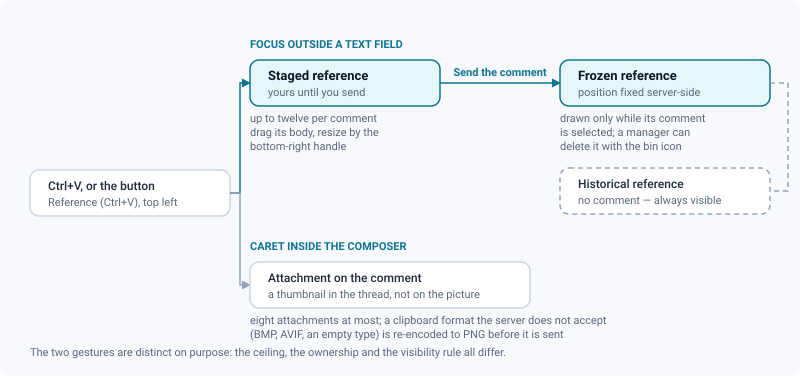
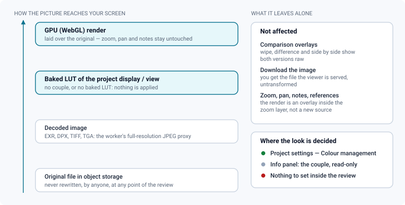

# Image review

*Pan-and-zoom stills with pixel-anchored notes, pinned references, version comparison, and a colour panel that changes what you see and nothing else.*

> Updated: 2026-08-23

An image media opens in a pan-and-zoom viewer with annotations anchored to the pixels,
reference pictures pinned inside the picture plane, and A/B comparison against the other
versions of the same task or asset. The mode switch offers two entries — **Watch** (`1`) and
**Compare** (`2`) — and the Annotate mode, which is not listed there: it arms itself from the
comment composer, from the viewer's right-click menu, or from any drawing tool letter. A
`CLIENT` never sees the switch and stays in Watch.

Everything the four media types have in common — mode switch, tool rail, options bar,
inspector dock, bottom row, comments — lives in
**[The review workspace](review-workspace.md)**. This page is what an image does differently.

## What the viewer is actually showing

A browser decodes a handful of image formats and refuses the ones a studio delivers. So the
worker builds a **full-resolution JPEG proxy** for the production formats, and it is that
proxy the viewer, the wipe and the difference read. The delivered file is never rewritten and
never deleted.

| Delivered as | What the viewer receives |
|---|---|
| `.jpg`, `.jpeg`, `.png`, `.webp`, `.gif`, `.bmp` | The file itself, untouched |
| `.exr` | A full-resolution JPEG proxy, decoded with the sRGB transfer curve applied — without it a correct render comes out nearly black |
| `.dpx`, `.tif`, `.tiff`, `.tga` | A full-resolution JPEG proxy, decoded as the file is encoded |
| Anything wider or taller than **16 384 px** | The same proxy, scaled down to that limit — JPEG cannot go past 65 535 px a side, and a scan panorama can |

The **info** button of the control cluster folds out the native resolution and the format.
The format is read from the delivered file name, so a plate delivered in EXR reads `EXR` even
though the pixels on screen come from its proxy.

> [!NOTE]
> A DPX in log or Cineon encoding comes out flat, because that proxy applies no curve of its
> own. Opening it up is the job of the [colour panel](#colour-management), not of the proxy.

An image sequence is not an image media: a thousand EXR frames become a single media of kind
`VIDEO` and are reviewed in the video workspace. See [Image sequences](image-sequences.md).

## Moving around the picture

- **Zoom** with the wheel, centred on the cursor, one notch at a time (about 1.15× per
  notch), between **0.1×** and **20×** of the fitted size.
- **The percentage is measured against the fit**, not against the native resolution: `100 %`
  is the picture contained in the viewport, which is where a review opens. Press `1:1` on a
  6K plate displayed at a third of its size and the readout jumps to about `300 %`.
- **Pan by dragging**: the left button pans whenever you are not annotating; the middle and
  right buttons always pan, so the picture moves without dropping the armed tool.
- The **control cluster** at the bottom right of the picture carries, in order: zoom out, the
  current percentage, zoom in, **`1:1`** (one image pixel per screen pixel), **fit**,
  **fullscreen**, **info**. There is no double-click shortcut for fit.
- The background is a light grid anchored to the picture — it follows the pan and scales with
  the zoom, which is how you tell a transparent area from a white one and how far you have
  zoomed without reading the number.
- **Fullscreen** (the cluster button) expands the whole review block: header, viewer and
  comments stay, so you keep annotating. **Theatre mode** (the screen icon in the review
  header) hides the application shell and the comments panel; `Esc` leaves it.
- `Tab` folds the inspector dock away and brings it back, `Esc` disarms the current tool.

> [!TIP]
> `F` and `H` do nothing here. Fit and 1:1 live in the control cluster on flat media; the
> rail's view actions and their shortcuts only exist on 3D and Gaussian splat media.

## Annotating a still

Arm the annotation from the composer's pencil, from the right-click menu, or simply by
pressing a tool letter — a drawing letter switches the workspace into Annotate on its own.

| Tool | Key | What it does |
|---|---|---|
| Navigate | `V` | Rest state: drag to move the picture, wheel to zoom |
| Freehand | `D` | Freehand stroke |
| Rectangle | `R` | Box in an area |
| Ellipse | `E` | Circle a detail |
| Arrow | `A` | Point at an element |
| Polygon | `G` | One click per vertex, double-click to close |
| Text | `T` | Drop a label |
| Move a shape | `M` | Pick up a shape of the stroke in progress |
| Eraser | `X` | Click or drag to erase |
| Zoom | `Z` | Rail entry shared with video; on a still the wheel and the cluster do the zooming |
| Wipe bar | `W` | Compare mode only — opens the comparison options |

The options bar carries the ink (five swatches plus a free colour picker), the **thickness**
(1 to 24 px), the **opacity** (10 to 100 %), undo, redo, clear all, and a count of the shapes
already attached to the comment being written.

Annotations are anchored to the **image pixels**: they share the picture's zoom and pan
transform, so a stroke stays on the detail it was drawn on however far you zoom, and it
survives a window resize or a fullscreen switch. You may draw up to **half an image width
beyond each edge**, which is what makes an arrow pointing in from outside possible. There is
no delivery-aspect letterbox guide on an image — that is a 3D and splat feature — and the
dock's *Guides* switches draw on the video viewer only.

> [!IMPORTANT]
> A stroke belongs to the comment you are writing. It is sent with it, and from then on it is
> only drawn when that comment is selected. Strokes already sent can no longer be edited. See
> [Annotations & comments](annotations-and-comments.md).

## Reference images

An image review can carry reference pictures pinned **inside** the picture plane — they zoom
and pan with it, so "this corner should look like that" holds at any zoom level.

- **Paste with `Ctrl+V`** anywhere outside a text field, or use the *Reference (Ctrl+V)*
  button at the top left of the viewer. Up to **twelve** per comment.
- A pasted reference lands just off the **right edge** of the picture, about three tenths of
  an image wide, each new one offset a little from the last — so it never hides the frame you
  are looking at until you move it.
- While the comment is still being written, a reference is outlined in the accent colour:
  **drag it by its body**, **resize it by the handle** at its bottom-right corner, or drop it
  with the bin icon.
- **Sending the comment freezes them.** Their position is fixed server-side, and from then on
  they are shown only when that comment is selected. Historical references that carry no
  comment stay visible all the time.
- Anyone who can manage the media can delete a persisted reference with its bin icon.

Pasting with the caret **inside** the comment composer does something else: the image becomes
an ordinary attachment on the comment, shown as a thumbnail in the thread. Eight attachments
maximum, and a clipboard format the server does not accept — BMP, AVIF, an empty type — is
re-encoded to PNG before it is sent.

> [!NOTE]
> The two gestures are distinct on purpose: the ceiling, the ownership and the visibility rule
> all differ. If a paste did not land where you expected, look at where the caret was.

## Comparing two versions

The **Compare…** selector in the review header lists the other versions of the same task or
asset. An image comparison is **exclusive**: ticking a version replaces the current B rather
than building a grid — the 2×2 grid is a video feature. A version that carries no image media
is reported as such instead of opening onto an error.

Three modes, chosen from the *Wipe bar* tool (`W`) options or from the *Comparison* panel of
the dock:

| Mode | What you get |
|---|---|
| **Side by side** | Two panes. Zoom and pan are replicated both ways, so both stay on the same detail. The B pane has its own header (name, *Wipe*, *Difference*, close) and its own control cluster — its fullscreen button expands that pane alone. |
| **Wipe** | The two pictures superimposed, split by a bar. The round grip at the centre slides it, the smaller handle further along rotates it (the angle is shown next to it), and a double-click on the centre grip snaps it back to vertical and centred. |
| **Difference** | \|A − B\| computed in the browser. The `×n` chip cycles the amplification (`×1`, `×2`, `×4`, `×8`, `×16`) and starts at **×4**, because a raw difference is usually invisible. The flame icon switches to a false-colour heatmap, dark where nothing changed and red where the difference is largest. |

Wipe and difference **replace** the viewer, which is why zoom and pan are suspended in those
two modes: go back to side by side to inspect a detail. The B pane is never annotatable, and
it always shows the raw picture.

> [!TIP]
> A two-pixel edge shift that is invisible side by side shows up as a bright outline in
> **Difference** at `×8`. Push the gain before concluding that nothing moved.

## Colour management

The **Image** panel of the dock is the colour panel, and on a still image it is the one place
in the review that changes the pixels you look at.

| Control | What it does | Default |
|---|---|---|
| **Display** / **View** | The couple taken from the project's OCIO config. Picking another one here affects your screen only, and only couples that exist in the project's config are honoured. | *Project default* |
| **Exposure** | A gain in stops, applied in linear light **before** the display transform. Drag the `EV` label to scrub, or type a value. | `0`, range −6 to +6, step 0.05 |
| **Gamma** | A viewing gamma applied **after** the display transform, to read into the shadows. | `1`, range 0.2 to 4, step 0.01 |
| **Display transform** | The on/off switch, and it governs the whole stack: turned off, exposure and gamma stop applying too and you are back on the raw file. | On |
| **Reset** | Back to the project's display and view, exposure 0, gamma 1. Greyed out when nothing is set. | — |

Under the controls, the panel says where the transform comes from. The message is worth
reading before doubting the image:

| Message | What it means |
|---|---|
| *LUT baked from the studio OCIO config.* | Exact: the display/view couple was baked by the worker's OCIO tooling |
| *Colorimetric conversion only — no rendering curve.* | Gamut and transfer function only, without the tone map an ACES output transform would add |
| *No baked LUT for this view yet…* | The view needs a rendering curve and the worker has no OpenColorIO tooling installed. Exposure and gamma still work; see [Colour management](../admin-guide/color-management.md#baked-luts) |
| *No colour configuration on this project.* | Nothing to apply. Exposure and gamma still work |
| *Display transform off — you are seeing the raw file.* | The switch is off |
| *This browser has no WebGL: the pixels are left as they are.* | The render needs a GPU context this browser does not give; the raw file is shown instead |
| *Applied to still images; video and 3D keep their own display.* | You opened the panel on another kind of media |

> [!IMPORTANT]
> **These are reading preferences.** Nothing is sent to the server, the media file is never
> rewritten, and other reviewers keep their own settings — the panel says so under the
> controls. They are stored in your browser and follow you from one media to the next.

Two consequences worth knowing:

- The transform runs on the GPU and the result is laid **over** the original inside the zoom
  layer, so zoom, pan, annotations and pinned references are untouched by it. Scrubbing the
  exposure re-renders after a short pause (about a seventh of a second), and the previous
  image stays on screen meanwhile.
- The **comparison overlays** — wipe, difference, side by side — show raw images. Comparing
  two versions means looking at both in the same state.

## Right-click, exports and notes

The viewer's right-click menu, on an image, offers:

- *Annotate* / *Finish the annotation*, and *Hide the annotation* when one is displayed.
- *Copy the image* — into the clipboard, re-encoded as PNG.
- *Download the image*, and *Download the annotated image* when annotations are visible (that
  one is flattened to JPEG, strokes burnt in).
- *Image → thumbnail*, for anyone who can manage the media.
- *Add to playlist…*, for every role except `CLIENT`.
- *Review notes* — the same export submenu as the dock: CSV and printable sheet for this
  media. See [Exporting review notes](exporting-notes.md).

The dock's **Export** panel is deliberately short on a still: *Original file* and the review
notes, under the hint *Only the original file can be exported here*. The two other buttons
you may know — *Displayed view (PNG)* and the contact sheet — belong to video media, where a
frame has to be captured and a timeline sprite exists to compose from.

> [!WARNING]
> Both download paths hand you **the picture the viewer is served**, saved under the
> delivered name. On a plate delivered in EXR, DPX, TIFF or TGA that is the JPEG proxy, not
> the original file — which stays in storage and is reachable through the API
> (`downloadUrl` on `GET /api/media/:id`). Neither download carries the exposure, the gamma
> or the display transform.

## In a live review session

An image review joins a synchronized room like any other media, from the antenna button of
the review header. What the driver does is replayed on every screen:

- **Zoom and pan**, broadcast at the image rate — **4 Hz** by default, configurable per media
  type in *Admin → Settings* between 1 and 30 Hz. The view is normalised, so the room lands
  on the same detail whatever the size of each window.
- **The comparison**: the B version, the mode (side by side, wipe, difference) and the wipe
  bar's position and angle.
- Any local zoom or pan by a pilot or co-pilot **takes the wheel** on the spot — no handover
  ceremony. Sync from anyone who is not the current driver is dropped by the server.

The shared pointer is drawn in the video viewer only; on a still, the room follows the frame
you are on and the zoom you are at. See
[Playlists & live review sessions](playlists-and-live-review.md).

## Use cases

### A matte painting note the artist can act on

The client says the sky is "too heavy". Open the plate, press `E` to arm the ellipse — that
alone switches you into Annotate — circle the cloud bank, then `A` for an arrow pointing at
the horizon line, and write the note. Before sending, paste the reference frame from the edit
with `Ctrl+V` and drag it next to the area concerned. The artist opens the comment and gets
the circle, the arrow and the reference exactly where you left them.

### Checking a texture fix at 1:1

Press `1:1` in the control cluster: one image pixel is now one screen pixel, so what you are
judging is the actual resolution rather than a browser resample. Pan with the middle button
while keeping the eraser armed if you are cleaning up a previous note.

### Reading into the blacks of an EXR without asking for a new render

Open the *Image* panel, drag the `EV` label up two stops and watch the shadow detail arrive.
Toggling **Display transform** off puts you back on the raw file — exposure included — which
is the honest before/after. Nothing of this reaches the artist: if the shot is genuinely too
dark, that is a comment, not a slider.

### Before / after on a retouch

Tick the previous version in *Compare…* and start in **side by side** — the two panes share
zoom and pan, so you inspect the same 300 % detail in both. When the difference is too fine to
see, switch to **Difference** and push the amplification.

### Approving a still for delivery

A supervisor issues the review decision from the clipboard button in the header, with a
comment. The badge follows the version everywhere it appears, and the version author is
notified. See [Review decisions & approvals](review-approvals.md).

## Troubleshooting

**Zoom and pan do nothing.** You are in wipe or difference comparison, which replace the
viewer. Switch back to side by side, or close the comparison.

**The image is there but it looks nothing like my render.** Check the colour panel's status
line first. A DPX in log encoding, or an EXR seen without the studio's display transform, is
expected to look wrong — that is what the panel is for.

**`Ctrl+V` did not pin my screenshot.** The paste only becomes a pinned reference when the
focus is outside a text field. With the caret in the composer, the same paste attaches the
image to the comment instead. Twelve references per comment is the ceiling, and the toast
says so when you reach it.

**My reference image vanished after I sent the comment.** By design: once sent, a reference
belongs to its comment and is only drawn when that comment is selected.

**The dock has a Guides panel but nothing appears on the image.** The composition guide
overlay is drawn on the video viewer only.

**The colour panel says no baked LUT.** The display and view you picked need a rendering
curve (an ACES output transform), and the worker of this instance has no OpenColorIO tooling
installed, so ReView refuses to guess the curve. An administrator can enable it — see
[Colour management](../admin-guide/color-management.md#baked-luts). Until then, `Raw` and
un-tone-mapped views, exposure and gamma still work.

**The colour panel says this browser has no WebGL.** A different cause with the same symptom:
the transform needs a GPU context this browser will not give (hardware acceleration disabled,
a remote desktop, a locked-down profile). The raw file is shown, and the panel stops
pretending otherwise.

**Moving the exposure takes a moment to show.** The transformed image is re-encoded after each
change; on a 6K plate that is a fraction of a second, and the previous image stays on screen
meanwhile.

**I downloaded the image and got a JPEG.** Downloads in the review serve the picture the
viewer is served, which is the proxy for a production format. The delivered file is untouched
in storage; fetch it through the API rather than from the viewer.

**Arming the rail's Zoom tool changes nothing.** On a still, zooming is the wheel, the `+` and
`−` buttons and `1:1`. The tool is shared with the other flat viewer and has nothing to add
here.

**`F` and `H` do nothing.** Fit and 1:1 are in the control cluster on images; the rail's view
actions and their shortcuts only exist on 3D and splat media.

**The comparison says there is no image to compare.** The version you ticked carries no image
media — pick another version, or check what its assets actually are in the *Version assets*
drawer of the bottom row.

## Related pages

- [The review workspace](review-workspace.md)
- [Video review](review-video.md)
- [Image sequences](image-sequences.md)
- [Annotations & comments](annotations-and-comments.md)
- [Exporting review notes](exporting-notes.md)
- [Review decisions & approvals](review-approvals.md)
- [Playlists & live review sessions](playlists-and-live-review.md)
- [Colour management (admin)](../admin-guide/color-management.md)
