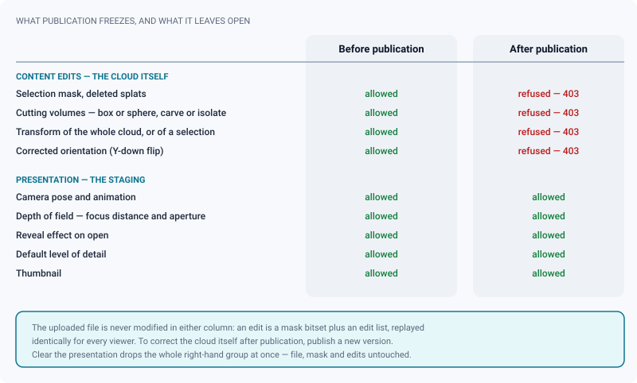

# Gaussian splat review

*Scans in Spark: DCC navigation, non-destructive clean-up, comparison across versions, presentation and a cleaned SPZ export.*

> Updated: 2026-08-23

Gaussian splat media are rendered with **Spark (SparkJS)** inside the Three.js scene, with the
same DCC-style navigation as [3D review](review-3d.md) — plus a full **non-destructive
editor**. A scan arrives dirty: floaters, half a car park behind the wall, an axis convention
nobody agreed on. You clean it here, in front of everyone, and the uploaded file never
changes.

All four media types share the same five places — mode switch, tool rail, options bar,
inspector dock, bottom row. See [The review workspace](review-workspace.md) for the layout,
the modes and the keyboard map; this page covers what is specific to splats. The mode switch
offers **Explore** (`1`), **Staging** (`2`) and **Clean up** (`3`); **Annotate** is armed from
the comment composer or by pressing a tool letter.

## Opening a splat

Splat files are served **as-is** — there is no server-side conversion — and loaded natively by
Spark:

| Format | Notes |
|---|---|
| **PLY** | Text or binary, compressed PLY included |
| **SPZ** | Compact gzip container — the best choice for storage and load time |
| **SPLAT**, **KSPLAT** | Loaded directly |
| **SOG / SOGS** | PlayCanvas self-organizing gaussians, a `.sog` zip bundle — **read** support only; a `.sogs` file is handled as a `.sog` bundle |

Large files stream in with a **real download progress bar** and a percentage, so a heavy scene
shows progress instead of a frozen screen; once the bytes are in, the readout switches to an
indeterminate decoding state.

A splat also gets an automatic **thumbnail**, rendered server-side straight from the file by a
point rasteriser — the splat centres are streamed, sampled and projected on the same
three-quarter view the 3D thumbnails use, so scans and models sit consistently side by side in
a list. It works on `.ply` and `.splat`; the compressed containers (`.spz`, `.ksplat`, `.sog`,
`.sogs`) are deliberately **not** queued, because decoding them approximately would produce a
wrong image nobody would question. Those keep relying on the capture made the first time
somebody opens the review. See [Spatial thumbnails](../admin-guide/spatial-thumbnails.md).

## Navigating the cloud

Orbit by dragging, zoom with the wheel, pan with the middle button. **Hold the right mouse
button** for free flight: the mouse looks around, `W`/`A`/`S`/`D` move (physical key positions,
so `Z`/`Q`/`S`/`D` on an AZERTY keyboard), `E` goes up and `Q` down, the wheel sets the flight
speed and `Shift` multiplies it by five. Releasing the button hands the orbit back with the
target placed in front of the camera.

`F` fits the selection — or the whole visible cloud when nothing is selected — and `H` returns
to the home view. Both answer in every mode, published media included. The **ground grid** is
a switch in the *Scene* panel (*Guides → Ground grid*), remembered in your browser.

The *Display* panel carries what changes the image without changing the data:

| Control | Who sees it | Effect |
|---|---|---|
| **Cloud render mode** — Splats · Ellipses · Points | Only while the editor is mounted (manager, unpublished media) | How each gaussian is drawn; Points is the fastest way to read the structure of a dense scan |
| **Corrected orientation** | Same | Flips the Y-down convention some exporters use — this one *is* an edit, and it is saved with the rest |
| **Inspection colouring** — none · normals · depth | Everyone | A session-local tint, never saved on the media |
| **Real size** | Everyone, once more than one cloud is loaded | Turns off the size unification used by the comparison — see [Comparing splats](#comparing-splats) |

> [!NOTE]
> The render mode and the orientation switch disappear on a published splat, or for anyone
> who cannot manage the media. That is not a bug: the orientation flip is stored with the
> edits, and the publish lock covers it.

## Cleaning up, without touching the file

The original splat file is **never modified**. Every edit is stored as metadata — a selection
mask bitset plus an edit list — and **replayed identically for every viewer**. All of it lives
in the **Clean up** mode (`3`), and only for someone who can manage the media on an
unpublished version.

| Tool | Key | A plain drag | Modifiers and options |
|---|---|---|---|
| **Rectangle** | `B` | Replaces the selection | `Shift` adds, `Alt` removes |
| **Lasso** | `L` | Replaces the selection | `Shift` adds, `Alt` removes |
| **Surface brush** | `P` | Replaces the selection, taking **only splats on the visible surface** | `Shift` adds, `Alt` removes; radius 8–150 px in the options bar |
| **Cutting volume** | `O` | Drops a **box** or a **sphere** | *Dig* removes what is inside, *Isolate* keeps only what is inside; click a chip to attach the gizmo to it; up to 32 volumes per media |
| **Move · Rotate · Scale** | `T` · `R` · `S` | Transforms the **whole cloud** when nothing is selected | Transforms just the **selected subset** when a selection is active; numeric fields in the options bar |

The surface brush is the tool that makes a scan workable: it only takes what is actually
visible, so sweeping over a halo of floaters leaves the wall behind them standing, where a
rectangle would swallow everything.

**Deleting** — `Delete` or `Backspace` hides the selection. Nothing is destroyed: the splats
are masked, and clearing the mask brings them back. The options bar keeps the score, both the
current selection and the running total of masked splats. The stored mask is one bit per
splat, capped at four megabytes, which covers clouds of some thirty million splats.

**Saving** — the commit group at the right of the options bar carries undo, redo and *Save*,
with a dot while something is pending. Saving writes the mask, the subset transforms and the
edit list; from then on every reviewer opens the cleaned cloud. `Ctrl/⌘+Z`, `Ctrl/⌘+Y` and
`Ctrl/⌘+Shift+Z` walk the edit history.

> [!TIP]
> None of these shortcuts fire while you hold the right mouse button (you are flying), while
> the caret is in a field, or while a dialog is open — so `S` never scales the cloud in the
> middle of typing a note.

## What publication freezes

A published media is finished work, so the cloud itself is frozen — the backend refuses every
content edit with a `403`. The **presentation**, on the other hand, is staging rather than
content: it is how the scan is shown, not what it contains, and it stays editable for as long
as the media exists.

That split is the answer to the two questions this page gets asked most:

- *My mask did not save but my camera did.* Correct, and deliberate: two endpoints, two rules.
- *How do I fix the geometry after publishing?* You do not. Publish a new version — that is
  what versions are for. See [Upload & publishing](upload-and-publishing.md).

## Comparing splats

When more than one cloud is in play, the header grows a row of **tabs** — one per splat, plus
**Show all** — and everything happens inside a single Spark scene, every cloud a child of the
same pivot, so they share the orientation flip and the camera.

| Source | How it gets there |
|---|---|
| The other splats of the **current version** | automatically, as soon as they are `READY` |
| Splats of **other versions** of the same task or asset | you check them in the **Compare…** selector at the right of the header — up to three |

The selector hides itself when the task or asset carries a single version.

- **One tab active** fades the chosen cloud to full opacity; the others fade out and slide back
  to the origin.
- **Show all** fades everyone in and slides them apart, the spacing derived from the widest
  visible bounding box.
- **Real size**, in the *Display* panel, turns off the size unification: by default every
  compared cloud is scaled onto the reference's bounding sphere so the shapes can be read
  against each other; turn it on to see the raw scales the files actually carry.

> [!IMPORTANT]
> Compared splats are loaded **raw** — their own mask, cutting volumes and transform are not
> replayed. You are comparing captures, not somebody else's clean-up. That is on purpose: a
> comparison that silently applied four different clean-ups would tell you nothing about the
> scans.

## Annotating: brush, pin, camera

The **Annotate** mode carries 3D tools rather than 2D drawing.

- **3D brush** (`P`) paints a stroke on the surface of the cloud. Four ink colours and a
  thickness from 1 to 5 px in the options bar, with *undo the last stroke* and *clear* next to
  a running count. The stroke is stored in object space and travels with the comment — it is an
  annotation, not an edit, and it never touches the splat data.
- **Pin** (`I`, also on the rail in Explore as *Point of interest*) anchors the comment to a
  point on the surface. Arm it and the viewer takes over: a banner reads *Click the surface to
  place the point*, the cursor becomes a crosshair, and the anchor lands **where you click**.
  A click in empty space places nothing and keeps the previous point; a drag stays an orbit;
  `Esc` disarms. The pin is stored in object space too, so it follows the cloud if the
  transform changes.

A splat comment can carry more than a stroke and a point:

| Attached | Replayed when the comment is selected |
|---|---|
| The camera view | The viewpoint you were on |
| The surface pin | The point on the cloud |
| Paint strokes | The strokes, from any angle |
| A **camera animation** | Loaded into the transport and **played**, from the Staging mode |
| Reference images | Staged in the composer, pinned to the comment |

> [!CAUTION]
> Selecting a comment that carries an animation loads it into the transport and plays it,
> replacing whatever you were authoring and clearing its undo history. Save your presentation
> before you go reading the thread. Details on [Camera animation](camera-animation.md).

## Depth of field, and the presentation

Independently of the content edits, the **presentation** is persisted per media and replayed
identically for every spectator — including a client on a share link who never touches a
control.

| Part | Where it is set |
|---|---|
| Camera pose and animation | The **Staging** mode and its transport — see [Camera animation](camera-animation.md) |
| **Depth of field** | The **Focus** tool (`C`) sets the focus distance on the point you click; the **Aperture** field of the *Camera* panel opens it, from `0` (sharp everywhere) to `0.1` |
| **Reveal on open** | *Scene* panel: fade, sweep or dissolve, with a duration from 0.2 s to 10 s and a *replay* button. Persisted, so it plays for whoever opens the review |
| **Default level of detail** | *Scene* panel, saved with the presentation |

*Clear the presentation* in the *Camera* panel removes the camera pose, the animation, the
depth of field, the reveal effect and the default level of detail in one go, behind a
confirmation. The file, the mask and the edits are untouched.

## Performance

A scan is heavy by nature, so the viewer tells you what it is doing instead of just getting
slower.

- **Level of detail** has four settings in the *Scene* panel: **off** (maximum quality),
  **auto**, **on** (forced) and **stream** (pages fetched on demand). *Auto* is the default: it
  engages when the framerate stays under 15 fps for five seconds and releases when it recovers
  above 25 fps for five seconds, each time with a toast — so the change in image quality is
  never a mystery. A manager can save the chosen mode as the media's default.
- **Edge culling** is disabled by default, which is why nothing disappears at strong zoom; the
  switch is next to the level of detail.
- The *Info* panel keeps the live counters, measured only while it is open:

| Counter | What it tells you |
|---|---|
| **fps** | Whether the scene is actually playable on this machine |
| **Rendered splats** | How many gaussians survive the current level of detail |
| **Total splats** | The size of the cloud as delivered |
| **Hidden splats** | How many the saved mask removes — the size of the clean-up |
| **Draw calls** | The cost of the frame |

## The dock, panel by panel

| Panel | What is in it |
|---|---|
| **Camera** | Focal length in mm (7–400) · tilt · aperture and *focus at click* · delivery aspect (read-only) · fit and home · picture-in-picture switch · Orbit preset · Clear the presentation |
| **Display** | Cloud render mode and corrected orientation (editor only) · inspection colouring · Real size for comparison |
| **Scene** | Ground grid · level of detail · edge culling · reveal effect and its duration |
| **Info** | Live counters · file name and status |
| **Export** | The four entries below |

The Export panel enumerates everything a splat can produce; the viewer's right-click is
reserved for flight, so nothing splat-related hides in a context menu.

| Entry | What it gives you |
|---|---|
| **`.spz` cleaned (edits baked)** | A compact SPZ with the edits applied: masked splats dropped, cutting volumes applied, the global transform baked into each splat |
| **Original file, without edits** | The raw uploaded file |
| **Camera animation (glTF)** | The move you built in Staging, for the DCC |
| **Import an animation** | Reads a camera from glTF/GLB, or an Alembic camera exported to JSON samples |
| **Capture the view** | The current frame, as an image file |

Two limits to know about the cleaned SPZ: only base colour is exported (SH degree 0 —
view-dependent spherical harmonics are not included), and the import orientation flip is *not*
baked, so the file keeps the original axis convention. Generation is entirely client-side and
the file in storage is never touched, so it works after publication too — and it uses the
**saved** edits, not your current unsaved selection.

> [!NOTE]
> The *Review notes* group of the Export panel — the CSV and the printable sheet described in
> [Exporting review notes](exporting-notes.md) — is not wired on splats, nor on 3D media. To
> get the thread of a scan out of ReView today, export it from a video or image media of the
> same shot, or from the playlist that carries it.

## Use cases

### Cleaning a set scan before it goes to layout

The scan arrives with a halo of floaters and half a car park behind the wall. Press `3` for
Clean up, arm the surface brush with `P`, and sweep over the floaters — the brush only takes
what is actually visible, so the wall behind survives. `Delete` hides them. For the car park,
drop a box volume with `O`, set it to *Isolate*, and scale it around the set: everything
outside disappears. Save from the commit group and every reviewer opens the cleaned scan — the
uploaded file is still intact if you got the box wrong.

### A note on a detail nobody else can find

In a point cloud, "the crack near the door" is meaningless. Arm the **Pin** (`I`), click the
crack, write the note. Anyone selecting that comment lands on the point. If the note is about
an area rather than a point, use the 3D brush to paint over it — the stroke sticks to the
surface and reads from any angle.

### Two scanning passes, one decision

The set was scanned twice and the second pass is supposed to be denser. Open one, check the
other version in **Compare…**, and flick between the two tabs on a fixed camera: the coverage
holes show up immediately. Take **Show all** to look at both at once, and turn **Real size** on
if you suspect the two passes were not reconstructed at the same scale. Remember that neither
is showing its clean-up — that is what makes the comparison honest.

### Delivering a clean SPZ to another department

Once the mask and the volumes are saved, take *`.spz` cleaned (edits baked)* from the Export
panel. The masked splats are gone from the file rather than hidden, the transform is baked, and
the result is a fraction of the original size. Note the two caveats: base colour only, and the
original axis convention.

### A scan that crawls on a laptop

Leave the level of detail on *auto*. When the reviewer's machine drops below 15 fps, LOD
engages by itself and a toast says why the image just got softer; when the framerate recovers
it releases. If a particular scene is always heavy, set the level of detail explicitly in the
*Scene* panel and save the presentation — the setting travels with the media. Open the *Info*
panel to see whether the decimation is actually happening: *rendered* well below *total* means
it is.

### A guided tour rather than a free-for-all

A splat scan is impressive and unreadable if everyone navigates it themselves. In **Staging**,
fly to a first viewpoint, press `K`, scrub forward, fly to the next, `K` again, and publish the
presentation: the move plays on its own for every viewer. Add a *reveal on open* and a focus
distance on the subject, and the scan presents itself. See
[Camera animation](camera-animation.md).

## Troubleshooting

**"Splat cannot be displayed: the file could not be loaded."** The format is not one of `.ply`,
`.spz`, `.splat`, `.ksplat`, `.sog`, or the file is corrupt. Re-upload — nothing is converted
server-side, so what you upload is what the viewer has to read.

**Editing tools are missing from the Clean up mode.** Splat editing requires that you can
manage the media *and* that it is not published. After publication the backend refuses every
content edit with a `403`, and the render mode and orientation switch disappear with them.

**"Nothing to export (everything is masked or cropped)".** The saved mask and volumes leave no
splat standing. Check the volume modes: an *Isolate* volume placed outside the geometry keeps
nothing.

**My last selection is not in the exported file.** Exports use the saved edits. Save from the
commit group in the options bar, then export.

**Keyboard shortcuts do nothing.** They are inert while you hold the right mouse button
(flight), while the caret is in a field, and while a dialog is open.

**The camera presentation saved, but the mask did not.** They are two different endpoints with
two different rules: presentation stays editable after publication, content edits do not. If
the media is published, only the presentation will save.

**There is no Compare… selector in the header.** The task or asset carries a single version.
The tabs for the splats of the *current* version appear on their own as soon as there are two.

**The compared splat looks nothing like what its own review shows.** It is loaded raw, without
its mask, volumes or transform. Open it directly to see it cleaned.

**The image got softer on its own.** Automatic level of detail engaged below 15 fps; a toast
said so. It releases above 25 fps, or you can force *off* in the *Scene* panel.

**Splats disappear when I zoom right in.** Turn edge culling back off in the *Scene* panel — it
is off by default precisely because of that.

**The scan tile is empty in the project lists.** Server-side thumbnails are only rendered for
`.ply` and `.splat`; compressed containers wait for the first person to open the review. See
[Spatial thumbnails](../admin-guide/spatial-thumbnails.md).

## Related pages

- [The review workspace](review-workspace.md)
- [3D review](review-3d.md)
- [Camera animation](camera-animation.md)
- [Annotations & comments](annotations-and-comments.md)
- [Upload & publishing](upload-and-publishing.md) — the publish lock
- [Spatial thumbnails (admin)](../admin-guide/spatial-thumbnails.md)
