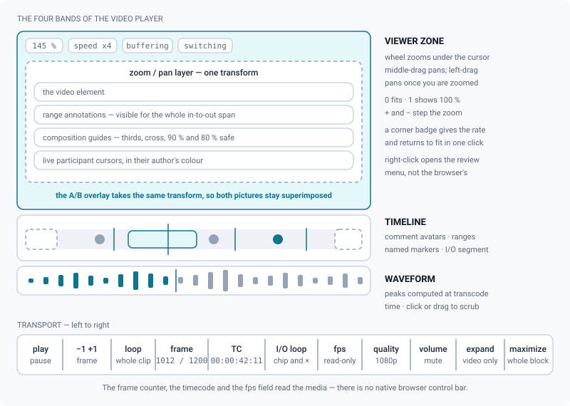
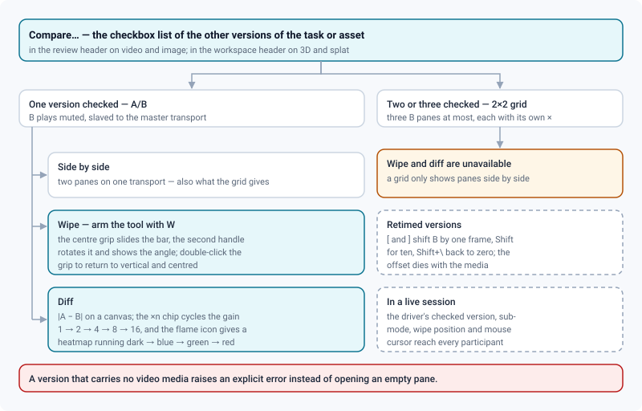
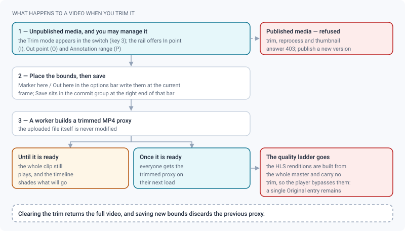

# Video review

*Frame-accurate playback, loops and markers, sound, zoom, A/B comparison and trim — everything specific to video.*

> Updated: 2026-08-23

> All four media types share the same workspace — mode switch, tool rail, options bar,
> inspector dock, bottom row. See **[The review workspace](review-workspace.md)** for the
> layout, the modes and the keyboard map; this page covers what is specific to video.

Open any video media from a project, a task or the Reviews page to enter the video review. The
player is frame-accurate, custom-built — there is no native browser control bar anywhere — and
streams adaptive HLS when renditions exist.

> [!NOTE]
> A shot delivered as an **image sequence** (EXR, DPX, TIFF, PNG, JPEG) is reviewed on this
> very page. The worker assembles the frames into a master and everything downstream — proxy,
> HLS ladder, filmstrip, annotations — behaves as if you had uploaded a movie. The delivery's
> own numbering becomes the counter base, so `plan.1001.exr` really is frame 1001 in the
> transport. See [Image sequences](image-sequences.md).

## Transport, timeline and sound

- **Play / pause** with `Space`, with the button in the transport, or by clicking the picture
  itself. A click that ends a pan does not toggle playback.
- **Frame stepping**: `←` / `→` move one frame, `Shift+←` / `Shift+→` move ten.
- **J / K / L**: reverse shuttle, pause, forward play. Pressing `J` or `L` repeatedly stacks
  speed (×2 / ×4 / ×8, capped at ×8); the current speed shows as a badge on the viewer
  (`◀ ×2`, `▶ ×4`) whenever playback is not normal ×1. Backward playback does not exist in
  HTML5 video — it is simulated frame by frame, so it is smoother on a proxy than on a heavy
  master.
- **`M`** pauses and opens the comment composer at the current frame. On a video `M` belongs to
  the transport, not to the rail: it does not arm *Move a shape*.
- Scrubbing on the timeline is smooth: seeks are coalesced, so a fast drag never leaves the
  player in an inconsistent state.
- The transport shows the **current frame** (offset by the shot's start frame) over the last
  frame, plus a timecode. Annotations and comments are anchored to that frame number.
- The **fps** field next to it is read-only when the framerate was detected from the file, and
  editable when it was not — set it before commenting, since every frame number depends on it.
  A detected rate is corrected on the way in, so `23.98` in the database counts as
  24000/1001 and your frame numbers match the artist's DCC.
- **Hover thumbnails**: moving the cursor along the timeline shows the filmstrip thumbnail for
  that instant, with its timecode underneath. The filmstrip is generated at transcode time; a
  media processed before that feature, or with the sprite disabled, simply has no hover
  preview.
- **Loop playback** (the circular arrow in the transport) repeats the whole clip. It is
  independent of the I/O loop below.
- **Volume and mute** sit at the right of the transport, next to the quality selector.
  Dragging the slider to zero mutes; the speaker button toggles back to the level you had.

**The audio waveform** is drawn as a thin strip between the timeline and the transport. It is
computed once during transcoding — one peak per bar, eight bars per second — and travels with
the media's own response: no extra request, no audio decoded in your browser. The played part
is filled in the accent colour, a hairline marks the playhead, and clicking or dragging on the
strip scrubs like the timeline does. It shows you where the dialogue starts, where it cuts,
and whether the sound sits on the picture.

> [!TIP]
> **Right-click the timeline** for the player's own settings: *Add a marker here…*, *Show the
> waveform*, *Auto-advance*. Each entry only appears when it applies — no marker entry without
> write access, no waveform entry on a silent media, no auto-advance outside a playlist — and
> the two checkboxes are remembered in your browser from one media to the next.

## Loops, ranges and timeline markers

`I` and `O` set the loop in and out points at the current frame; `Shift+I` or `Shift+O` clears
both.

- The **I/O loop chip** in the transport suspends the loop **without removing the points**; the
  small `×` next to it clears them. Setting a new point re-enables the loop.
- Looping only applies **during playback** — manual navigation (pause, stepping, scrubbing) can
  freely go past the out point.
- When a loop is active while you send a comment, the comment carries the **in→out range**: its
  drawings stay visible for the whole range during playback, and the range shows as a coloured
  segment (the author's colour) with handles on the timeline. Click a segment to select the
  comment.

**Timeline markers** are named, coloured, shared with the whole team and persisted on the
media:

| Action | How | Who |
| --- | --- | --- |
| Add | Right-click the timeline → *Add a marker here…*, name it, pick one of six colours | `ARTIST`, `SUPERVISOR`, `ADMIN` |
| Read | Hover a tick for its name and author; click it to seek there | Everyone |
| Rename, recolour, delete | Right-click the tick | The author, or any `SUPERVISOR` / `ADMIN` |

Markers also appear as **clickable separators in the comments panel**, splitting the thread
into sections by timeline position. Changes propagate live: a marker added by someone else
appears without reloading. With **scene detection** enabled in the studio transcoding settings,
markers are placed automatically at the detected cuts.

Annotations themselves are drawn with the tools of the Annotate mode, anchored to the frame,
and shown as author avatars on the timeline. With an I/O loop active, the annotation covers the
whole range. See [Annotations & comments](annotations-and-comments.md).

## Zoom, frame and composition guides

The picture is fitted to the available space at its own aspect ratio, and the annotation
overlay shares exactly the same box — a stroke stays on the pixel it was drawn on, whatever the
window size or the fullscreen mode. (The delivery-aspect letterbox guide is a 3D and splat
feature: a video is shown as it was encoded.)

The player zooms and pans, which is what you need to look at a rotoscoping edge or an aliasing
step up close:

| Gesture | Effect |
| --- | --- |
| Wheel | Zooms around the point under the cursor, `1.15×` per notch |
| Middle-button drag | Pans, at any zoom level |
| Left-button drag on the picture | Pans **once you are zoomed** — at fit, the left button still plays and pauses |
| `0` | Back to a fitted picture |
| `1` | 100 %, one media pixel per screen pixel |
| `+` / `-` | Step the zoom by `1.25×`, centred |

The scale is clamped between `0.25×` and `32×`. As soon as the picture is not fitted, a badge
appears in the top-left corner with the current rate; clicking it returns to fit. The A/B
overlay is transformed identically, so the two pictures stay superimposed to the pixel when you
zoom in on a difference.

> [!WARNING]
> `1` is also the mode key for *Watch*, and the two handlers do not know about each other.
> Pressing `1` in *Compare* or *Trim* will zoom to 100 % **and** drop you back into *Watch*.
> Prefer `0` and the wheel while you are working in another mode.

**Composition guides** — rule of thirds, centre cross, action safe (90 %) and title safe
(80 %) — are toggled from the viewer's right-click menu or from the *Guides* panel of the dock.
The preference is local to your browser and applies to every video you open.

## Playback quality

The quality selector sits at the right of the transport.

- There is **no automatic bitrate switching**. Playback starts locked on the highest available
  rendition, so what the selector shows is always what is being served.
- Changing quality **while playing** takes effect at the next fragment — no buffer hole, no
  sound over a frozen frame. Changing it **while paused** refreshes the displayed frame.
- While a video is still transcoding you can already play the first ready rendition; higher
  qualities appear in the selector on their own as the worker finishes them, keeping your
  position, your playback state and a quality you picked by hand.
- Media segments are served by signed storage URLs. If a signature expires during a long
  session, the player quietly reloads the manifest to get fresh ones — up to three times,
  after which it stops insisting rather than looping.
- A media with no usable HLS ladder shows a single **Original** entry and plays the MP4 proxy.
  Three things cause that: the media was transcoded before the adaptive ladder existed, the
  ladder is disabled in the studio transcoding settings, or **the media is trimmed** — see the
  next chapter but one.

## Comparing versions

Use the **Compare…** selector in the review header — a checkbox list of the other versions of
the same task or asset.

- **One version checked — A/B**: the second version plays muted and synchronised with the
  master. Three sub-modes, from the *Wipe bar* tool (`W`) options or the *Comparison* panel:
  **side by side**, **Wipe** and **Diff**.
- The **wipe bar** carries two handles: the round grip at its centre slides it across the
  picture, and the small handle further along the bar rotates it — the current angle is
  displayed next to it. Double-click the centre grip to snap back to vertical and centred.
- **Two or three versions checked — 2×2 grid**: up to four versions on screen (three B panes
  maximum), all slaved to the master transport. Each pane has its own close button; wipe and
  diff are only available in simple A/B.
- **Diff mode** computes |A − B| in the browser on a canvas. Click the `×n` chip to cycle the
  amplification (×1 → ×2 → ×4 → ×8 → ×16 → back) — the raw difference is often invisible — and
  the flame icon for a false-colour heatmap that runs from dark for no difference through blue
  and green to red for the largest.
- A version that carries no video media raises an explicit error instead of opening an empty
  pane.
- In a **live session**, the driver's comparison (selected version, side / wipe / diff mode and
  the wipe bar position) is replicated to every viewer.

**Retimed versions.** The B pane copies the master's time exactly, which is right until someone
has retimed the shot, lengthened a handle or moved the entry point between v02 and v03. `[` and
`]` shift the B pane one frame earlier or later, `Shift` makes it ten, and `Shift`+`\` returns
to zero; a single toast, replacing itself, announces the current offset. The keys are read by
their **position** on the keyboard, so they work on an AZERTY layout. The offset is capped at
±240 frames, applies to every B pane at once, and is dropped when you leave the media — the
next shot has no reason to share the same conform.

## Trim

A video can be trimmed from the review before it is published.

1. Switch to the **Trim** mode (key `3`).
2. Arm *In point* (`I`) or *Out point* (`O`). The options bar then offers **Marker here** and
   **Out here**, which place the bound at the current frame, plus a `×` that clears both. It
   also summarises the bounds and the number of frames kept. The rail buttons arm the tool; the
   options-bar buttons are what actually write a bound.
3. Save from the commit group at the right of the options bar. The out point must come after
   the in point, or the save is refused with a message.

The worker then produces a **trimmed proxy** and the original file is never modified; the proxy
is served to everyone on the next load. Until it is ready, the out-of-trim regions are simply
shaded on the timeline and the whole clip still plays. Clearing the trim returns the full
video, and saving new bounds discards the previous proxy.

> [!IMPORTANT]
> **A trimmed media loses its quality ladder.** The HLS renditions are built from the whole
> master and carry no trim, so the player deliberately refuses them once the trimmed proxy is
> ready — otherwise your in and out points would have no effect on playback. From that moment
> the quality selector shows a single *Original* entry and the single MP4 proxy plays. It is
> the price of a non-destructive trim, and it is why trimming is a delivery decision rather
> than a review habit.

Trim is only offered to someone who can manage the media, and only before publication — see the
troubleshooting section below.

## Fullscreen, theatre and the detachable player

| Mode | Where | What it does |
| --- | --- | --- |
| **Unified fullscreen** | *Maximize* button, transport | Takes the whole review block — header, viewer, playbar and comments — into browser fullscreen, so you can keep annotating |
| **Video-only fullscreen** | *Expand* button, transport | The picture alone fills the screen; the playbar becomes a translucent overlay that fades out, cursor included, after one second of inactivity. Move the mouse to bring it back |
| **Theatre mode** | Screen icon, review header | Hides the app shell, the review header and the comments panel, and shows the media full-frame *inside the window*. `Esc` leaves it. Not browser fullscreen, so it works when fullscreen is blocked |
| **Detachable player** | Picture-in-picture icon, review header | Pops the video into the browser's own floating window, video only, so you can keep watching while working elsewhere |

**Animated thumbnails**: hovering a video card in the Reviews list cycles through its filmstrip
tiles as a live preview.

## Playing a run of shots

Open a media from a playlist and the review URL carries `?playlist=<id>`. The header then shows
a playlist navigator, and the end of a clip opens the next playable item on its own —
*Auto-advance*, on by default, is the checkbox in the timeline's right-click menu. Versions
whose media you are not allowed to see are skipped rather than opened onto an error, and
navigation **replaces** the history entry, so twenty clips do not leave twenty entries in the
browser's Back button. When the review is driven by a cut (`?timeline=`) instead, the cut leads
and auto-advance stands down: two chains reacting to the same end-of-clip event would navigate
twice.

In a **live session**, the driver's mouse pointer is drawn on every participant's video — in
the driver's own colour, normalised to the media frame, and inside the zoom-and-pan layer, so
it designates the same pixel of the image on every screen at any magnification. It is sent on
its own cadence, around 20 Hz, deliberately faster than the 2 Hz playhead sync: a pointer that
updates twice a second designates nothing. A cursor that has gone still for 2.5 seconds
disappears. If a viewer joins without having interacted with the page, the browser may block
sound: playback starts muted and a sound button appears on the LIVE chip.

See [Playlists & live review](playlists-and-live-review.md) and
[Auto-updating cut timelines](auto-cut-timelines.md).

## Right-click in the viewer

The native browser menu is replaced by a review menu:

- *Annotate* / *Finish the annotation*, and *Hide the annotation* when one is displayed.
- *Play / pause*, *Previous frame*, *Next frame*, *Composition guides*.
- *Copy the frame*, *Download the frame* (JPEG), and *Download the annotated frame* when
  annotations are visible.
- *Export the contact sheet* — a PNG grid built from the timeline filmstrip with a timecode
  under each tile. Only offered when the media has a filmstrip.
- *Copy the link to this frame* — a URL carrying `?frame=N`; opening it seeks straight there.
- *Current frame → thumbnail* for anyone who can manage the media.
- *Add to playlist…* for every role except `CLIENT`.
- *Review notes* — **CSV** or a **printable sheet** of the notes left on this media. It sits at
  the end of the menu because "download the frame" is where people already look for it. EDL and
  OTIO need a continuous timecode and are therefore offered on a playlist or a cut, not on a
  single media. See [Exporting review notes](exporting-notes.md).

The *Export* panel of the dock carries the same notes exports plus two of its own: *Current
frame → PNG*, lossless where the right-click menu gives JPEG, and *Contact sheet*.

## Use cases

### The end-of-day dailies pass

You have twenty shots to go through before the client call. Open the first one from the Reviews
page and play with `L`; `L` again doubles the speed for a stretch you already know. The moment
something is off, `K` stops on the spot, `←` walks back to the offending frame, and `M` pauses
and drops you straight into the composer with that frame attached. Circle the area, send, and
let auto-advance open the next clip. Every note you left is a timeline avatar the artist can
click tomorrow morning.

### A flicker you cannot pin down

Set `I` two frames before and `O` two frames after the suspect area, then play: the clip loops
on those four frames until you can name what moves. Comment while the loop is active — the note
carries the range, so the artist opens it and gets exactly the same loop rather than a single
frame with "around here it flickers".

### Before / after on a colour fix

Check the previous version in *Compare…*, arm the wipe bar with `W`, and drag the split across
the picture by its centre grip; the second handle turns it horizontal if the fix runs along the
horizon. When the difference is too subtle to see, switch to *Diff* and click the `×n` chip up
to ×8 — what was invisible side by side becomes an obvious patch. The heatmap makes it
printable for a note.

### The two versions are not on the same conform

The comp was retimed by two frames between v03 and v04, so the A/B is useless: the panes never
show the same action. Press `]` twice — a toast confirms "B is two frames ahead" — and the two
pictures line up again. Zoom in with the wheel: the B pane follows the same transform, so the
comparison holds at 400 %. `Shift`+`\` puts the offset back to zero when you move on.

### Finding the sound problem without listening to the whole reel

The client says the dialogue starts late. Show the waveform from the timeline's right-click
menu: the first block of speech is plainly visible, drag on the strip to land on it, and read
the frame counter. The note goes out with a frame number instead of "somewhere near the
beginning".

### A remote client approval

Put the version in a playlist, share it, and drive a live session. Your comparison choice, your
wipe position, your playhead and your mouse cursor are replicated to everyone watching, so "the
shot on the left, at 1012" needs no explanation. The client, on a `CLIENT` account, sees only
the Watch mode: no trim, no annotation tools, nothing that could alter the media.

### Cutting the slate off a playblast

The version arrives with ten frames of slate and eight of black tail. In **Trim** mode, put the
in point after the slate and the out point before the tail, save, and the whole team gets the
clean proxy on their next load. The uploaded file is untouched, so nothing is lost if the
bounds were wrong — set them again and save. Expect the quality selector to fall back to
*Original* once the proxy lands.

## Troubleshooting

**"Video not ready yet (still processing)" when saving a trim.** The media is still being
transcoded. Wait for the status to become ready, then set the bounds again.

**Trim, reprocess and thumbnail are refused with a 403.** The version is published, and a
published media is frozen for good. Publish a new version instead — the trim, like every other
edit, is part of what the publish lock protects.

**The Trim mode exists but its options bar is empty.** Trimming is limited to users who can
manage the media (its uploader, a supervisor or an admin) and to unpublished media.

**No hover thumbnail, and no contact sheet in the right-click menu.** Both come from the same
timeline filmstrip, generated during transcoding. If the media predates the feature, reprocess
it.

**The quality selector is stuck on "Original".** Either the media has no HLS renditions — it
was transcoded to a single MP4 proxy, or the ladder is disabled in the studio transcoding
settings — or the media is **trimmed**, in which case the ladder is bypassed on purpose.

**There is no waveform entry in the timeline menu.** The media carries no audio track, or it
was transcoded before waveforms were computed. Reprocess it.

**Sound plays over a frozen picture after a seek.** Playback waits for a decodable frame before
starting, and quality changes during playback are deferred to the next fragment precisely to
avoid this. If it still happens, the network is starving the stream: pin a lower rendition in
the quality selector.

**Playback stops with a network error after a long session.** The signed segment URLs expired
and the three automatic manifest reloads did not fix it — usually because your access to the
project was actually revoked while you were watching. Reload the page.

**The comment I selected disappeared from the picture.** Moving the playhead by hand
un-selects the comment and hides its annotation, because the drawing is only aligned with its
own frame. Click the comment card again to jump back.

**The A/B pane is one frame off and I cannot make it match.** The offset moves in whole frames
and is capped at ±240. Past that, the two versions are not two conforms of the same shot —
compare them side by side rather than superimposed.

## Related pages

- [The review workspace](review-workspace.md)
- [Image review](review-image.md)
- [Annotations & comments](annotations-and-comments.md)
- [Playlists & live review](playlists-and-live-review.md)
- [Exporting review notes](exporting-notes.md)
- [Image sequences](image-sequences.md)
- [Auto-updating cut timelines](auto-cut-timelines.md)
- [Upload & publishing](upload-and-publishing.md)
- [Personalization & everyday UX](personalization.md)
- [Transcoding (admin)](../admin-guide/transcoding.md)
