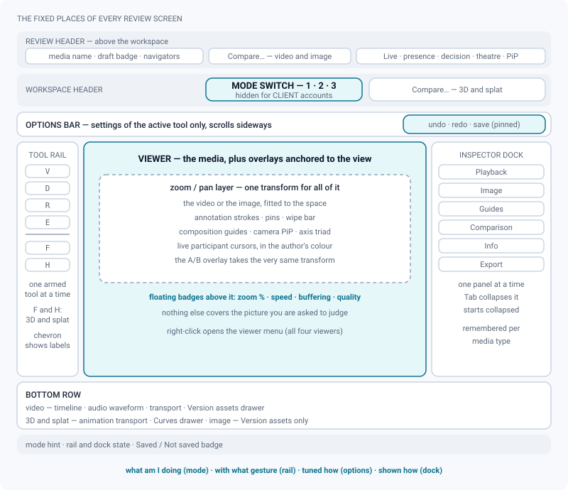
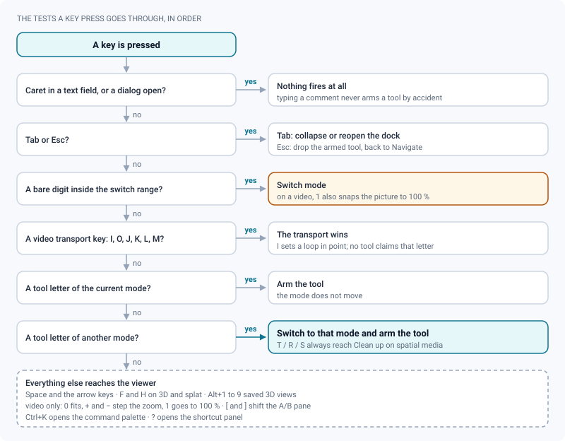

# The review workspace

*The five fixed places every viewer shares — mode switch, tool rail, options bar, inspector dock, bottom row.*

> Updated: 2026-09-22

Every media type — video, image, 3D model, Gaussian splat — opens in the **same workspace**.
Only the tools change; their places never do. Nothing floats over the media except what is
anchored to the view itself: annotation strokes, pins, the wipe bar, composition guides, the
camera PiP, the axis triad, the cursors of the people watching with you, a few corner
badges that vanish when they have nothing to say — and, on the two spatial viewers, the small
menus in the top-left corner that set how the scene is drawn and, on a splat, how it is edited.

Reading the workspace is therefore always the same sentence: *what am I doing* (mode) → *with
what gesture* (rail) → *tuned how* (options bar), and separately *how is it displayed* (dock).

## The five places

| Place | What it is for |
| --- | --- |
| **Mode switch** — workspace header, centre | Decides what exists on screen. Number keys pick a mode |
| **Tool rail** — left column | The exclusive pointer tools of the current mode, then the view actions |
| **Options bar** — one row under the header | Settings of the **active tool only** |
| **Inspector dock** — right column | Settings that are not tools. One panel at a time |
| **Bottom row** | Time (video, animation) and the drawers |

Two header rows sit above all of it, and they do different jobs:

- The **review header** carries the media itself — name, draft badge, version / playlist /
  cut navigators, the ShotGrid link when the project is connected, the live-session antenna,
  the avatars of everyone else watching, *Publish*, the review decision, the detachable
  player, theatre mode, the shortcut panel and the comments toggle. On video and image it
  also carries **Compare…**, the checkbox list of the other versions.
- The **workspace header** carries the mode switch — and, on 3D and splat, the **Compare…**
  selector, which those two viewers gained once the shared scene could host a second version.
  Choosing a version to compare is a header gesture in all four viewers — on an image the
  options bar of *Compare* mode offers the same list — and the sub-mode (side by side, wipe,
  difference) is picked in that options bar.

On a draft, *Publish* opens **Publish and hand over the review**: the people who should
look at this delivery, and the brief written for each of them. Afterwards, the same list
lives in the review-decision dialog, which is where a forgotten brief gets caught up. And
if the version was handed to **you**, the brief written for you sits in a strip above the
viewer the moment you open the media — you do not have to go looking for it. See
[Review decisions & approvals](review-approvals.md#handing-a-version-to-someone).

> [!NOTE]
> The workspace has no minimum width. The rail is a 44 px column of icons, the dock folds to
> its own 44 px tab strip, and the header wraps rather than pushing the page into horizontal
> scrolling — a 13-inch laptop gets the same workspace, just tighter.

## Modes

The mode switch sits in the middle of the workspace header, and each mode is also bound to a
number key — **the position in the switch is the key**: first mode `1`, second `2`.

| Media | Modes in the switch | Keys | What is not in the switch |
| --- | --- | --- | --- |
| Video | Watch · Compare | `1` `2` | Annotate |
| Image | Watch · Compare | `1` `2` | Annotate |
| 3D model | Explore · Clean up | `1` `2` | Annotate, Staging |
| Splat | Explore | `1` — no switch is drawn | Annotate, Staging, Clean up |

A mode missing from the switch is **not** a mode that was removed. It is a mode reached from
where it is used, which is the rule the workspace follows everywhere: *Compare* only exists when
a neighbouring version exists, *Clean up* on a 3D model only when its gizmos have somewhere to
write, and the modes that were listed twice now have a single control each:

| Mode | Where it is armed |
| --- | --- |
| **Annotate** | the *Annotate* button of the comment composer, right-click in the viewer on video and image, or any drawing-tool letter |
| **Staging** (3D, splat) | the **Staging** switch of the *Camera* panel, in its *Framing* group |
| **Clean up** (splat) | the *Edit* group of the tool rail, or any of its tool letters |

In all cases `1` brings you back to the first mode, and it is the way out when the switch is not
there to click.

**Annotate is a mode, but it is not in the switch.** You enter it from the comment space (the
*Annotate* button of the composer, or right-click in the viewer on video and image), or simply
by pressing a drawing tool letter — `D`, `R`, `E`, `A`, `P`, `T`, `X`, and `S` on an image,
all arm the tool *and* switch to Annotate. On video and image, finishing the annotation takes
you back to the first mode.

The same rule applies to the other modes: pressing the letter of a tool that belongs to
another mode switches to that mode. On a video the transport keeps `I`, `O`, `J`, `K` and `L`
for itself — no tool claims those letters — and `M` opens the comment composer. *Move a shape*
answers to `S`, precisely so that the two stop fighting over the same letter.

The first mode (**Watch** / **Explore**) is the only one served to clients: an account with
the `CLIENT` role does not see the switch and stays in read-only exploration. The switch also
disappears whenever a media is left with a single listed mode, because a lone segment switches
to nothing: a splat always, a 3D model whose *Clean up* is out of reach, and an auto-updating
cut, which only has *Watch*.

Changing mode never destroys anything: it only changes which tools exist. If the tool you were
holding does not exist in the new mode, you fall back to navigation.

## Tool rail

One tool is armed at a time — it decides what a click does in the view. The first tool is
always **Navigate** (`V`), the resting state of every mode. Each tool shows its shortcut in its
tooltip, and next to its label when the rail is expanded (chevron at the bottom of the rail;
the choice is remembered per media type).

Tools a viewer does not implement are not shown at all, rather than shown inert: the 3D viewer
has no mask brush, the splat viewer has no screen region, and the
video rail has no zoom button. That last one is a rail entry, not a capability — **the video
picture does zoom and pan**, from the wheel, the middle button and the keyboard (see
[Video review](review-video.md#zoom-frame-and-composition-guides)).

**Flat media (video, image)**

| Mode | Tools |
| --- | --- |
| Watch | Navigate `V` |
| Annotate | Navigate `V` · Freehand `D` · Rectangle `R` · Ellipse `E` · Arrow `A` · Polygon `P` · Text `T` · Move a shape `S` · Eraser `X` |
| Compare | Navigate `V` |

Outside Annotate a flat viewer has nothing to arm but navigation, and it shows exactly that: one
button. Fit and actual size are not rail entries here — they are in the image's control cluster
and on the video player's own keys.

**Spatial media (3D model, splat)**

| Mode | Tools |
| --- | --- |
| Explore | Navigate `V` · Focus `C` (splat only) · Point of interest `I` |
| Annotate | Navigate `V` · Surface brush `P` · Stroke eraser `X` · Pin `I` |
| Staging | Navigate `V` · Place the camera `T` · Aim the camera `R` · Focus `C` (splat only) |
| Clean up | Navigate `V` · Rectangle `B` · Lasso `L` · Mask brush `M` · Cutting volume `O` (all four splat only) · Move `T` · Rotate `R` · Scale `S` |

On an editable splat the rail carries a **second group**, titled *Edit*: the seven *Clean up*
tools, always visible, under the tools of the current mode. Clicking one arms the tool and the
mode in a single gesture — there is no switch to throw first. The group appears only while the
editor is mounted (you can manage the media, the version is unpublished, the viewer is ready);
without it those seven letters do nothing either, so the keyboard never reaches a tool the rail
does not show. **Navigate**, at the top of the first group, is how you leave the clean-up.

Below a separator, the spatial viewers add two **view actions**: **Fit the selection or the
object** (`F`) and **Home view** (`H`). Video and image do not show them — the image viewer
carries its own zoom / `1:1` / fit cluster in the bottom-right corner of the picture, and the
video player answers to `0` and `1` instead.

`Esc` drops the armed tool and returns to Navigate.

> [!TIP]
> On 3D and splat media, `T`, `R` and `S` always reach the **Clean up** gizmos from wherever
> you are — they are the standard DCC transform keys, and the rail is searched in that order.
> Staging keeps `T` and `R` for its camera tools while you are already in Staging. This is the
> keyboard path into a mode whose header segment no longer exists, and it is why the mode still
> needs something else to *leave* it: **Navigate** at the top of the rail, the *Staging* switch
> of the *Camera* panel, or `1`.

## Options bar

The row under the header shows the settings of the **active tool only** — ink, thickness and
opacity for a drawing tool, radius for the mask brush, axes and snapping for a gizmo. That
is what allows the workspace to keep every setting without stacking anything: changing tool
changes the row. The row scrolls horizontally when it is too dense, and always opens with the
tool's own name and shortcut.

In modes that write (Clean up, Staging), a **commit group** is pinned at the
right-hand end, outside the scrolling area, so the primary action is always reachable: undo,
redo, and the save button — *Save* for a clean-up, *Publish* for a staging. It is there whatever
armed the mode: those two modes lost their header segments, not their options bar. An unsaved state shows as a dot inside the button; a clean state
shows a check, and hovering the button names what is not saved. There is never a status label
next to it — the footer of the workspace carries the *Saved* / *Not saved* badge.

## Inspector dock

The right column holds what you set once and forget: the technical sheet, the exports — and on
spatial media the camera, the lighting and the scene.

- One panel at a time, in a 280 px body next to a 44 px tab strip. Clicking the open tab
  closes it again, leaving the strip of icons.
- `Tab` collapses the dock, or reopens it on the first panel of the media.
- The dock **starts collapsed** so the media gets the full width.

| Media | Panels |
| --- | --- |
| Video | Info · Export |
| Image | Info · Export |
| 3D model | Camera · Lighting · Scene · Info · Export |
| Splat | Camera · Scene · Info · Export |

Lighting only exists for 3D models: a splat carries its own baked light.

**The dock got much shorter in Phase 50, and nothing was lost.** A tab was removed whenever it
restated what the viewer already shows, or set at arm's length something that is better set on
the picture:

| Tab that left | Where its controls are now |
| --- | --- |
| *Guides* (video, image) | the four composition switches of the viewer's right-click menu |
| *Comparison* (video, image) | the options bar of **Compare** mode, which is also where B is chosen on an image |
| *Playback*, *Display* (video, image) | the frame rate is in the *Info* sheet; a still image never had a frame rate or a playback speed to set |
| *Image* — the colour panel | colour management is inherited from the project (*Project → Settings*) and no longer set per review; the *Info* sheet repeats the project's OCIO display and view, read-only |
| *Display* (3D, splat) | the **Render** popover in the top-left corner of the viewer |

The **Export** panel is no longer about the media file alone. Below the original download (and
the cleaned `.spz` / transformed `.glb` on spatial media) it hosts *Review notes* — CSV and a
printable sheet of the notes left on this media. On video it also carries *Current frame →
PNG*, which is lossless where the right-click menu produces JPEG, and *Contact sheet*. EDL and
OTIO are not offered here: a single media has no continuous timecode, so those two formats
only appear on a playlist or a cut. See [Exporting review notes](exporting-notes.md).

> [!NOTE]
> Whether the dock is open, which panel is selected, whether the rail shows its labels, and
> the height of the Curves drawer are remembered **per media type** in your browser. A
> supervisor who lives in *Info* and an artist who works full width both get their own
> workspace back on the next shot, and on every machine separately.

## Bottom row

- **Video**: the player's own timeline, a scrubbable audio waveform strip under it, and the
  transport (play, frame stepping, loop, frame and timecode readout, fps, quality, volume,
  fullscreen), plus a *Version assets* drawer showing the other assets of the version as
  thumbnails — click one to review it. Right-clicking the timeline opens its own small menu:
  *Add a marker here…*, *Show the waveform*, *Auto-advance* (the last two are checkboxes, and
  each entry only appears when it applies).
- **Image**: the *Version assets* drawer only. Zoom, `1:1`, fit and fullscreen live in the
  control cluster at the bottom-right of the picture itself.
- **3D / splat**: the animation transport — track selector (*Camera*, or the clips carried by
  the file), play, key-to-key jumps, key insertion, playhead, loop — and the **Curves** drawer,
  docked under the transport and resizable by its top edge.

## What may cover the media

The viewer is the one place with a rule: only things that mean something *at that pixel* are
allowed on top of the picture.

| Overlay | Where it comes from |
| --- | --- |
| Annotation strokes, pins and hotspots | The Annotate mode, or a selected comment |
| Wipe bar, A/B and diff overlays | Compare mode — the overlay takes the **same** zoom and pan transform as the picture, so the two images stay superimposed at any magnification |
| Composition guides | The viewer right-click menu, on video and image |
| Camera PiP, axis triad | 3D and splat viewers |
| The **Render** popover | Top-left corner of the two spatial viewers. It sits outside the review frame, so the letterbox guide and the annotation coordinates are unaffected, and it opens downwards along the left edge rather than over the middle of the picture |
| Live participant cursors | A live session: the driver's pointer, normalised to the media frame, in the author's colour, gone after 2.5 s of stillness |
| Corner badges | Zoom rate (click it to return to fit), playback speed when it is not ×1, buffering, quality switching |

Everything else — every setting, every list, every readout you might want to keep an eye on —
lives in the rail, the options bar, the dock, the bottom row or the footer.

## Keyboard

| Keys | Action |
| --- | --- |
| `1`–`2` | Mode, in switch order — `1` alone on a splat, which lists a single mode |
| `Alt`+`1`–`9` | Recall a saved camera view — **3D only** |
| `V` | Navigate (rest) |
| Tool letters | Arm the tool — and switch to its mode if it belongs to another one |
| `Esc` | Back to navigation |
| `Tab` | Collapse / reopen the dock |
| `F` / `H` | Fit · home view — **3D and splat only** |
| `0` / `1` / `+` / `-` | Fit · 100 % · zoom in · zoom out — **video only** |
| `Space` `←` `→` `J` `K` `L` `I` `O` `M` | Transport and loop — **video only**, see [Video review](review-video.md) |
| `[` / `]` / `Shift`+`\` | Shift the A/B pane by one frame (`Shift` = ten) · back to zero — **video only** |
| `Ctrl+Z` / `Ctrl+Y` / `Ctrl+Shift+Z` | Undo · redo — the history that holds your gesture |
| `?` | Open the keyboard shortcut panel |
| `Ctrl+K` | Command palette |

**Undo goes to one history at a time.** A review screen can carry several — the annotation you
are drawing, the 3D strokes of the surface brush, the splat or model editor, the camera
animation — and each of them listens to the same three keys. They are served in the order of
what you have in your hands: the annotation in progress first, then the 3D brush, then the
media editor, with the camera animation taking precedence over all of them while the **Staging**
switch of the *Camera* panel is on. On a splat, the media editor's history holds the mask
**selections** as well as the edits, so a lasso that took the wrong half comes back.
A history with nothing left to give stands aside, so `Ctrl+Z` reaches the next one instead
of doing two things at once. Actions that write to the server are not part of any of these
stacks: they are confirmed by a toast that carries its own `Undo` — see
[Navigation & search](navigation-and-search.md).

Keys are tested in a fixed order, and the first test that matches wins.

No shortcut fires while the caret is in a text field (comment composer, numeric field, search
box) or while a dialog is open — so typing a comment never arms a tool by accident.

> [!WARNING]
> **`1` does two things on a video.** The player's zoom listens to `0`, `1`, `+` and `-`, and
> the mode switch listens to the bare digits; neither stops the other. Pressing `1` on a video
> therefore snaps the picture to 100 % **and** returns to *Watch*. It goes unnoticed while you
> are already in *Watch*; it will pull you out of *Compare*. Use `0` to go back to a
> fitted picture — `0` is not a mode key.

The shortcut panel is also reachable from the keyboard icon in the review header. Its
*Navigation* section is editable: click a key to rebind it, and the binding follows your
account; the review shortcuts above are fixed.

## Use cases

### End-of-day dailies on a compositing shot

Open the latest version from the Reviews page, stay in **Watch**, and play with `L`. When
something is wrong, press `K` to stop dead, step back to the exact frame with `←`, then press
the *Annotate* button of the composer: the rail turns into drawing tools and the mode switch
releases. Circle the problem with `E`, write the note, send. The comment is anchored to that
frame; a click on its card later brings the player back to it.

### Handing the same shot to three different people

Hand the version to the three of them and write a different brief beside each name — "the
lighting", "the cut at 1042", "the tracking on the sign". Each gets a notification that
opens straight onto the review, and finds their own line above the viewer; none of them
reads the other two.

Once notes are in, the versions themselves are chosen in the header (*Compare…*); the options
bar of **Compare** mode only decides between side by side, wipe and diff. What you
keep per person is the workspace state: an artist who reviews on a laptop collapses the dock
with `Tab` and works full width; a supervisor who lives in the technical sheet leaves *Info*
open. Both preferences are stored per media type, so they survive from one shot to the next.

### A modelling supervisor going through an asset

Open the model, stay in **Explore**, press `H` to get the home view, `F` to fit whatever is
selected, and `Alt`+`1` to `Alt`+`9` to jump between the views you saved. Nothing is written,
nothing is saved — Explore has no editing tool at all, which is exactly why it is the mode
served to clients on a share link.

### Pointing at something during a screening

In a live session, the driver's cursor is drawn inside the transformed media layer of every
participant's video viewer. Zoom into a corner of the frame and the cursor still lands on the
same pixel for everyone — "there, that halo" needs no coordinates. Taking the wheel clears the
cursors you were receiving. See [Playlists & live review](playlists-and-live-review.md).

## Troubleshooting

**A number key changes the mode instead of doing what I expect.** The bare number keys are the
mode switch, in every viewer and with nothing else on them — except on video, where `1` is
also the player's 100 % zoom. The saved camera views of a 3D model, which used to share those
keys, answer to `Alt`+`1` to `Alt`+`9`.

**Pressing a letter jumps me to another mode.** That is intended: a tool letter arms its tool
wherever it lives. If you only wanted to type, click into the composer first — while the caret
is in a text field no shortcut fires.

**The rail is missing the fit and home buttons.** They only exist on 3D and splat media.

**The mode switch is missing entirely.** Either you are signed in with the `CLIENT` role
(read-only exploration by design), or the media is left with a single listed mode — which is
always the case on a splat. Nothing is out of reach: the *Camera* panel arms **Staging**, the
*Edit* group of the tool rail arms the splat clean-up, the composer arms **Annotate**, and `1`
takes you back to *Explore*.

**A panel I used to open is not in the dock any more.** Five tabs left the flat viewers in
Phase 50 — *Comparison*, *Guides*, *Playback*, *Display* and the *Image* colour panel — and
*Display* left the two spatial ones. None of their controls left with them: the table in
[Inspector dock](#inspector-dock) says where each one went.

**The Export panel says only the original file is available.** Its *Current frame → PNG* and
*Contact sheet* buttons are video-only, and the contact sheet additionally needs the timeline
filmstrip built during transcoding. *Review notes* is offered on video and image; the spatial
panels do not carry it.

**The workspace is too cramped on a laptop.** Keep the dock closed with `Tab`, and use the
chevron at the bottom of the rail to hide the tool labels — the rail drops from 168 px to
44 px.

## Related pages

- [Video review](review-video.md) · [Image review](review-image.md) ·
  [3D review](review-3d.md) · [Splat review](review-splat.md)
- [Annotations & comments](annotations-and-comments.md)
- [Camera animation](camera-animation.md)
- [Review decisions & approvals](review-approvals.md)
- [Playlists & live review](playlists-and-live-review.md)
- [Exporting review notes](exporting-notes.md)
- [Personalization & everyday UX](personalization.md)
