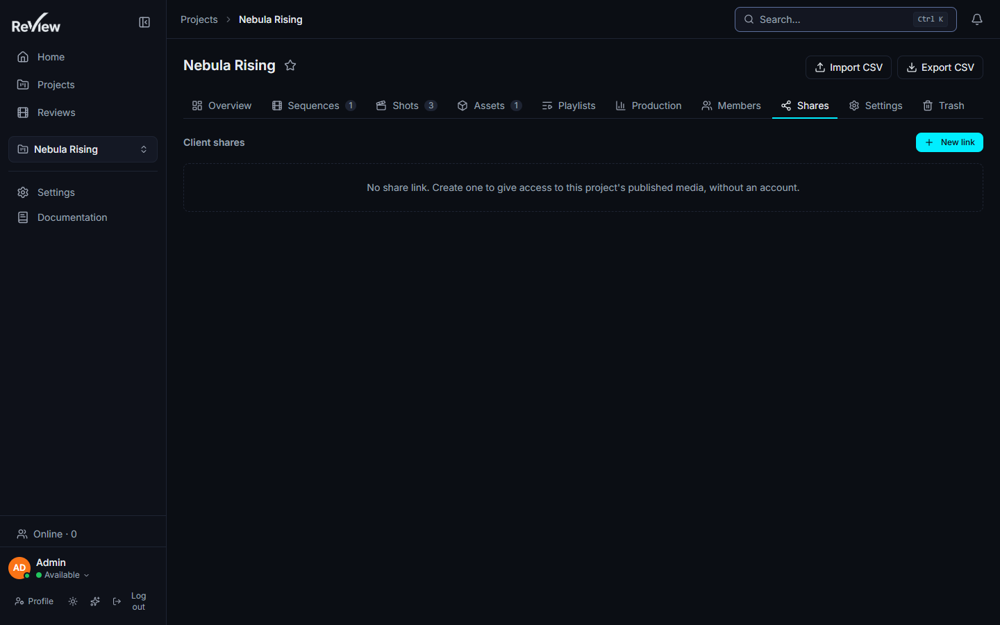

# Sharing with clients

> Updated: 2026-08-21

Supervisors and admins can create **share links** giving external clients access to a
project's published media without an account. Links are managed in the project's
**Shares** tab and open a dedicated, distraction-free client page.

## What a link covers

**A share link exposes the whole project**, not a selection. There is no per-media, per-
shot or per-playlist scope: what the client sees is every media of the project that is
published, `READY`, and belongs to a published version. Publish accordingly — the publish
decision *is* the sharing decision.

## Creating a link

Project page → **Shares** tab → **New link**. Each link carries:

| Field | Effect |
|-------|--------|
| **Recipient label** | 1–120 characters. Shown in the admin list and embedded in the on-screen watermark of the client page. |
| **Permission** | `VIEW` (watch only) or `COMMENT` (watch and comment). |
| **Password** | Optional, 4–200 characters, hashed with bcrypt and never displayed again. |
| **Expiry** | Optional, expressed in **days** from creation. |
| **View limit** | Optional maximum number of viewing sessions. |

The generated URL is `https://<studio>/client/<token>`, with a 48-character random token,
and is copied to your clipboard on creation. The list shows the view counter
(`views / limit`), the last-viewed date and a lock icon for password-protected links.
A copy button on each row gets the URL back later.

Links can be **revoked** at any time from the same tab.

## How views are counted

Opening the client page starts a **share session**, valid for 24 hours and stored in the
browser tab. **One session = one view.** The session is granted by the initial page load,
or by a successful password unlock, and every subsequent request requires it — the view
limit and the password cannot be bypassed by calling media URLs directly.

Practical consequence: the same person opening the link in a second tab or window
consumes a second view. Size the limit accordingly, or leave it empty.

The counter is incremented atomically against the limit, so two visitors arriving at once
cannot both slip through the last slot. When the limit is reached new visitors get a clear
*view limit reached* message, while **sessions already open keep working** — a client is
never cut off mid-review.

An expired or revoked link answers exactly like an unknown token, deliberately: an
attacker cannot tell a real token from a dead one. That check runs on every request, so
revoking a link also kills the sessions already open on it.

## What clients see

The client page is intentionally minimal: studio logo and name, a media grid, a viewer
and comments — **no navigation into the app**. When a password is required, the locked
page shows only the studio branding, never project data.

- **Only published media of published versions with processing `READY`**, newest first.
- **Video and image play; 3D and Gaussian splat do not.** They are listed in the grid,
  but selecting one shows a "no preview here, contact the studio" message. Send those
  through a live review session or an export instead.
- **Video source.** When the studio has enabled **client derivatives**, the client gets
  the derivative — which carries a 3-second **slate** identifying studio, project, shot,
  version, artist, file and date. Comment timestamps are offset automatically so they
  always refer to the media itself, slate excluded, both when writing and when seeking.
  Without a derivative, the client is served the same file the studio holds (the proxy
  when the original was deleted after transcoding, the original otherwise).
- **Watermark.** A discreet overlay — recipient label, studio name, today's date — is
  drawn over the **viewer** (not over the grid thumbnails) when enabled. It is on by
  default for shares, at a low opacity the studio can tune.
- **Downloads.** No download route and no download button exist, and the player is set to
  `nodownload`. The presigned media URL is still handed to the browser, so this is a
  courtesy, not a DRM guarantee.
- **Comments read.** Clients see **top-level comments explicitly flagged visible to the
  client**. Replies are never shown, and internal notes stay internal — the flag is off by
  default, so nothing leaks by accident. Use *Show to the client* on a comment to publish
  it outward.
- **Comments write.** With `COMMENT` permission, the client signs with a free-form name
  (remembered in their browser) and their note lands in the same thread the team uses,
  flagged visible to the client and pushed live into the project room. A `VIEW` link
  refuses the write with a `403`.

## Auditing

Every step is recorded in the audit log (*Admin → Maintenance → Audit*):

| Action | When |
|--------|------|
| `SHARE_CREATE` | Link created, with permission, label, whether it has a password, its limit and expiry |
| `SHARE_REVOKE` | Link revoked |
| `SHARE_VIEW` | A view is consumed — on the first open, and again after a password unlock |
| `SHARE_UNLOCK_FAIL` | Wrong password |

Public events carry the IP and the link id, not a user id — there is no user. Media
access through a share is recorded separately, per media.

Password attempts are rate-limited to **10 per 15 minutes per IP and link**, on top of a
global 300-requests-per-15-minutes cap on the client routes.

## Use cases

### Sending tonight's cut to a client who has no account

1. Publish what the client should see, and nothing else. The link exposes the whole
   project's published media — an unpublished draft is invisible, which is exactly the
   lever you have.
2. Project → **Shares** → **New link**: label `Client — Acme`, permission **COMMENT**,
   expiry **7 days**, view limit **20**.
3. The URL is on your clipboard. Paste it into your own email — ReView does not send it.
4. Watch the counter over the week. `6 / 20` with a recent last-viewed date means it is
   being read.

### A link that must not travel further

Add a **password**, and send the password on a different channel from the link. The lock
icon in the list reminds you which links carry one; the password itself is never shown
again, so if you lose it, revoke and re-create.

Ten wrong attempts within a quarter of an hour lock that IP out of that link, and every
failure is in the audit log.

### The client asks for a 3D model

They will not be able to look at it in the browser: the client page lists 3D and splat
media but does not render them.

Two options — hold a **live review session** and send them the `?live=1` URL if they can
have a temporary account, or **export** the cut / the media and send the file. See
[Playlists & live review](playlists-and-live-review.md).

### Cutting access after delivery

Revoke the link in the **Shares** tab. It stops working immediately, including for
sessions already open, and answers the same way an unknown token does. The audit entry
records who revoked it and when.

If you only want to stop *new* viewers while letting the current review finish, let the
**view limit** do it: open sessions survive, new ones are refused.

## Related pages

- [Secure distribution (admin)](../admin-guide/secure-distribution.md) — burn-ins, client
  derivatives, slate and watermark settings
- [Annotations & comments](annotations-and-comments.md) — the client-visible flag
- [Upload & publishing](upload-and-publishing.md) — what "published" means
- [Users & roles (admin)](../admin-guide/users-and-roles.md)
