<p align="center">
  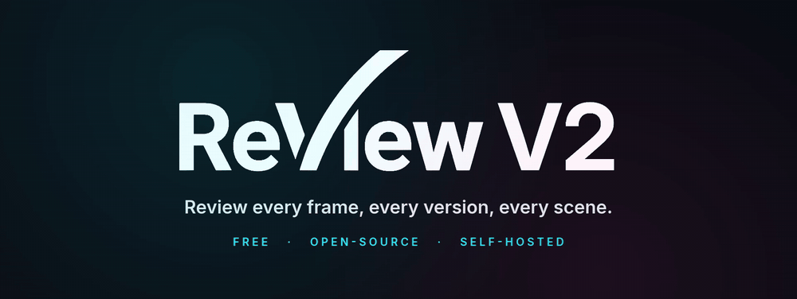
</p>

<p align="center">
  <b>The collaborative review platform for VFX, animation and 3D studios.</b><br>
  Video, images, EXR sequences, USD scenes and Gaussian splats, reviewed in one place, on your own servers.
</p>

<p align="center">
  <a href="https://discord.gg/vw7h6BqcNc">
    
  </a>
  <a href="LICENSE">
    
  </a>
  <a href="#-install">
    
  </a>
  <a href="#-languages">
    
  </a>
  <a href="#-how-this-project-is-built">
    
  </a>
</p>

<p align="center">
  <a href="#-highlights"><b>Highlights</b></a> ·
  <a href="#-everything-it-does"><b>Everything it does</b></a> ·
  <a href="#-install"><b>Install</b></a> ·
  <a href="#-architecture"><b>Architecture</b></a> ·
  <a href="#-documentation"><b>Documentation</b></a> ·
  <a href="https://discord.gg/vw7h6BqcNc"><b>Discord</b></a>
</p>

---

**ReView** is a collaborative review platform for VFX studios, post-production teams and
creatives. Frame-accurate video, annotated images and EXR sequences, 3D and USD scenes,
Gaussian splats, reference boards, kanban, live dailies, secure client shares and full studio
administration: in one place, on your own infrastructure. **One instance = one studio.**

It is **free software** ([AGPL-3.0-or-later](#-licence)), it installs with **one script**, and
it keeps working the way artists already talk: a frame, a note, a version, a decision.

<p align="center">
  
</p>
<p align="center"><sub>The real interface. The animations below are motion-design illustrations made with
<a href="https://mirage.app">Tesseract</a> (Mirage), built from ReView's own interface strings and its three.js scene setup.</sub></p>

## ✨ Highlights

### Draw on the exact frame

<p align="center">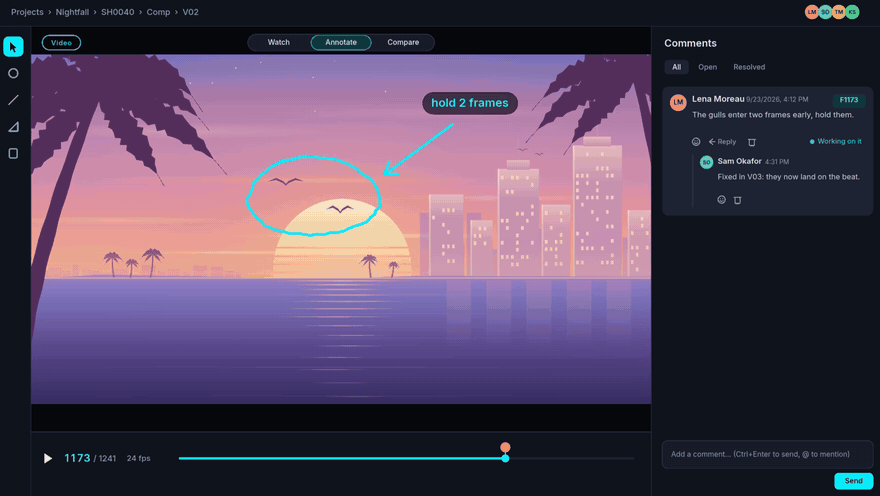</p>

Adaptive HLS playback, frame-by-frame navigation with `J` / `K` / `L`, in→out loops and hover
thumbnails. Annotations are anchored to the delivery frame; comments come in **threads** with
`@` mentions, replies, reactions, **voice notes**, deep links to a frame, and five colour-coded
states. A comment can become a kanban task in one click.

→ [Video review](DOCUMENTATION/user-guide/review-video.md) ·
[Annotations & comments](DOCUMENTATION/user-guide/annotations-and-comments.md)

### Compare every version

<p align="center">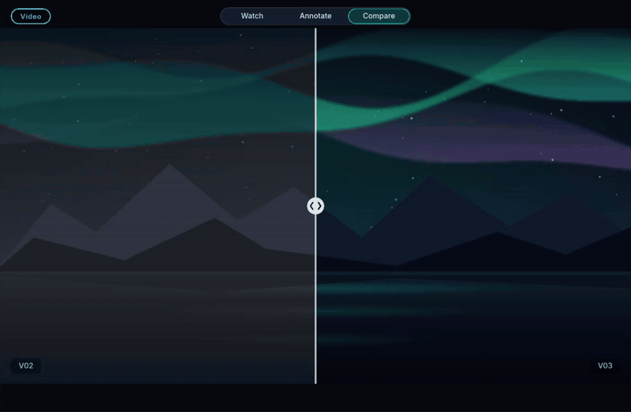</p>

Side by side, through an orientable **wipe**, as a GPU-composited **difference** with a heatmap,
or four at once in a **2×2 grid**, with a letterbox guide, centre cross and action/title safe
areas. Images get A/B, a reference image and a lightbox; an **EXR/DPX/TIFF sequence** is
ingested as a single media and reviewed like a clip.

→ [Video review](DOCUMENTATION/user-guide/review-video.md) ·
[Image review](DOCUMENTATION/user-guide/review-image.md) ·
[Image sequences](DOCUMENTATION/user-guide/image-sequences.md)

### The real USD, in the review

<p align="center"></p>

<table>
  <tr>
    <td width="50%"></td>
    <td width="50%"></td>
  </tr>
  <tr>
    <td>The <b>Scene panel</b> shows the real prim tree: search it, click in the viewport to select, <code>F</code> to frame.</td>
    <td>After publication, a change <b>joins a comment</b>: select the note to see the proposal, <code>Esc</code> to go back. Nothing is published by accident.</td>
  </tr>
</table>

`.usd`, `.usdc`, `.usda`, `.usdz` and zipped archives are converted natively through Blender and
`usd-core`, keeping `UsdPreviewSurface` materials, variants and `UsdSkel` animation. Per-prim
overrides (transform, visibility, variant) are stored by ReView **without touching the file**.
Around them: a DCC-style viewer with orbit and fly navigation, HDRI lighting, inspection modes,
section planes, measurement, turntable, **3D A/B** with linked cameras, and an F-curve camera
that can be imported from Alembic.

→ [3D review](DOCUMENTATION/user-guide/review-3d.md) ·
[USD pipeline](DOCUMENTATION/admin-guide/3d-usd.md) ·
[Camera animation](DOCUMENTATION/user-guide/camera-animation.md)

### Gaussian splats

<p align="center">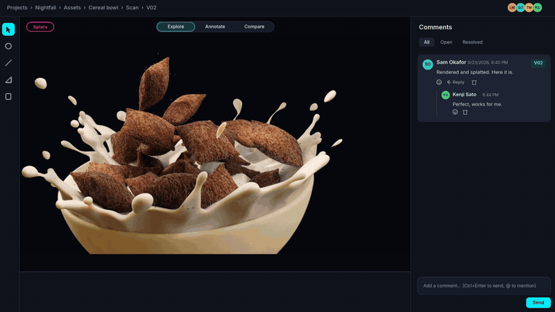</p>

A **Spark (SparkJS)** viewer inside the three.js scene, reading PLY, SPZ and SOG/SOGS. The editor
is **non-destructive**: brush and volume selection, masking, tint, transform. The original file
is never modified, every edit is replayed identically for everyone, and cleaned splats export to
SPZ.

→ [Splat review](DOCUMENTATION/user-guide/review-splat.md)

### From a note to a new version

<p align="center">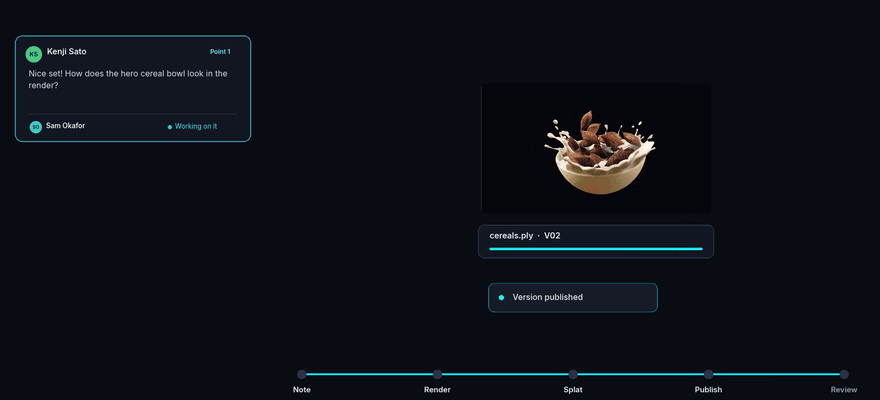</p>

Notes do not stay in the review. The artist picks the note up, renders, publishes from the DCC,
and the new version lands where the note was written, ready to compare. Publishing goes through
the public API; **Blender and Nuke publishers** ship in [`clients/dcc`](clients/dcc).

→ [API overview](DOCUMENTATION/api/overview.md) ·
[Python client](DOCUMENTATION/api/python-client.md)

### Decide, on the record

<p align="center">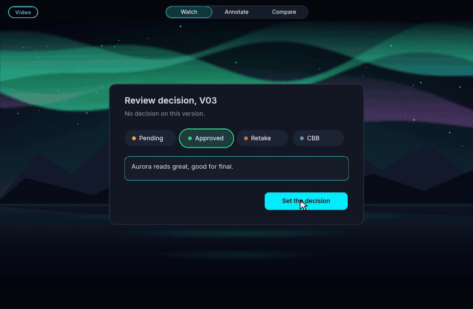</p>

Decisions use the studio's own statuses. Each one is recorded per version with its comment, and
shows as a badge everywhere that version appears.

→ [Approvals](DOCUMENTATION/user-guide/review-approvals.md)

### Run the production

<p align="center">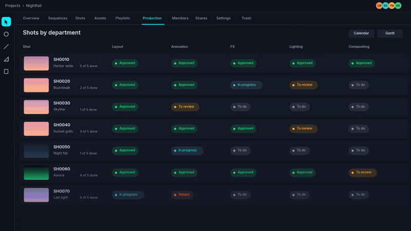</p>

Project → episode → sequence → shot or asset → task → version. A **shots × departments** grid,
a **kanban** built on your statuses, **auto-cut timelines**, a deadline calendar, a per-sequence
**Gantt**, review statistics and a weekly email to supervisors. Delivery settings (resolution,
framerate, frame ranges) are inherited from studio to shot.

→ [Projects & pipeline](DOCUMENTATION/user-guide/projects-and-pipeline.md) ·
[Kanban & tasks](DOCUMENTATION/user-guide/kanban-and-tasks.md) ·
[Production reporting](DOCUMENTATION/user-guide/production-reporting.md)

### Ships with ShotGrid

<p align="center">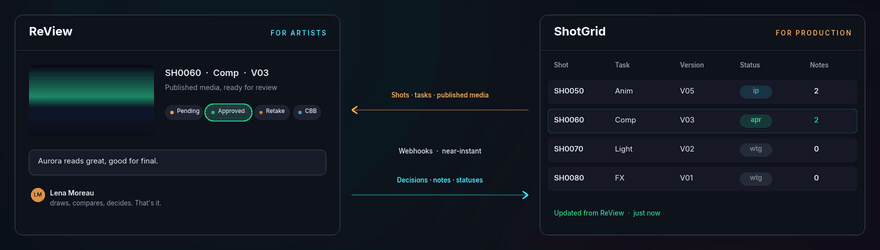</p>

A **bidirectional** integration: shots, assets, tasks, crew, statuses and notes, with a hard
project boundary on every request. Production stays in ShotGrid, artists review in ReView, and
nothing is typed twice.

→ [ShotGrid integration](DOCUMENTATION/admin-guide/shotgrid-integration.md)

### Plugs into your pipeline

<p align="center">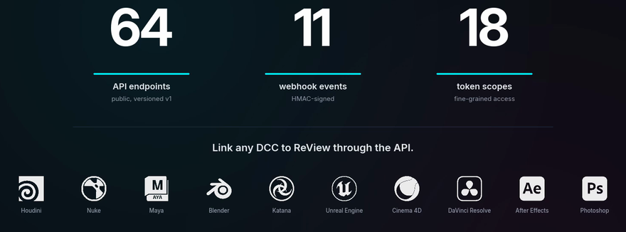</p>

A **public API v1** with personal and service tokens and fine-grained **scopes**, **HMAC-signed
webhooks** per project, an interactive OpenAPI reference served at `/api/docs`, and a **Python
client**. Any DCC that can make an HTTP request can publish to ReView.

→ [Identity & API](DOCUMENTATION/admin-guide/identity-and-api.md) ·
[API overview](DOCUMENTATION/api/overview.md)

## 🧭 Everything it does

<p align="center">
  
</p>

| Area | What ReView does |
|------|------------------|
| 🎬 **Video** | Adaptive multi-rendition HLS, frame-accurate navigation, `J`/`K`/`L`, in→out loops, sprite hover thumbnails, shared timeline markers, audio waveform, zoom and pan, wipe · difference · 2×2 grid, letterbox and safe areas |
| 🖼️ **Image** | Overlay annotations, A/B, reference image, lightbox; **EXR/DPX/TIFF sequences** read as one media, with a web-playable proxy |
| 🧊 **3D & USD** | DCC-style viewer, HDRI studio library, end-to-end USD (scenegraph, variants, overrides), inspection modes, texture inspector, sections, measurement, bookmarks, turntable, 3D A/B, reliable GLB animation (rigs, morph targets) |
| ✨ **Splats** | Spark viewer, PLY · SPZ · SOG/SOGS, non-destructive editor, SPZ export |
| 🎥 **Camera** | F-curve camera on Hermite channels, dopesheet and graph editor, Alembic `.abc` import, replayed identically for every viewer |
| 💬 **Collaboration** | Frame-anchored annotations, threads, `@` mentions, reactions, voice notes, local drafts, deep links, comment → task, direct and group messages |
| 🎞️ **Dailies** | Cross-shot playlists, chained playback, a synchronised **live review room** where one driver broadcasts playback, comparison, 3D camera and cursor |
| 🧩 **Boards** | Excalidraw canvases per project and per asset, for mood and references |
| 📋 **Production** | Hierarchy with inherited delivery settings, publication lock, kanban, auto-cut timelines, reporting, calendar, Gantt, templates, archiving, quotas, per-project roles, CSV import and export |
| 🔗 **ShotGrid** | Bidirectional: shots, assets, tasks, crew, statuses and notes, hard project boundary |
| 🔒 **Distribution** | Hardened share links (password, expiry, view limit, revocation, access audit), a **client portal** in the studio's colours with the studio's drawing tools, burn-ins, slates, per-viewer watermark; notes out as CSV, EDL, OTIO or a contact sheet |
| 🛡️ **Identity & API** | OIDC SSO, TOTP 2FA with backup codes, per-device sessions, media access log, scoped tokens, HMAC webhooks, OpenAPI, public API v1, Python client, Blender and Nuke add-ons |
| ⚙️ **Administration** | Users and roles, pipeline defaults, transcoding profiles, **OCIO** colour management, HDRI library, branding, SMTP, retention, storage and quotas, content explorer, job dashboard, audit log, backups and maintenance |
| ✋ **Everyday comfort** | Light, dark and system themes, density, 14 languages, reconfigurable shortcuts with a `?` cheatsheet, `Ctrl+K` palette and right-click menus, favourites, saved views, Web Push, Slack and Discord notifications, in-app documentation at `/docs` |
| 🐳 **Operations** | One Docker Compose stack, FFmpeg workers on BullMQ (optional NVENC), resumable uploads deduplicated by SHA-256, backups and restore, health probes, Prometheus and Grafana, optional ClamAV, scripted installer and updater with rollback |

**→ The full tour, area by area, with a link to the guide for each:
[Feature tour](DOCUMENTATION/getting-started/feature-tour.md).**

## 🚀 Install

<p align="center">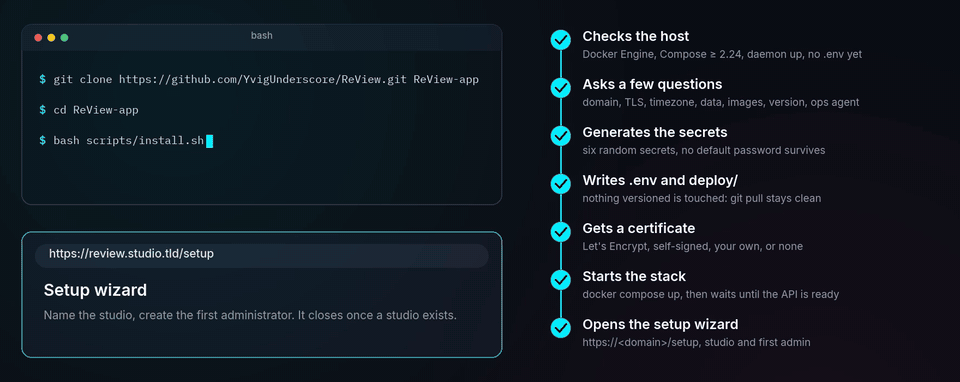</p>

**Requirements:** Docker Engine and Docker Compose v2 (≥ 2.24), about 4 GB of RAM for the
stack, plus disk for your media.

```bash
git clone https://github.com/YvigUnderscore/ReView.git ReView-app
cd ReView-app
bash scripts/install.sh
```

The installer asks a few questions: the public domain, the TLS mode (Let's Encrypt, self-signed,
your own certificates, or none behind a proxy you already run), the timezone, where the data
lives, whether to pull the **published images** or build locally, which version to install, and
whether to add the **ops agent** (backups and updates from the admin screen; it mounts the Docker
socket, which is why it is asked, never assumed). Then it generates every secret, writes `.env`
and `deploy/`, obtains a certificate, starts the stack, waits until the API reports ready, and
prints the URL of the setup wizard. **No versioned file is touched**, so a later `git pull`
still applies cleanly.

Configuration-managed hosts can skip the questions:

```bash
bash scripts/install.sh --non-interactive \
  --domain review.studio.tld --tls letsencrypt --email ops@studio.tld \
  --timezone Europe/Paris --data-root /mnt/pool/review \
  --image-tag v2.0.0 --ops-agent
```

`--images -` builds the images on the host instead of pulling them.

### First launch

On a fresh instance the first screen is the **setup wizard**: it creates the studio and its
administrator account, then closes for good. There is no default password in production. Invite
your team, create a project, and drop a file on it.

### Try it on a laptop instead

```bash
cp .env.example .env   # → edit JWT_SECRET and the MinIO / PostgreSQL / Redis secrets
docker compose up -d --build
```

The application answers on **http://localhost:3429** (API on `:3430`, optional Grafana on
`:3431`). `npm run seed` in `backend/` then gives you two accounts:
`admin@review.local` / `admin1234` and `artist@review.local` / `artist1234`.

> ⚠️ Seeded accounts are for local development. Never expose a seeded instance.

### Updating

```bash
bash scripts/update.sh
```

It snapshots the database and the configuration, pulls, migrates, restarts, health-checks, and
rolls back on its own if the new version does not come up. With the ops agent, the same update
runs from the administration screen.
[Updating](DOCUMENTATION/getting-started/updating.md) ·
[Production deployment](DEPLOYMENT.md)

### Can you run it in production?

**Yes, with a technical director, a pipeline TD or a sysadmin alongside.** ReView installs
itself, backs itself up, monitors itself and updates itself with a rollback, and it is running
a real studio instance today. But it is a self-hosted platform that holds your masters, and the
questions it cannot answer for you are the ones that matter: where the data pool lives and how
it is sized, who holds the TLS certificates, whether the restore has actually been rehearsed,
what the retention policy is, how an upgrade is scheduled around a delivery.

Deploy it the way you would deploy any storage-backed service you depend on: someone technical
owns it. If that person exists in your studio, ReView is ready for them.
[Installation](DOCUMENTATION/getting-started/installation.md) ·
[Backups](DOCUMENTATION/infrastructure/backups.md) ·
[Monitoring](DOCUMENTATION/infrastructure/monitoring.md) ·
[Security](DOCUMENTATION/infrastructure/security.md)

## 🧱 Architecture

<p align="center">
  
</p>

| Layer | Technology |
|-------|------------|
| Backend | Node.js + Express 5 + TypeScript + Prisma + PostgreSQL 16 |
| Frontend | React 19 + Vite 7 + Tailwind CSS + shadcn-style primitives |
| Auth / Realtime | JWT (+ OIDC SSO, TOTP 2FA) / Socket.io |
| Jobs | BullMQ + Redis. FFmpeg workers: multi-rendition HLS, thumbnails, 3D→GLB, USD chain (Blender + usd-core → `guc` → assimp) |
| 3D / Splat | Three.js / Spark (SparkJS) |
| Board | Excalidraw |
| Storage | MinIO (S3-compatible), presigned URLs; nginx TLS front in production |
| Observability | Prometheus + Grafana (optional), `/metrics` endpoint |

```
ReView-app/
├── docker-compose.yml       # postgres + minio + redis + backend + worker + frontend (+ monitoring)
├── DOCUMENTATION/           # the manual (EN, committed, served in-app at /docs)
├── backend/                 # Express 5 + Prisma: routes, services, workers, tests
├── frontend/                # React 19 + Vite: pages, review viewers, ui, stores, tests
├── clients/                 # Python client, Blender and Nuke add-ons
├── nginx/ · monitoring/     # production reverse proxy, Prometheus/Grafana provisioning
└── scripts/                 # install.sh, update.sh, backup.sh, validate.sh, checkers
```

→ [Architecture](DOCUMENTATION/infrastructure/architecture.md) ·
[Docker stack](DOCUMENTATION/getting-started/docker-stack.md) ·
[Jobs & workers](DOCUMENTATION/infrastructure/jobs-and-workers.md)

## 📚 Documentation

The manual lives in [`DOCUMENTATION/`](DOCUMENTATION/README.md), is versioned with the code,
and is **served inside the application at `/docs`**: searchable, organised by chapter.

| | |
|---|---|
| [Getting started](DOCUMENTATION/getting-started/installation.md) | Install, first run, Docker stack, updating |
| [User guide](DOCUMENTATION/user-guide/review-workspace.md) | Review, annotations, playlists, kanban, boards, sharing |
| [Admin guide](DOCUMENTATION/admin-guide/overview.md) | Users and roles, pipeline, transcoding, colour, ShotGrid |
| [API](DOCUMENTATION/api/overview.md) | Authentication, domains, public v1, Python client |
| [Infrastructure](DOCUMENTATION/infrastructure/architecture.md) | Architecture, storage, workers, monitoring, backups |
| [Development](DOCUMENTATION/development/code-structure.md) | Code structure, conventions, validation suite, i18n |

## 🤖 How this project is built

ReView is **vibe-coded**: every line of it was written by an AI agent, under human direction.
That is unusual enough to say plainly rather than let you discover it.

It is not, however, a demo. The bet of this project is that AI-written code is only worth
anything if something mechanical keeps it honest, so the guard rails came first and have never
been relaxed:

- **A single validation suite gates every commit.** `scripts/validate.sh` chains licence
  headers, dependency notices, the four i18n checks, theme tokens, documentation links,
  script linting, route size budgets, then, for both backend and frontend, formatting,
  ESLint at **zero warnings**, type-checking with tests included, the build, and the tests.
  It fails at the first red. Nothing is committed on a red suite.
- **830 test files**, unit and integration, plus Playwright smoke tests and an end-to-end
  ShotGrid harness against a fake site.
- **Ratchets, never dials.** Hardcoded UI strings: ceiling 0. Raw translation keys shown on
  screen: ceiling 0. Unnamed controls: a number that may only go down. Coverage floors that
  refuse to be lowered. The rule written into the repository is that the suite may be
  extended, never weakened.
- **Documentation is a deliverable**, committed with the code, served inside the application,
  and checked: every internal link, anchor, image and figure.

If you find something broken, an issue is genuinely useful: the suite catches regressions, not
missing requirements.

## 🌍 Languages

English is the source language. ReView ships **thirteen more**, chosen so a studio can work in
its own, including regional languages that rarely get software written for them: Breton,
Basque, Corsican, Alsatian and Occitan, alongside French, Spanish, German, Portuguese,
Simplified Chinese, Korean, Japanese and Hindi.

<p align="center">
  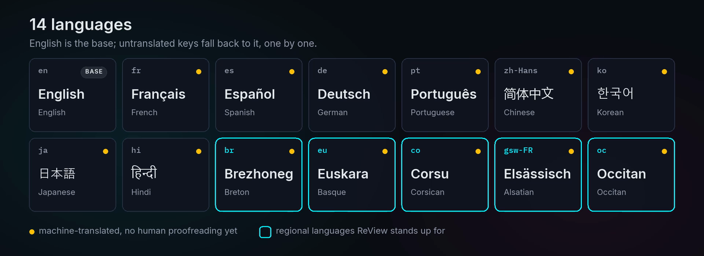
</p>

> ### ⚠️ These translations are machine-generated
>
> **Every language other than English was translated automatically, with no human
> proofreading.** Wording may be clumsy, unidiomatic, or plainly wrong; the same warning
> appears in the application wherever a language is chosen.
>
> **Corrections are very welcome, and they are the only way these catalogues get better.** A
> correction is a one-line edit in a JSON file: no build step, no framework to learn. That goes
> double for the regional languages, which have far fewer speakers reviewing software strings
> than English does. Proposals for new languages are equally welcome: untranslated keys fall
> back to English, so a partial catalogue is useful from its first line.

Production terminology is deliberately **left in English in every language**: `shot`,
`sequence`, `dailies`, `playblast`, `version`, `annotation`, `review`, `board`, `retake`.
Artists read these words in English in every pipeline they touch. The list is enforced by a
checker. How to contribute a translation:
[Internationalisation](DOCUMENTATION/development/i18n.md).

## 🧪 Contributing

```bash
bash scripts/validate.sh                    # typecheck + build + lint + unit tests
bash scripts/validate.sh --with-integration # + integration tests (docker stack required)
bash scripts/validate.sh --with-e2e         # + Playwright smoke tests
```

Green suite, or it does not go in. Conventions and code structure:
[Development](DOCUMENTATION/development/code-structure.md) ·
[Writing documentation](DOCUMENTATION/development/documentation-style.md) ·
[Contributing](CONTRIBUTING.md) · [CLA](CLA.md). Questions, ideas and show-and-tell are welcome on
[Discord](https://discord.gg/vw7h6BqcNc).

## ⭐ Star History

<a href="https://www.star-history.com/#YvigUnderscore/ReView&type=date&legend=top-left">
 <picture>
   <source media="(prefers-color-scheme: dark)" srcset="https://api.star-history.com/svg?repos=YvigUnderscore/ReView&type=date&theme=dark&legend=top-left" />
   <source media="(prefers-color-scheme: light)" srcset="https://api.star-history.com/svg?repos=YvigUnderscore/ReView&type=date&legend=top-left" />
   
 </picture>
</a>

## 🙏 Acknowledgements & licences

ReView stands on other people's work: **[React](https://react.dev/)**,
**[Vite](https://vitejs.dev/)**, **[Node.js](https://nodejs.org/)**,
**[Express](https://expressjs.com/)**, **[Prisma](https://www.prisma.io/)**,
**[TailwindCSS](https://tailwindcss.com/)**, **[Three.js](https://threejs.org/)**,
**[Spark](https://sparkjs.dev/)**, **[Excalidraw](https://excalidraw.com/)**,
**[Socket.IO](https://socket.io/)**, **[BullMQ](https://bullmq.io/)**,
**[MinIO](https://min.io/)**, **[FFmpeg](https://ffmpeg.org/)**,
**[Blender](https://www.blender.org/)**, **[OpenUSD](https://openusd.org/)**, and 625
packages in all. The exhaustive list, with each licence text, lives in
**[THIRD-PARTY-NOTICES.md](THIRD-PARTY-NOTICES.md)** (generated, never written by hand).

The README illustrations use the Kitchen Set (© Disney/Pixar, OpenUSD reference scene) and the
“CGI Cereals Bowl” scan by Léo Mallet (@_leomllt, CC BY-NC 4.0).

## 📄 Licence

ReView is **free software under [AGPL-3.0-or-later](LICENSE)**.

You may install it and modify it. The only thing asked in return: if you offer a **modified
version** to others, including simply by hosting it for your clients, you must give them its
sources (section 13). In practice, publish your fork and set its URL in
**Admin → Studio → Studio identity → "Source code (AGPL §13)"**. An unmodified instance has
nothing to do.

Your media, projects and data are never covered: the licence applies to the software.

- **[Commercial licence](COMMERCIAL-LICENSE.md)**: for studios that cannot accept the
  obligations of the AGPL.
- **[Licensing documentation](DOCUMENTATION/development/licensing.md)**: detailed
  obligations, dependency compatibility, Docker image redistribution.

> Until 2 August 2026, ReView was distributed under the MIT licence.
