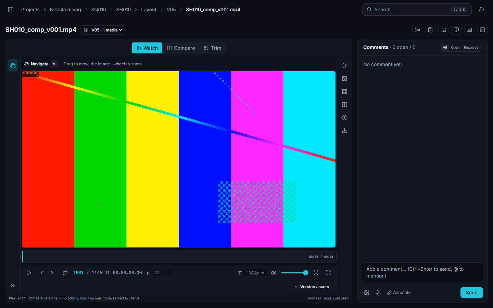

<p align="center">
  
</p>

<p align="center">
  <b>Collaborative media review platform for VFX &amp; post-production studios</b><br>
  Open-source · Self-hostable · Desktop-first
</p>

<p align="center">
  <a href="https://discord.gg/vw7h6BqcNc">
    
  </a>
  <a href="LICENSE">
    
  </a>
  <a href="#-languages">
    
  </a>
  <a href="#-how-this-project-is-built">
    
  </a>
</p>

---

**ReView** is a collaborative review platform for VFX studios, post-production teams and
creatives. Frame-accurate video, annotated images and EXR sequences, 3D and USD scenes,
Gaussian splats, reference boards, kanban, live dailies, secure client shares and full studio
administration — in one place, on your own infrastructure. **One instance = one studio.**

<p align="center">
  
</p>

## What it does

| Area | What ReView does |
|------|------------------|
| 🎬 **Video** | Adaptive HLS, frame-by-frame, A/B · wipe · diff · 2×2 grid, frame-anchored annotations, safe areas, waveform, contact sheet |
| 🖼️ **Image** | Overlay annotations, A/B, reference, lightbox — and **EXR/DPX sequences read as a single media** |
| 🧊 **3D & USD** | DCC-style viewer, end-to-end USD (scenegraph, variants, overrides), inspection, OCIO, F-curve camera |
| ✨ **Splats** | Spark viewer, non-destructive editor, SPZ export, SOG playback |
| 💬 **Collaboration** | Threads, mentions, voice notes, customisable statuses, dailies and a synchronised live review room |
| 📋 **Production** | Project → shot → task → version, publication lock, kanban, auto-cut timelines, stats, calendar, Gantt |
| 🔒 **Distribution** | Hardened share links, burn-ins, slates, per-viewer watermark, CSV/EDL/OTIO note export |
| 🛡️ **Identity & API** | OIDC SSO, 2FA, scoped tokens, HMAC webhooks, OpenAPI, public API v1 + Python client |
| ⚙️ **Infra** | Docker, FFmpeg workers (NVENC), resumable + deduplicated uploads, backups, Prometheus/Grafana |

**→ The full tour, area by area, with a link to the guide for each:
[Feature tour](DOCUMENTATION/getting-started/feature-tour.md).**

## 🤖 How this project is built

ReView is **vibe-coded**: every line of it was written by an AI agent, under human direction.
That is unusual enough to say plainly rather than let you discover it.

It is not, however, a demo. The bet of this project is that AI-written code is only worth
anything if something mechanical keeps it honest — so the guard rails came first and have never
been relaxed:

- **A single validation suite gates every commit.** `scripts/validate.sh` chains licence
  headers, dependency notices, the four i18n checks, theme tokens, documentation links,
  script linting, route size budgets, then — for both backend and frontend — formatting,
  ESLint at **zero warnings**, type-checking with tests included, the build, and the tests.
  It fails at the first red. Nothing is committed on a red suite.
- **524 test files**, unit and integration, plus Playwright smoke tests and an end-to-end
  ShotGrid harness against a fake site.
- **Ratchets, never dials.** Hardcoded UI strings: ceiling 0. Raw translation keys shown on
  screen: ceiling 0. Unnamed controls: a number that may only go down. Coverage floors that
  refuse to be lowered. The rule written into the repository is that the suite may be
  extended, never weakened.
- **Documentation is a deliverable**, committed with the code, served inside the application,
  and checked — every internal link, anchor, image and figure.

### Can you run it in production?

**Yes — with a technical director, a pipeline TD or a sysadmin alongside.** ReView installs
itself, backs itself up, monitors itself and updates itself with a rollback, and it is running
a real studio instance today. But it is a self-hosted platform that holds your masters, and
the questions it cannot answer for you are the ones that matter: where the data pool lives and
how it is sized, who holds the TLS certificates, whether the restore has actually been
rehearsed, what the retention policy is, how an upgrade is scheduled around a delivery.

Deploy it the way you would deploy any storage-backed service you depend on: someone
technical owns it. If that person exists in your studio, ReView is ready for them —
[Installation](DOCUMENTATION/getting-started/installation.md),
[Backups](DOCUMENTATION/infrastructure/backups.md),
[Monitoring](DOCUMENTATION/infrastructure/monitoring.md),
[Security](DOCUMENTATION/infrastructure/security.md).

If you find something broken, an issue is genuinely useful: the suite catches regressions, not
missing requirements.

## 🚀 Install

**Requirements** — Docker Engine and Docker Compose v2 (≥ 2.24), ~4 GB of RAM for the stack,
plus disk for your media.

```bash
git clone https://github.com/YvigUnderscore/ReView.git ReView-app
cd ReView-app
bash scripts/install.sh
```

The installer asks four questions — public domain, TLS mode, timezone, where the data lives —
then generates every secret, writes `.env`, renders the nginx configuration, obtains a
certificate, starts the stack, waits until the API reports healthy, and prints the URL of the
setup wizard. **No versioned file is touched**, so a later `git pull` still applies cleanly.

Configuration-managed hosts can skip the questions:

```bash
bash scripts/install.sh --non-interactive \
  --domain review.studio.tld --tls letsencrypt --email ops@studio.tld \
  --timezone Europe/Paris --data-root /mnt/pool/review
```

### First launch

On a fresh instance the first screen is the **setup wizard**: it creates the studio and its
administrator account. There is no default password in production. Then invite your team,
create a project, and drop a file on it.

### Try it on a laptop instead

```bash
cp .env.example .env   # → edit JWT_SECRET and the MinIO / PostgreSQL / Redis secrets
docker compose up -d --build
```

The application answers on **http://localhost:3429** (API on `:3430`, optional Grafana on
`:3431`). `npm run seed` in `backend/` then gives you two accounts —
`admin@review.local` / `admin1234` and `artist@review.local` / `artist1234`.

> ⚠️ Seeded accounts are for local development. Never expose a seeded instance.

### Updating

```bash
bash scripts/update.sh
```

It snapshots the database and the configuration, pulls, migrates, restarts, health-checks —
and rolls back on its own if the new version does not come up.
[Updating](DOCUMENTATION/getting-started/updating.md) ·
[Production deployment](DEPLOYMENT.md)

## 📚 Documentation

The manual lives in [`DOCUMENTATION/`](DOCUMENTATION/README.md), is versioned with the code,
and is **served inside the application at `/docs`** — searchable, organised by chapter.

| | |
|---|---|
| [Getting started](DOCUMENTATION/getting-started/installation.md) | Install, first run, Docker stack, updating |
| [User guide](DOCUMENTATION/user-guide/review-workspace.md) | Review, annotations, playlists, kanban, boards, sharing |
| [Admin guide](DOCUMENTATION/admin-guide/overview.md) | Users and roles, pipeline, transcoding, colour, ShotGrid |
| [API](DOCUMENTATION/api/overview.md) | Authentication, domains, public v1, Python client |
| [Infrastructure](DOCUMENTATION/infrastructure/architecture.md) | Architecture, storage, workers, monitoring, backups |
| [Development](DOCUMENTATION/development/code-structure.md) | Code structure, conventions, validation suite, i18n |

## 🧱 Stack

| Layer | Technology |
|-------|------------|
| Backend | Node.js + Express 5 + TypeScript + Prisma + PostgreSQL 16 |
| Frontend | React 19 + Vite 7 + Tailwind CSS + shadcn-style primitives |
| Auth / Realtime | JWT (+ OIDC SSO, TOTP 2FA) / Socket.io |
| Jobs | BullMQ + Redis — FFmpeg workers: multi-rendition HLS, thumbnails, 3D→GLB, USD chain (Blender + usd-core → `guc` → assimp) |
| 3D / Splat | Three.js / Spark (SparkJS) |
| Board | Excalidraw |
| Storage | MinIO (S3-compatible), presigned URLs; nginx TLS front in production |
| Observability | Prometheus + Grafana (optional), `/metrics` endpoint |

```
ReView-app/
├── docker-compose.yml       # postgres + minio + redis + backend + worker + frontend (+ monitoring)
├── DOCUMENTATION/           # the manual (EN, committed, served in-app at /docs)
├── backend/                 # Express 5 + Prisma: routes, services, workers, tests
├── frontend/                # React 19 + Vite: pages, review viewers, ui, stores, tests
├── clients/                 # Python client, Blender and Nuke add-ons
├── nginx/ · monitoring/     # production reverse proxy, Prometheus/Grafana provisioning
└── scripts/                 # install.sh, update.sh, backup.sh, validate.sh, checkers
```

## 🌍 Languages

English is the source language. ReView ships **thirteen more**, chosen so a studio can work in
its own — including regional languages that rarely get software written for them: Breton,
Basque, Corsican, Alsatian and Occitan, alongside French, Spanish, German, Portuguese,
Simplified Chinese, Korean, Japanese and Hindi.

> ### ⚠️ These translations are machine-generated
>
> **Every language other than English was translated automatically, with no human
> proofreading.** Wording may be clumsy, unidiomatic, or plainly wrong — the same warning
> appears in the application wherever a language is chosen.
>
> **Corrections are very welcome, and they are the only way these catalogues get better.** A
> correction is a one-line edit in a JSON file: no build step, no framework to learn. That goes
> double for the regional languages, which have far fewer speakers reviewing software strings
> than English does. Proposals for new languages are equally welcome — untranslated keys fall
> back to English, so a partial catalogue is useful from its first line.

Production terminology is deliberately **left in English in every language** — `shot`,
`sequence`, `dailies`, `playblast`, `version`, `annotation`, `review`, `board`, `retake`.
Artists read these words in English in every pipeline they touch. The list is enforced by a
checker. How to contribute a translation:
[Internationalisation](DOCUMENTATION/development/i18n.md).

## 🧪 Contributing

```bash
bash scripts/validate.sh                    # typecheck + build + lint + unit tests
bash scripts/validate.sh --with-integration # + integration tests (docker stack required)
bash scripts/validate.sh --with-e2e         # + Playwright smoke tests
```

Green suite, or it does not go in. Conventions and code structure:
[Development](DOCUMENTATION/development/code-structure.md) ·
[Writing documentation](DOCUMENTATION/development/documentation-style.md) ·
[Contributing](CONTRIBUTING.md) · [CLA](CLA.md).

## ⭐ Star History

<a href="https://www.star-history.com/#YvigUnderscore/ReView&type=date&legend=top-left">
 <picture>
   <source media="(prefers-color-scheme: dark)" srcset="https://api.star-history.com/svg?repos=YvigUnderscore/ReView&type=date&theme=dark&legend=top-left" />
   <source media="(prefers-color-scheme: light)" srcset="https://api.star-history.com/svg?repos=YvigUnderscore/ReView&type=date&legend=top-left" />
   
 </picture>
</a>

## 🙏 Acknowledgements & licences

ReView stands on other people's work: **[React](https://react.dev/)**,
**[Vite](https://vitejs.dev/)**, **[Node.js](https://nodejs.org/)**,
**[Express](https://expressjs.com/)**, **[Prisma](https://www.prisma.io/)**,
**[TailwindCSS](https://tailwindcss.com/)**, **[Three.js](https://threejs.org/)**,
**[Spark](https://sparkjs.dev/)**, **[Excalidraw](https://excalidraw.com/)**,
**[Socket.IO](https://socket.io/)**, **[BullMQ](https://bullmq.io/)**,
**[MinIO](https://min.io/)**, **[FFmpeg](https://ffmpeg.org/)**,
**[Blender](https://www.blender.org/)**, **[OpenUSD](https://openusd.org/)** — and 605
packages in all. The exhaustive list, with each licence text, lives in
**[THIRD-PARTY-NOTICES.md](THIRD-PARTY-NOTICES.md)** (generated, never written by hand).

## 📄 Licence

ReView is **free software under [AGPL-3.0-or-later](LICENSE)**.

You may install it and modify it. The only thing asked in return: if you offer a **modified
version** to others — including simply by hosting it for your clients — you must give them its
sources (section 13). In practice, publish your fork and set its URL in
**Admin → Settings → "Source code (AGPL §13)"**. An unmodified instance has nothing to do.

Your media, projects and data are never covered: the licence applies to the software.

- **[Commercial licence](COMMERCIAL-LICENSE.md)** — for studios that cannot accept the
  obligations of the AGPL.
- **[Licensing documentation](DOCUMENTATION/development/licensing.md)** — detailed
  obligations, dependency compatibility, Docker image redistribution.

> Until 2 August 2026, ReView was distributed under the MIT licence.
