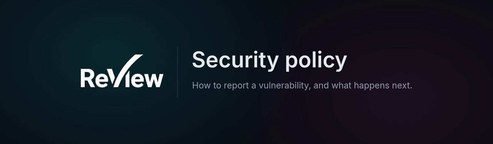
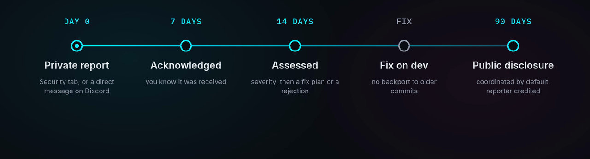

  

  
  
  
  

  <a href="#-reporting-a-vulnerability"><b>Report</b></a> ·
  <a href="#-what-to-expect"><b>What to expect</b></a> ·
  <a href="#-supported-versions"><b>Supported versions</b></a> ·
  <a href="#-scope"><b>Scope</b></a> ·
  <a href="#-hardening-your-own-instance"><b>Hardening</b></a>

---

ReView is self-hosted software: every instance is run by the studio that installed it. The
project operates no service on anyone's behalf, holds no user data, and offers no bug bounty.
What follows is how to report a vulnerability in the code published here, and what you can
expect in return.

## 📨 Reporting a vulnerability

> [!CAUTION]
> **Do not open a public issue, pull request or Discord message for a security problem.**

| | Channel | How |
|---|---|---|
| **1. Preferred** | GitHub private vulnerability reporting | Go to the [Security tab](https://github.com/YvigUnderscore/ReView/security) of this repository and choose *Report a vulnerability*. The report stays private between you and the maintainer. |
| **2. Fallback** | Discord, in private | If private reporting is unavailable to you, join the [Discord server](https://discord.gg/vw7h6BqcNc) and send a **direct message to the maintainer** asking for a private channel. Do not describe the issue in a public channel. |

A useful report contains:

- the affected version (commit hash);
- the component: backend route, worker, frontend, nginx or docker configuration;
- reproduction steps or a proof of concept;
- the impact you believe it has;
- whether authentication or a specific role is required.

## ⏱️ What to expect

  

| Stage | Target |
|---|---|
| Acknowledgement that the report was received | 7 days |
| Assessment, severity, and a fix plan or a rejection | 14 days |
| Coordinated public disclosure after a fix ships | 90 days by default |

ReView is maintained by one person; these are the honest targets of a small project, not a
commercial SLA. If a deadline slips you will be told, and you are free to disclose after the
90 days if nothing has happened. Reporters are credited in the advisory unless they ask not
to be.

## 🛡️ Supported versions

| Version | Supported |
|---|---|
| Tip of the default branch (`dev`) | ✅ Yes |
| Any older commit or git tag | ❌ No |

There is no released version line yet. Security fixes land on the default branch and are not
backported: the git tags in this repository predate the current codebase. Self-hosted
instances should track the default branch.

## 🎯 Scope

**In scope:** anything shipped from this repository.

- the backend API (authentication, RBAC, uploads, presigned URLs, client shares, public routes
  such as the OpenAPI page and unsubscribe links, the v1 API and its tokens);
- the frontend application (XSS, token handling, annotation and board rendering);
- the workers (media handling, archive extraction, 3D/USD conversion);
- the configuration published here as a default: `docker-compose*.yml`, `nginx/`,
  `backend/Dockerfile`, `frontend/Dockerfile`;
- the dependency set, when a vulnerable version is pinned in a committed lockfile.

**Out of scope:**

- misconfiguration of a specific instance (weak secrets, an object store exposed to the
  internet, TLS termination that was not set up, self-registration deliberately enabled);
- vulnerabilities in third-party dependencies with no exploitable path in ReView: report those
  upstream, then tell us so the dependency can be bumped;
- findings that require pre-existing studio administrator privileges, which by design can
  reconfigure the instance;
- resource exhaustion or denial of service against a self-hosted instance, and volumetric
  testing in general;
- reports produced solely by an automated scanner, without a demonstrated impact;
- social engineering, physical access, and anything targeting the maintainer's accounts rather
  than the code.

> [!WARNING]
> Never test against an instance you do not own or have written permission to test.

## 🔒 Hardening your own instance

The security model actually implemented (authentication and sessions, authorization, storage,
SSRF guards, secrets, transport headers, rate limiting, and the known watch-points) is
documented in [DOCUMENTATION/infrastructure/security.md](DOCUMENTATION/infrastructure/security.md).
Read it before exposing an instance to the internet. The project has never undergone a
third-party security audit.

## 📄 License

ReView is distributed under the GNU Affero General Public License v3.0 or later (see
[LICENSE](LICENSE)). Contributions, including security fixes, follow
[CONTRIBUTING.md](CONTRIBUTING.md) and require the [CLA](CLA.md).
