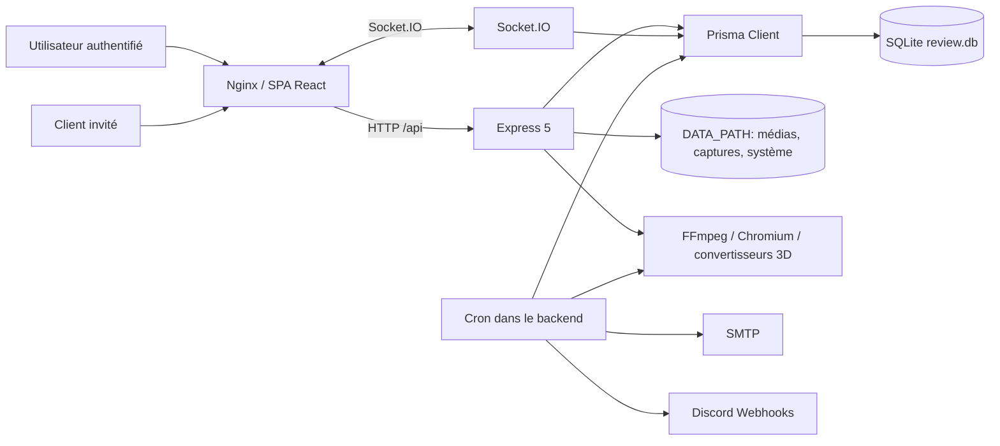
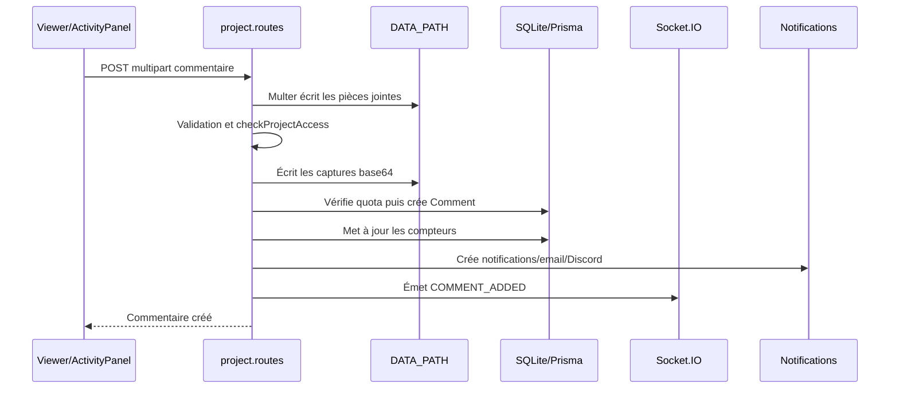
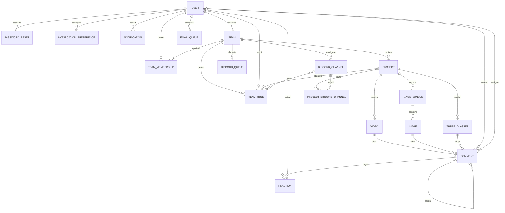
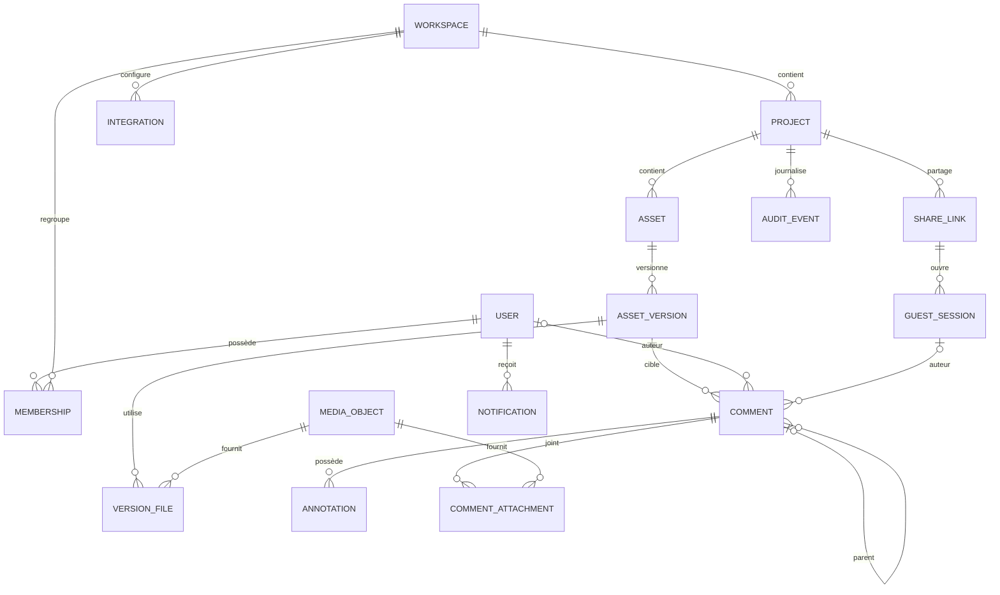

# Audit technique complet de ReView 1.1.0

**Date de l'audit :** 14 juin 2026  
**Périmètre :** état local du dépôt `ReView-app`, incluant les modifications non commitées présentes au moment de l'audit  
**Référence Git observée :** commit `5ca706a3e8c3dcd2ccfdc325a0a8dddb7551d819`, tag `1.1.0`  
**Méthode :** inspection statique exhaustive du code, des configurations, des migrations et des routes, complétée par une lecture seule de `dev_data/review.db` et de son arborescence média

> Ce rapport ne repose pas uniquement sur les README. Les conclusions citent les fichiers et symboles réellement inspectés. Les termes **non trouvé**, **à confirmer** et **inféré depuis le code** signalent explicitement les limites de preuve.

## A. Résumé exécutif

### A.1 Ce qu'est ReView 1.1.0

ReView est une application web full-stack auto-hébergeable de revue collaborative de médias. Elle permet de créer des projets contenant des versions vidéo, image ou 3D, de commenter et annoter ces médias, de gérer des équipes, de partager une revue avec un client externe et d'envoyer des notifications internes, email et Discord.

Le produit est techniquement un monolithe distribué en deux applications :

- un frontend React/Vite servi par Nginx ;
- une API Node.js/Express avec Socket.IO ;
- une base SQLite pilotée par Prisma ;
- un stockage média sur le système de fichiers local ;
- des traitements FFmpeg, Chromium/Puppeteer et conversion 3D exécutés dans le processus backend ou dans des tâches cron du même conteneur.

Sources principales : `frontend/src/App.jsx`, `frontend/src/desktop/DesktopApp.jsx`, `frontend/src/mobile/MobileApp.jsx`, `backend/server.js`, `backend/project.routes.js`, `backend/prisma/schema.prisma`, `docker-compose.yml`.

### A.2 Stack détectée

| Couche | Technologies |
|---|---|
| Frontend | React 19.2, React Router 7.10, Vite 7.3, Tailwind CSS 3.4, Socket.IO Client, Framer Motion, Sonner |
| Média | HTML5 video/canvas, Google `<model-viewer>`, Three.js, JSZip |
| Backend | Node.js CommonJS, Express 5.2, Socket.IO 4.8 |
| Données | SQLite, Prisma 5.10 |
| Traitements | FFmpeg, Puppeteer Core/Chromium, FBX2glTF/Assimp, PDFKit, csv-writer |
| Notifications | Nodemailer, webhooks Discord, files d'attente stockées en SQLite |
| Déploiement | Docker Compose, Nginx, images Node 18 |

Les README et le tag annoncent `1.1.0`, tandis que `frontend/package.json` et `backend/package.json` déclarent `1.0.2`. La version applicative n'a donc pas de source unique fiable.

### A.3 Complexité et état global

Le niveau de complexité est **élevé** pour une application mono-instance :

- trois familles de médias avec des comportements distincts ;
- annotation vectorielle et 3D ;
- collaboration temps réel ;
- gestion de versions ;
- partage public ;
- quotas de stockage ;
- génération de rendus et digests ;
- plusieurs canaux de notification ;
- gestion du cycle de vie des fichiers.

Le produit est fonctionnellement riche, mais son architecture est arrivée à un point où les modifications deviennent risquées. Les symptômes les plus visibles sont :

- `backend/project.routes.js` dépasse 3 700 lignes ;
- `frontend/src/components/ThreeD/ModelViewer.jsx` dépasse 2 200 lignes ;
- plusieurs responsabilités sont mélangées dans les routes et composants ;
- les opérations DB et fichiers ne sont pas atomiques ;
- les règles de permission sont dispersées et incohérentes ;
- le schéma autorise des états impossibles au niveau métier ;
- les migrations ne constituent pas une histoire reproductible fiable ;
- la couverture de tests automatisés est quasiment absente.

### A.4 Conclusions critiques

| ID | Gravité | Conclusion | Preuves |
|---|---|---|---|
| C-01 | Critique | Chaque démarrage exécute `prisma db push --accept-data-loss`. Une évolution de schéma peut supprimer ou réécrire des données sans migration contrôlée. | `backend/start.sh` |
| C-02 | Critique | Un détenteur d'un ancien `clientToken` rejoint automatiquement la room Socket.IO du projet, sans contrôle du statut courant, puis reçoit les événements de commentaires internes non filtrés. | `backend/services/socketService.js`, émissions `COMMENT_*` dans `backend/project.routes.js` |
| C-03 | Critique | L'identité d'un client invité est seulement son `guestName`. Connaître ce nom suffit à demander la modification ou suppression de ses commentaires. | `backend/client.routes.js`, `frontend/src/pages/ClientReview.jsx` |
| C-04 | Élevée | Les médias protégés utilisent un JWT en paramètre d'URL. Cela expose le jeton dans l'historique, les logs, les outils réseau et potentiellement les en-têtes Referer. Le partage client ne possède en parallèle aucun mécanisme correct d'accès aux médias protégés. | `frontend/src/context/AuthContext.jsx`, `backend/media.routes.js`, `frontend/src/pages/ClientReview.jsx` |
| C-05 | Élevée | Suppression, corbeille, restauration et comptage de stockage comportent des chemins incohérents, du code dupliqué et des fichiers orphelins probables. | `backend/project.routes.js`, `backend/services/cleanupService.js`, `backend/utils/storage.js`, `backend/admin.routes.js` |
| C-06 | Élevée | La création de commentaires internes ne garantit ni une cible média unique, ni l'appartenance de la cible, du parent ou de l'assigné au projet. La base locale contient déjà 16 commentaires sans cible média. | `backend/project.routes.js`, `backend/prisma/schema.prisma`, `dev_data/review.db` |
| C-07 | Élevée | Un membre d'équipe standard, et dans certains états un rôle `CLIENT`, obtient des droits d'écriture étendus via `checkProjectAccess`, notamment ajout de version et modifications de commentaires. | `backend/utils/authCheck.js`, `backend/project.routes.js` |
| C-08 | Élevée | La file email et la file Discord peuvent supprimer des événements même en cas d'échec d'envoi. Il n'existe ni tentative, ni statut, ni dead-letter queue. | `backend/services/emailBatchService.js`, `backend/services/discordService.js` |

### A.5 Orientation recommandée

ReView 2.0 devrait être reconstruit comme un **monolithe modulaire TypeScript**, accompagné d'un worker séparé pour les traitements média. Une architecture microservices serait prématurée. Les changements structurants recommandés sont :

- PostgreSQL et migrations versionnées obligatoires ;
- modèle unifié `Asset` / `AssetVersion` / `MediaObject` ;
- stockage objet S3-compatible ;
- worker asynchrone pour FFmpeg, conversion 3D, exports et notifications ;
- transactions et outbox pour synchroniser DB, fichiers et événements ;
- permissions centralisées et testées ;
- liens clients révocables associés à une session invitée ;
- schémas JSON validés et stockés en `JSONB` ;
- API versionnée et documentée par OpenAPI ;
- tests unitaires, intégration et E2E exécutés en CI.

## B. Cartographie du repository

### B.1 Arborescence synthétique

```text
ReView-app/
├── AGENTS.md
├── README.md
├── README_FR.md
├── installation.md
├── docker-compose.yml
├── package.json
├── assets_for_testing/
├── backend/
│   ├── server.js
│   ├── *.routes.js
│   ├── middleware.js
│   ├── middleware/
│   ├── services/
│   ├── utils/
│   ├── scripts/
│   ├── prisma/
│   │   ├── schema.prisma
│   │   └── migrations/
│   ├── bin/
│   ├── Dockerfile
│   └── start.sh
├── frontend/
│   ├── src/
│   │   ├── components/
│   │   ├── context/
│   │   ├── desktop/
│   │   ├── hooks/
│   │   ├── mobile/
│   │   ├── pages/
│   │   ├── utils/
│   │   └── assets/
│   ├── public/
│   ├── Dockerfile
│   ├── nginx.conf
│   └── vite.config.js
├── dev_data/
│   ├── review.db
│   ├── media/
│   └── comments/
└── docs/
    └── review-2.0-audit-plan.md
```

Les dossiers générés et volumineux ont été ignorés conformément au plan. Aucun `node_modules`, `dist`, `coverage` ou historique `.git` complet n'a été analysé.

### B.2 Rôle des dossiers majeurs

| Dossier | Rôle observé |
|---|---|
| `backend/` | API HTTP, authentification, permissions, accès Prisma, traitements média, notifications et Socket.IO |
| `backend/prisma/` | Schéma logique SQLite et 29 migrations SQL |
| `backend/services/` | Email, Discord, digests, cron, nettoyage, statistiques, Socket.IO et génération 3D |
| `backend/utils/` | Validation de fichiers, sécurité, quotas, métadonnées, exports et conversion FBX |
| `backend/scripts/` | Scripts manuels de test et de backfill ; pas un framework de migration métier |
| `frontend/src/components/` | Lecteurs vidéo/image/3D, annotation, commentaires et composants transverses |
| `frontend/src/pages/` | Écrans desktop, administration, équipes, revue client, paramètres et corbeille |
| `frontend/src/mobile/` | Application mobile distincte, avec routes et composants dédiés |
| `frontend/src/context/` | Authentification, branding, thème, en-tête et notifications |
| `frontend/src/hooks/` | Contrôleur de projet, dessin et logique d'état partagée |
| `frontend/public/` | Logo, captures du guide et script de rendu de digest |
| `dev_data/` | Base SQLite et médias d'une petite instance de développement |
| `assets_for_testing/` | Médias servant aux essais manuels |
| `docs/` | Plan d'audit fourni ; aucun autre document d'architecture préexistant |

### B.3 Fichiers clés

| Fichier | Importance |
|---|---|
| `backend/server.js` | Composition de l'API, middlewares, routes, Socket.IO et tâches planifiées |
| `backend/project.routes.js` | Cœur métier : projets, médias, versions, commentaires, exports, statuts et corbeille |
| `backend/prisma/schema.prisma` | Source déclarative du modèle de données courant |
| `backend/start.sh` | Initialisation de la base et démarrage de production |
| `backend/utils/authCheck.js` | Politique d'accès projet/commentaire |
| `backend/media.routes.js` | Autorisation et service des médias privés |
| `backend/client.routes.js` | Revue externe par jeton |
| `backend/services/socketService.js` | Authentification et rooms temps réel |
| `backend/services/notificationService.js` | Création et diffusion des notifications |
| `backend/services/discordService.js` | Routage Discord et traitement des files |
| `frontend/src/desktop/DesktopApp.jsx` | Routage desktop |
| `frontend/src/mobile/MobileApp.jsx` | Routage mobile |
| `frontend/src/hooks/useProjectController.js` | Orchestration de la page projet |
| `frontend/src/components/VideoPlayer.jsx` | Revue vidéo |
| `frontend/src/components/ImageViewer.jsx` | Revue image |
| `frontend/src/components/ThreeD/ModelViewer.jsx` | Revue 3D |
| `frontend/src/components/ActivityPanel.jsx` | Commentaires et actions de revue |
| `frontend/src/pages/ClientReview.jsx` | Expérience client externe |
| `frontend/src/pages/Admin/AdminDashboard.jsx` | Administration globale |

## C. Stack technique

### C.1 Langages et paradigmes

- JavaScript ES modules côté frontend ;
- JavaScript CommonJS côté backend ;
- SQL SQLite dans les migrations ;
- JSX pour l'interface ;
- CSS Tailwind et CSS global ;
- shell POSIX pour le démarrage du conteneur.

TypeScript, contrats partagés et génération de types API : **non trouvés**.

### C.2 Dépendances majeures et usages

| Dépendance | Usage | Risque observé |
|---|---|---|
| React 19 / React Router 7 | UI et navigation | Deux applications desktop/mobile maintenues en parallèle |
| Vite 7 | Build frontend | Aucun test intégré au script de build |
| Express 5 | API | Routes très volumineuses, validation manuelle |
| Prisma 5.10 | ORM SQLite | Version déclarée ancienne par rapport au reste de la stack ; surtout, usage de `db push` en production |
| Socket.IO | Commentaires, projets, notifications, stats | Autorisation différente de l'API et rooms partagées client/interne |
| Multer | Uploads | Écriture disque avant validation complète ; limites inégales |
| FFmpeg | Métadonnées, miniatures, exports, digests | Charge CPU dans le serveur web, synchronisation fragile |
| Puppeteer Core | Captures et rendus 3D | Processus lourds dans le backend, dépendance à Chromium |
| `<model-viewer>` / Three.js | Affichage et rendu 3D | Composants très volumineux et état complexe |
| PDFKit / csv-writer | Exports | Résolution de chemins incohérente selon le type de média |
| Nodemailer | Email | Secrets SMTP stockés en clair dans `SystemSetting` |
| Axios | Webhooks Discord | URL principale d'équipe insuffisamment validée |

### C.3 Scripts disponibles

| Emplacement | Script | Observation |
|---|---|---|
| `frontend/package.json` | `dev` | Lance Vite |
| `frontend/package.json` | `build` | Construit le frontend |
| `frontend/package.json` | `lint` | Exécute ESLint |
| `frontend/package.json` | `preview` | Prévisualise le build |
| `backend/package.json` | `test` | Échoue volontairement avec `Error: no test specified` |
| `backend/start.sh` | démarrage | Génère Prisma, pousse le schéma avec perte acceptée, puis lance Node |
| `backend/scripts/backfill_slugs.js` | maintenance | Backfill manuel des slugs |
| `backend/scripts/test_notifications.js` | essai manuel | Script ad hoc, pas une suite de tests |
| `backend/scripts/test_digest_gif_gen.js` | essai manuel | Script ad hoc avec effets de bord potentiels |

Le package racine installe Jest, Supertest et Playwright, mais aucun `playwright.config.*`, `jest.config.*` ou scénario E2E exploitable n'a été trouvé.

### C.4 Tests observés

- `frontend/src/utils/annotationUtils.test.js` est un script Node artisanal. Il a été exécuté en lecture seule : **8 assertions réussies sur 8**.
- `frontend/src/utils/tests/dummy.test.js` contient uniquement un import Vitest, alors que Vitest n'est pas déclaré.
- aucun test de routes, permissions, migration, stockage, Socket.IO ou traitement média n'a été trouvé ;
- aucune CI sous `.github/workflows` n'a été trouvée ;
- les dépendances n'étaient pas installées localement, donc lint, build et tests de dépendances n'ont pas été exécutés.

### C.5 Configuration et déploiement

`docker-compose.yml` lance :

- Nginx/frontend sur `3429` par défaut ;
- backend sur `3430` côté hôte et `3000` dans le réseau Docker ;
- un volume unique pour la base et les médias ;
- `DATABASE_URL=file:/app/data/review.db`.

`frontend/nginx.conf` :

- accepte des corps jusqu'à 1 Go ;
- sert la SPA ;
- proxy `/api` et `/socket.io`.

`backend/Dockerfile` installe FFmpeg, Chromium, Assimp et plusieurs familles de polices. Le backend et les workers lourds partagent le même processus applicatif.

Variables effectivement référencées :

| Variable | Usage |
|---|---|
| `JWT_SECRET` | Signature JWT, obligatoire dans le middleware |
| `DATA_PATH` | Base du stockage local |
| `DATABASE_URL` | Connexion Prisma |
| `PORT` | Port backend |
| `SITE_URL` | Liens d'email de réinitialisation |
| `SMTP_FROM` | Expéditeur de secours |
| `TZ` | Fuseau du conteneur |
| `BPORT` | Publication du backend dans Compose |

Il n'existe pas de `.env.example`. Le fichier `.env` réel est ignoré par Git et n'est pas reproduit dans ce rapport.

### C.6 Écarts documentation/code

- Le README annonce une interface bilingue. Le guide et la page de mise à jour sont bilingues, mais l'application métier contient majoritairement des chaînes anglaises codées en dur. Une infrastructure i18n globale est **non trouvée**.
- Le guide mentionne GLB/FBX ; le code accepte aussi USD/USDA/USDC/USDZ et ZIP, avec support effectif à confirmer selon les outils système.
- Le README décrit des liens clients « sécurisés ». Le jeton est long et aléatoire, mais il est permanent, non révocable explicitement et insuffisamment isolé du temps réel interne.
- Les package manifests annoncent `1.0.2`, contrairement au tag et aux README `1.1.0`.

## D. Fonctionnalités complètes

### D.0 Cartographie des routes frontend

#### Desktop

| Route | Accès | Écran/fonction |
|---|---|---|
| `/` | public | landing ou redirection dashboard |
| `/setup` | public, seulement première initialisation | création du premier administrateur |
| `/login` | public | connexion |
| `/register` | public | inscription par invitation |
| `/forgot-password` | public | demande de réinitialisation |
| `/reset-password` | public | choix du nouveau mot de passe |
| `/review/:token` | public par capability | revue client externe |
| `/guide` | public | guide bilingue |
| `/latest-update` | public | notes de version bilingues |
| `/dashboard` | authentifié | activité récente |
| `/projects` | authentifié | bibliothèque de projets |
| `/project/:id` | authentifié | revue projet par ID |
| `/:teamSlug/:projectSlug/:versionName?` | authentifié | revue projet par slugs |
| `/project/:id/comments-popup` | authentifié | commentaires dans une fenêtre séparée |
| `/admin` | authentifié, contrôle admin dans le composant/API | administration |
| `/team` et `/:teamSlug` | authentifié | gestion d'équipe |
| `/team/roles` | authentifié | rôles/départements et canaux Discord |
| `/team/settings` | authentifié, avec exception présente pendant setup | paramètres d'équipe |
| `/trash` | authentifié | corbeille |
| `/settings` | authentifié | profil, notifications, équipes et danger zone |

Source : `frontend/src/desktop/DesktopApp.jsx`.

#### Mobile

| Route | Accès | Écran/fonction |
|---|---|---|
| `/login` | public | connexion mobile |
| `/dashboard` | authentifié | dashboard mobile |
| `/projects` | authentifié | projets |
| `/activity` | authentifié | activité |
| `/project/:id` | authentifié | revue projet plein écran |
| `/:teamSlug/:projectSlug/:versionName?` | authentifié | revue projet par slugs |
| `/settings` | authentifié | profil |
| `/settings/edit` | authentifié | édition profil |
| `/settings/preferences` | authentifié | préférences |
| `/settings/privacy` | authentifié | confidentialité |

Setup, inscription, reset, revue client, guide, administration, équipes et corbeille sur mobile : **non trouvés dans le routeur mobile**. Source : `frontend/src/mobile/MobileApp.jsx`.

### D.1 Authentification et cycle de vie utilisateur

**Objectif.** Initialiser une instance, créer des comptes par invitation, se connecter, gérer son profil et réinitialiser son mot de passe.

**Parcours.**

1. `GET /api/auth/status` détecte l'absence d'utilisateur.
2. `POST /api/auth/setup` crée le premier administrateur.
3. Les comptes suivants utilisent un `Invite`.
4. `POST /api/auth/login` retourne un JWT valable sept jours.
5. Le frontend stocke ce JWT dans `localStorage`.
6. Le profil permet nom, email, avatar et changement de mot de passe.
7. La réinitialisation crée un `PasswordReset` et envoie un email.

**Écrans et fichiers.** `frontend/src/pages/Setup.jsx`, `Login.jsx`, `Register.jsx`, `ForgotPassword.jsx`, `ResetPassword.jsx`, `SettingsPage.jsx`, `frontend/src/context/AuthContext.jsx`, `backend/auth.routes.js`, `backend/middleware.js`.

**Données.** `User`, `Invite`, `PasswordReset`, `SystemSetting` pour SMTP.

**Règles et erreurs.**

- mots de passe contrôlés par `backend/utils/validation.js` ;
- bcrypt pour le hash ;
- réponses génériques sur mot de passe oublié ;
- contrôles de débit sur setup/register/login/reset ;
- avatar limité à 5 Mo et validé après écriture.

**Faiblesses.**

- JWT longue durée, sans refresh token, table de session, révocation ou rotation ;
- stockage en `localStorage`, aggravant l'impact d'une XSS ;
- jetons de reset stockés en clair ;
- course possible lors du premier setup, car `count` puis `create` ne sont pas transactionnels ;
- remplacement d'avatar non atomique entre fichier et DB ;
- l'invitation créée par un propriétaire d'équipe crée un compte global sans rattachement automatique à cette équipe.

**Recommandation 2.0.** Sessions serveur ou access token court + refresh token rotatif en cookie `HttpOnly`, invitations liées à un workspace et à un rôle, jetons sensibles hashés, journalisation des connexions et révocation.

### D.2 Profil, préférences et suppression de compte

**Fonctions.** Mise à jour profil/avatar/mot de passe, thème, volume et vitesse locale, préférences de notifications, mémorisation de filtres, suppression du compte.

**Fichiers.** `frontend/src/pages/SettingsPage.jsx`, `frontend/src/components/UserProfileModal.jsx`, `frontend/src/context/ThemeContext.jsx`, `frontend/src/pages/RecentActivity.jsx`, `backend/user.routes.js`, `backend/auth.routes.js`.

**Données.** `User.preferences` contient du JSON texte ; `NotificationPreference` stocke email/in-app/Discord par type.

**Faiblesses.**

- schémas de préférences non versionnés ;
- préférences réparties entre DB et plusieurs clés `localStorage` ;
- `inApp` est exposé mais les notifications sont créées sans toujours respecter ce choix ;
- l'UI de suppression ne redemande pas le mot de passe ;
- suppression et transfert de ressources dépendent de règles dispersées.

### D.3 Équipes, membres et rôles

**Fonctions.**

- création et sélection d'équipe ;
- ajout d'un utilisateur existant par email ;
- rôles de membership `OWNER`, `ADMIN`, `MEMBER`, `CLIENT` ;
- changement de rôle, retrait, départ, transfert de propriété et suppression ;
- configuration du frame de départ ;
- quotas de stockage ;
- rôles personnalisés/départements avec couleur et assignation aux utilisateurs/projets/canaux Discord.

**Fichiers.** `frontend/src/pages/Team/TeamDashboard.jsx`, `TeamSettings.jsx`, `TeamRoles.jsx`, `frontend/src/context/AuthContext.jsx`, `backend/team.routes.js`, `backend/role.routes.js`, `backend/discordChannel.routes.js`.

**Données.** `Team`, `TeamMembership`, `TeamRole`, `_UserRoles`, `_ProjectRoles`, `_ChannelRoles`.

**Faiblesses.**

- deux concepts portent le nom de rôle : rôle d'accès de `TeamMembership` et étiquette départementale `TeamRole` ;
- les `TeamRole` ne sont pas des permissions, malgré une présentation pouvant le laisser penser ;
- absence d'unicité `(teamId, name)` ;
- suppression/assignation/retrait d'un `roleId` sans vérifier qu'il appartient au `teamId` de l'URL dans `backend/role.routes.js` ;
- ajout de rôles à un canal Discord sans validation d'appartenance à l'équipe ;
- le propriétaire existe dans `Team.ownerId` et peut aussi être représenté par un membership, créant deux sources de vérité ;
- suppression d'équipe et fichiers non atomiques.

### D.4 Bibliothèque de projets et tableau d'activité

**Fonctions.**

- navigation par dossier d'équipe ;
- recherche, filtre de statut, filtre équipe/date et tri ;
- glisser-déposer pour créer un projet ;
- cartes avec statut, édition et suppression ;
- activité récente ;
- mémorisation des filtres côté client et dans `User.preferences`.

**Fichiers.** `frontend/src/pages/ProjectLibrary.jsx`, `RecentActivity.jsx`, `frontend/src/components/ProjectListToolbar.jsx`, `ProjectCard.jsx`, `CreateProjectModal.jsx`, `EditProjectModal.jsx`, `backend/project.routes.js`.

**Données.** `Project`, relations médias, `Team`.

**Faiblesses.**

- le frontend charge tous les projets accessibles puis filtre par équipe en mémoire ;
- pagination serveur absente ;
- filtres et tris exécutés côté client ;
- les recherches ne sont pas indexées ;
- logique similaire dupliquée entre bibliothèque et activité récente.

### D.5 Création de projet et upload média

**Formats.**

- vidéo ;
- image unique ou collection jusqu'à 50 fichiers ;
- 3D GLB, FBX, USD, USDA, USDC, USDZ ;
- ZIP contenant modèle et textures.

**Parcours.**

1. L'utilisateur choisit équipe, nom, description, type et rôles.
2. Multer écrit les fichiers dans un répertoire temporaire.
3. Le backend détecte le type par extension et contenu.
4. Le projet et sa première version sont créés.
5. Les fichiers sont déplacés sous `media/<teamSlug>/<projectSlug>/`.
6. Miniatures, GIF 3D ou conversions sont générés.
7. Les compteurs de stockage et notifications sont mis à jour.

**Fichiers.** `frontend/src/components/CreateProjectModal.jsx`, `backend/project.routes.js`, `backend/utils/validation.js`, `thumbnail.js`, `fbxConverter.js`, `backend/services/threeDService.js`.

**Données.** `Project`, `Video`, `ImageBundle`, `Image`, `ThreeDAsset`, `TeamRole`.

**Faiblesses.**

- validation après écriture disque ;
- pas de limite Multer globale sur l'upload projet, malgré la limite Nginx de 1 Go ;
- conversion et génération lourdes dans la requête HTTP ;
- écritures DB et mouvements de fichiers non transactionnels ;
- nettoyage incomplet sur certains retours précoces ou exceptions ;
- `roleIds` de création non vérifiés contre l'équipe ;
- ZIP traité en mémoire avec `adm-zip`, risque de consommation mémoire et zip bomb ;
- chemin et taille du 3D converti peuvent ne plus correspondre à l'original comptabilisé.

### D.6 Versioning et comparaison

**Fonctions.**

- ajout d'une version vidéo, image ou 3D ;
- nommage automatique `Vxx` basé sur le nombre total de versions ;
- sélection de version ;
- renommage des versions vidéo et 3D ;
- comparaison vidéo côte à côte ;
- événements temps réel `VERSION_ADDED`.

**Fichiers.** `frontend/src/hooks/useProjectController.js`, `frontend/src/components/ViewerTopMenu.jsx`, `VideoPlayer.jsx`, `backend/project.routes.js`.

**Faiblesses.**

- trois tables de versions séparées ;
- ordre client externe construit par catégorie et non par date ;
- nom de version calculé par comptage, donc sensible aux courses, suppressions et trous ;
- aucune contrainte unique `(projectId, versionName)` ;
- un projet peut changer de type de média entre versions, sans modèle explicite ;
- pas de suppression d'une version individuelle ;
- comparaison UI susceptible de recevoir un média incompatible ;
- notifications de nouvelle vidéo émises deux fois dans certains chemins.

### D.7 Revue vidéo

**Fonctions.**

- lecture/pause, seek et navigation frame par frame ;
- vitesse, volume, boucle et plein écran ;
- timecode SMPTE et numéro de frame ;
- sélection d'une plage temporelle ;
- marqueurs de commentaires sur timeline ;
- comparaison synchronisée de deux versions ;
- dessin sur image courante ;
- raccourcis clavier.

**Fichiers.** `frontend/src/components/VideoPlayer.jsx`, `VideoControls.jsx`, `Timeline.jsx`, `VideoImageToolbar.jsx`, `frontend/src/utils/timeUtils.js`, `frontend/src/hooks/useDrawing.js`.

**Données.** `Video.frameRate`, `Comment.timestamp`, `Comment.duration`, `Comment.annotation`, captures de commentaire.

**Faiblesses.**

- `formatSMPTE` ignore le paramètre `startFrame`, alors que le numéro de frame applique le décalage ;
- état de lecture, comparaison, annotation et commentaires centralisé dans un hook très volumineux ;
- absence de validation serveur des timestamps par rapport à la durée du média ;
- l'historique du dessin ne permet pas toujours d'annuler la première forme jusqu'à un canvas vide ;
- aucune gestion documentée des framerates non entiers/drop-frame.

### D.8 Revue image

**Fonctions.**

- affichage d'image ou séquence ;
- navigation entre images ;
- zoom, pan et plein écran ;
- annotations vectorielles ;
- commentaires attachés à une image précise.

**Fichiers.** `frontend/src/components/ImageViewer.jsx`, `AnnotationCanvas.jsx`, `VideoImageToolbar.jsx`, `backend/project.routes.js`.

**Données.** `ImageBundle`, `Image.order`, `Image.path`, `Comment.imageId`.

**Faiblesses.**

- la notion de bundle image est couplée à la version ;
- absence de métadonnées d'image normalisées : largeur, hauteur, espace couleur, hash ;
- export PDF résout certains chemins avec `DATA_PATH/..`, fragile selon l'environnement ;
- la taille d'un bundle est reconstituée par somme, sans entité de stockage unifiée.

### D.9 Revue 3D

**Fonctions.**

- affichage de modèles et textures ;
- caméra orbitale, presets et restauration de vue ;
- animations, seek et sélection de clip ;
- variantes de matériau ;
- exposition, environnement et ombres ;
- hotspots point, surface et dimension ;
- vues caméra enregistrées ;
- annotations 2D superposées ;
- commentaires avec état caméra et zoom adaptatif ;
- capture d'image et génération de GIF de rotation.

**Fichiers.** `frontend/src/components/ThreeD/ModelViewer.jsx`, `ThreeDViewer.jsx`, `frontend/src/mobile/components/ThreeD/MobileModelViewer.jsx`, `backend/services/threeDService.js`, `backend/utils/fbxConverter.js`.

**Données.** `ThreeDAsset`, `Comment.cameraState`, `Comment.hotspots`, `Comment.annotation`.

**Faiblesses.**

- composant desktop de plus de 2 200 lignes ;
- JSON non typé et non versionné pour caméra/hotspots ;
- ancienne colonne `scale` ajoutée puis supprimée par migrations successives ;
- rendu digest 3D charge Three.js depuis `unpkg.com` dans `backend/services/digestVideoService.js`, créant une dépendance réseau et supply-chain au runtime ;
- fonctionnalités desktop/mobile partiellement divergentes ;
- conversion USD annoncée/acceptée mais support réel à confirmer par format et environnement.

### D.10 Annotation et dessin

**Outils observés.**

- crayon ;
- surligneur ;
- gomme et suppression d'objet ;
- rectangle, cercle, ligne, flèche, courbe ;
- texte ;
- hotspots 3D et dimensions ;
- annulation/rétablissement ;
- couleurs et épaisseurs.

**Fichiers.** `frontend/src/components/AnnotationCanvas.jsx`, `frontend/src/hooks/useDrawing.js`, `frontend/src/utils/annotationUtils.js`, `frontend/src/components/ThreeD/ModelViewer.jsx`.

**Stockage.** Coordonnées normalisées dans `Comment.annotation`, JSON texte. Captures dans `dev_data/comments` ou le répertoire `comments` de `DATA_PATH`.

**Faiblesses.**

- schéma JSON implicite ;
- absence de version du format ;
- absence de migration ou validateur central ;
- plusieurs champs se chevauchent : annotation, hotspots, cameraState, screenshot et annotationScreenshot ;
- captures et JSON peuvent diverger sans checksum ni statut de génération.

### D.11 Commentaires, fils, assignation et réactions

**Fonctions.**

- commentaire racine ou réponse ;
- commentaire ponctuel ou plage ;
- mentions d'utilisateurs et rôles ;
- assignation ;
- résolution ;
- visibilité client ;
- édition et suppression ;
- réactions emoji ;
- jusqu'à 10 pièces jointes image de 5 Mo ;
- popout et navigation vers le média/commentaire ;
- mute de projet.

**Fichiers.** `frontend/src/components/ActivityPanel.jsx`, `FixedCommentsPanel.jsx`, `MentionsInput.jsx`, `CommentsPopout.jsx`, `backend/project.routes.js`, `backend/notification.routes.js`.

**Données.** `Comment`, `Reaction`, `Notification`, `_MutedProjects`.

**Faiblesses.**

- aucune contrainte « exactement une cible média » ;
- aucun `projectId` direct sur Comment, donc accès et requêtes complexes ;
- aucune validation que cible, parent et assigné appartiennent au projet ;
- n'importe quel membre autorisé peut modifier résolution, assignation et visibilité client ;
- première route de suppression atteignable ne supprime pas les fichiers et ne décrémente pas le stockage ;
- seconde route de suppression est morte à cause du doublon de déclaration ;
- `Reaction.guestName` n'est pas réellement utilisé par l'API invitée ;
- les commentaires sans cible deviennent impossibles à autoriser via `checkCommentAccess`.

### D.12 Revue client externe

**Parcours.**

1. Un statut projet génère ou réutilise `Project.clientToken`.
2. Le client ouvre `/client/:token`.
3. Il saisit un nom, mémorisé globalement dans `localStorage.clientName`.
4. Il consulte les médias et commentaires visibles.
5. Il ajoute, édite ou supprime ses commentaires pendant `CLIENT_REVIEW`.
6. `ALL_REVIEWS_DONE` rend la revue en lecture seule.

**Fichiers.** `frontend/src/pages/ClientReview.jsx`, `ClientLogin.jsx`, `backend/client.routes.js`, `backend/services/socketService.js`.

**Faiblesses majeures.**

- jeton non expirant, non rotatif et non révocable explicitement ;
- Socket.IO rejoint la room même si le projet repasse en `INTERNAL_REVIEW` ;
- événements Socket internes non filtrés par `isVisibleToClient` ;
- édition/suppression protégées uniquement par le nom ;
- nom partagé entre tous les projets sur le même navigateur ;
- le client n'écoute que `COMMENT_ADDED`, pas update/delete/status/version ;
- médias rendus via `/api/media/...` sans JWT ou capability média adaptée ;
- choix de « dernière version » incorrect lorsque plusieurs types de médias coexistent.

### D.13 Notifications temps réel et internes

**Fonctions.**

- notifications utilisateur ;
- notifications non lues/lues/suppression ;
- événements projet, commentaire, version et upload ;
- room utilisateur, projet et statistiques admin ;
- rafraîchissement des listes et du projet.

**Fichiers.** `frontend/src/context/NotificationContext.jsx`, `frontend/src/components/NotificationsPopover.jsx`, `backend/notification.routes.js`, `backend/services/socketService.js`, `backend/services/notificationService.js`.

**Faiblesses.**

- l'API et Socket.IO n'appliquent pas exactement la même authentification ;
- Socket.IO fait confiance au rôle contenu dans le JWT sans relire l'utilisateur ;
- CORS Socket.IO autorise `*` ;
- certains appels passent `data` alors que le service attend `extraData`, perdant des détails ;
- beaucoup d'événements provoquent un rechargement complet du projet ;
- absence de séquence d'événements, reprise ou idempotence.

### D.14 Email et Discord

**Fonctions.**

- SMTP configurable ;
- email de reset, test et broadcast ;
- préférences et digests ;
- webhook Discord d'équipe ;
- canaux Discord personnalisés par département ;
- timing REALTIME, GROUPED, HYBRID, HOURLY, MAJOR ;
- digest vidéo/image, annotations brûlées, bot et avatar personnalisés.

**Fichiers.** `backend/services/emailService.js`, `emailBatchService.js`, `discordService.js`, `digestVideoService.js`, `digestImageService.js`, `digestGifService.js`, `backend/discordChannel.routes.js`, `frontend/src/pages/Team/TeamSettings.jsx`, `TeamRoles.jsx`.

**Faiblesses.**

- mot de passe SMTP stocké en clair ;
- HTML email construit avec des données insuffisamment échappées ;
- liens email pouvant viser d'anciennes routes/hash routes ;
- `EmailQueue` supprimée même lorsque l'envoi retourne un échec ;
- `DiscordQueue` supprimée même si le webhook échoue ou le canal n'existe plus ;
- canaux ayant un timing override groupé/horaire potentiellement non traités si le timing d'équipe diffère ;
- webhook principal d'équipe sans validation équivalente aux canaux personnalisés ;
- aucune tentative, backoff, dead-letter ou clé d'idempotence.

### D.15 Exports

**Fonctions.**

- vidéo : PDF et CSV ;
- image : PDF ;
- 3D : PDF ;
- captures et pièces jointes intégrées quand elles sont trouvées.

**Fichiers.** routes export de `backend/project.routes.js`, `backend/utils/export.js`.

**Faiblesses.**

- résolution de chemins différente entre miniature, image et pièce jointe ;
- métadonnées vidéo demandées avec un chemin relatif dans certains cas ;
- exports lourds produits dans la requête ;
- pas d'entité d'export, de statut ou de lien temporaire ;
- nettoyage best-effort des fichiers temporaires.

### D.16 Corbeille et rétention

**Fonctions.**

- soft delete via `Project.deletedAt` ;
- déplacement des médias vers `media/Trash/...` ;
- restauration ;
- suppression définitive ;
- nettoyage automatique selon une durée globale.

**Fichiers.** `frontend/src/pages/Trash.jsx`, `backend/project.routes.js`, `backend/services/cleanupService.js`, `backend/services/cronService.js`.

**Faiblesses.**

- deux routes identiques `DELETE /:id/permanent`, la seconde étant inatteignable ;
- droits trop larges pour restaurer/supprimer définitivement ;
- première route utilise `project.creatorId`, champ inexistant ;
- pièces jointes et captures externes au dossier projet non déplacées ;
- nettoyage automatique vérifie des chemins relatifs et ne supprime pas forcément le dossier Trash ;
- restauration des miniatures incohérente entre `/api/thumbnails` et le dossier média ;
- risque de DB supprimée avec fichiers conservés, ou inversement.

### D.17 Administration

**Fonctions.**

- utilisateurs, rôles globaux, mots de passe et quotas ;
- équipes et quotas ;
- rétention ;
- branding, titre, format de date, icône et son ;
- annonces popup/banner en Markdown ;
- SMTP, tests et broadcast ;
- paramètres de génération 3D/digest ;
- statistiques CPU/RAM/stockage ;
- recalcul des compteurs.

**Fichiers.** `frontend/src/pages/Admin/AdminDashboard.jsx`, `backend/admin.routes.js`, `backend/settings.routes.js`, `backend/services/systemStatsService.js`.

**Faiblesses.**

- stockage arbitraire clé/valeur sans schéma ;
- secrets dans `SystemSetting` ;
- `rehype-raw` et contenu d'annonce exigent une politique de sanitization stricte ;
- stockage affiché basé sur les compteurs utilisateurs plutôt que l'occupation disque réelle ;
- deux implémentations de recalcul diffèrent sur les commentaires ;
- route frontend admin protégée uniquement par la présence d'un utilisateur, même si le composant redirige ensuite les non-admins.

### D.18 Mobile

**Fonctions.** Dashboard, projets, activité, profil, préférences, confidentialité et revue des trois médias avec commentaires et dessin.

**Fichiers.** `frontend/src/mobile/MobileApp.jsx`, `frontend/src/mobile/pages/*`, `frontend/src/mobile/components/*`.

**Faiblesses.**

- application parallèle plutôt que design responsive partagé ;
- routes publiques setup/register/reset/client review/guide absentes du routeur mobile ;
- détection mobile basée sur user-agent et largeur, initialisée à `false`, pouvant monter brièvement l'app desktop ;
- divergence fonctionnelle et duplication des viewers/outils ;
- logs de debug présents dans `MobileModelViewer.jsx`.

### D.19 Logs, analytics et tracking

- logs console et fichiers `backend.log`/`backend_output.log` observés ;
- logging structuré, corrélation de requêtes, rotation et niveaux : **non trouvés** ;
- Sentry, OpenTelemetry, Prometheus ou équivalent : **non trouvés** ;
- analytics produit ou tracking utilisateur : **non trouvés** ;
- audit log des actions sensibles : **non trouvé**.

## E. Architecture actuelle

### E.1 Diagramme



### E.2 Frontend

**Structure.** Providers globaux dans `frontend/src/App.jsx`, puis sélection desktop/mobile. Le routage est en `BrowserRouter`. L'état mélange :

- contextes globaux ;
- états locaux volumineux ;
- `localStorage` ;
- `BroadcastChannel` ;
- Socket.IO ;
- rechargements complets via `fetch`.

**Points de couplage.**

- `useProjectController.js` orchestre récupération, versions, sockets, popout, playback, commentaires et partage ;
- les viewers connaissent directement les formes de données API ;
- `ClientReview.jsx` réimplémente une part importante du contrôleur ;
- l'app mobile réimplémente des pans entiers du desktop.

**Bugs visibles.**

- cleanup `VERSION_ADDED` utilisant `socket.on` au lieu de `socket.off` dans `useProjectController.js` ;
- canal `BroadcastChannel` construit avec `id` pouvant être `undefined` sur route slug ;
- URLs popout/thumbnail utilisant également `id` sur route slug ;
- deep link commentaire limité à la version active.

### E.3 Backend

Le backend est un monolithe de routes Express. La couche contrôleur, service métier, transaction, accès DB, fichiers, notifications et formatage de réponse est souvent fusionnée dans un même handler.

Plusieurs modules instancient leur propre `PrismaClient`, notamment routes, middleware et services. SQLite tolère mal une prolifération de connexions concurrentes et la fermeture ordonnée n'est pas centralisée.

Il n'existe pas de :

- couche de validation déclarative globale ;
- service de permissions unique par action ;
- unité de travail DB/fichiers ;
- repository cohérent ;
- gestion centralisée des erreurs métier ;
- contrat de réponse ou OpenAPI.

### E.4 Flux de création d'un commentaire



Ce flux n'est pas transactionnel. Une erreur après l'écriture fichier ou après la création DB peut laisser un état partiel.

### E.5 Sécurité actuelle

**Mesures positives.**

- bcrypt ;
- JWT signé ;
- Helmet ;
- taille limitée sur plusieurs corps ;
- validation du contenu réel des images/vidéos/3D ;
- sanitation HTML ;
- prévention simple de path traversal ;
- contrôles de débit sur les opérations sensibles ;
- vérification d'existence utilisateur dans le middleware HTTP ;
- protection CSV contre les formules.

**Lacunes.**

- CORS HTTP et Socket.IO ouvert ;
- JWT en URL et `localStorage` ;
- pas de CSRF car auth Bearer, mais le partage public est une capability permanente ;
- CSP contient `unsafe-inline` ;
- permissions par handler incohérentes ;
- aucune politique de sécurité de contenu uploadé centralisée ;
- aucun antivirus/sandbox ;
- aucune protection zip bomb explicite ;
- webhooks et sorties réseau insuffisamment encadrés ;
- secrets applicatifs en DB sans chiffrement ;
- aucune journalisation d'audit.

### E.6 Dette technique structurante

1. Monolithes de fichiers et duplication de routes.
2. Modèle média fragmenté.
3. Chemins de fichiers utilisés comme identifiants métier.
4. JSON texte non versionné.
5. Politiques d'accès implicites.
6. Travaux lourds dans le serveur web.
7. Temps réel sans modèle d'événement public/interne.
8. Migrations non fiables.
9. Compteurs de stockage non dérivables de manière unique.
10. Absence de tests de non-régression.

## F. Base de données actuelle

### F.1 Type et connexion

- moteur : SQLite ;
- ORM : Prisma ;
- schéma : `backend/prisma/schema.prisma` ;
- connexion : `DATABASE_URL`, définie à `file:/app/data/review.db` dans `docker-compose.yml` ;
- fichier local inspecté : `dev_data/review.db` ;
- initialisation production : `prisma db push --accept-data-loss` dans `backend/start.sh`.

Seeds formels : **non trouvés**. Une valeur de `SystemSetting` est amorcée dans l'historique SQL, mais il n'existe pas de mécanisme de seed idempotent dédié.

### F.2 État de la base de développement

La base a été ouverte en mode SQLite lecture seule.

| Contrôle | Résultat |
|---|---|
| `PRAGMA integrity_check` | `ok` |
| `PRAGMA foreign_key_check` | aucune violation |
| Table `_prisma_migrations` | absente |
| Utilisateurs | 1 |
| Projets | 3 |
| Vidéos | 1 |
| Bundles image | 1 |
| Images | 1 |
| Assets 3D | 1 |
| Commentaires | 18 |
| Équipes/memberships/rôles | 0 |
| Notifications/réactions/files | 0 |

Constats sur cet échantillon :

- les 3 projets sont `INTERNAL_REVIEW` ;
- 16 commentaires sur 18 n'ont aucune cible média ;
- 2 commentaires ont exactement une cible ;
- aucun commentaire n'a plusieurs cibles ;
- chaque commentaire a exactement un auteur utilisateur ou invité ;
- les trois médias principaux référencés existent sur disque ;
- les JSON présents dans `preferences`, `annotation` et `cameraState` sont valides ;
- aucun doublon de nom de version n'est présent dans l'échantillon.

La base est petite et ne permet pas de mesurer les performances réelles. Elle prouve néanmoins que les états orphelins permis par le schéma existent déjà.

### F.3 Historique des migrations

29 dossiers de migration sont présents dans `backend/prisma/migrations`.

Problèmes principaux :

- la première migration `20240523000000_add_reactions` crée presque tout le schéma, malgré son nom ;
- plusieurs migrations reconstruisent des tables SQLite avec `PRAGMA foreign_keys=OFF` ;
- ces reconstructions omettent des colonnes ajoutées auparavant, ensuite restaurées par d'autres migrations ;
- `Team.slug`, les colonnes Discord, `Comment.hotspots`, `annotationScreenshotPath`, `attachmentPaths` et `ThreeDAsset.scale` ont connu des pertes/restaurations successives ;
- certaines migrations sont seulement des commentaires/no-op ;
- `scale` est ajouté, restauré puis supprimé ;
- `startFrame` possède deux migrations dont une commentée ;
- la base inspectée n'a pas `_prisma_migrations`, cohérent avec l'usage de `db push`.

Conclusion : le schéma Prisma courant est la seule source pratique de vérité, mais l'histoire de migration n'est pas rejouable avec confiance sur une instance arbitraire.

### F.4 ERD actuel



### F.5 Dictionnaire de données

Les types ci-dessous sont les types Prisma ; SQLite applique un typage dynamique. Les dates Prisma sont stockées comme valeurs SQLite compatibles `DateTime`, et `BigInt` comme entiers.

#### Identité et accès

| Entité | Champs et contraintes | Observations |
|---|---|---|
| `User` | `id` PK autoincrément ; `email` unique ; `password` ; `name?` ; `role` défaut `user` ; `avatarPath?` ; timestamps ; `preferences?` JSON texte ; `storageUsed` BigInt ; `storageLimit?` | `role` non contraint ; mot de passe hashé ; compteur mutable |
| `PasswordReset` | `id` PK ; `userId` FK cascade ; `token` unique ; `expiresAt` ; `used` ; `createdAt` | Jeton stocké en clair |
| `Invite` | `id` PK ; `token` unique ; `email?` ; `role` ; `used` ; `createdAt` ; `expiresAt?` | Invitation globale, pas de teamId |
| `NotificationPreference` | `id` PK ; `userId` FK cascade ; `type` ; `email` ; `inApp` ; `discord` ; unique `(userId,type)` | Type libre |

#### Organisation

| Entité | Champs et contraintes | Observations |
|---|---|---|
| `Team` | `id` PK ; `name` ; `slug?` unique ; `ownerId` FK ; timestamps ; stockage ; `startFrame`; configuration Discord/digest | Suppression du propriétaire restreinte par défaut ; paramètres nombreux |
| `TeamMembership` | `id` PK ; `userId` FK cascade ; `teamId` FK cascade ; `role` ; `joinedAt` ; unique `(userId,teamId)` | Rôle libre ; propriétaire dupliqué conceptuellement |
| `TeamRole` | `id` PK ; `name` ; `color` ; `teamId` FK sans cascade déclarée | Pas d'unicité équipe/nom ; étiquette, pas autorisation |
| `_UserRoles` | M:N Prisma `User`-`TeamRole` | Appartenance d'équipe non garantie par contrainte |

#### Projets et médias

| Entité | Champs et contraintes | Observations |
|---|---|---|
| `Project` | `id` PK ; `name` ; `slug?` ; `description?` ; miniature ; `status` ; `clientToken?` unique ; timestamps ; `teamId?` FK ; `deletedAt?` ; unique `(teamId,slug)` | Statut libre ; projet personnel possible mais mal supporté |
| `Video` | `id` PK ; `projectId` FK cascade ; noms ; `versionName` ; MIME ; `path` ; `frameRate` ; `createdAt` ; `size` ; `uploaderId?` FK set null | Pas de durée, dimensions, codec, hash, index ou unicité version |
| `ImageBundle` | `id` PK ; `projectId` FK cascade ; `versionName` ; `createdAt` ; `uploaderId?` | Pas de métadonnées globales |
| `Image` | `id` PK ; `bundleId` FK cascade ; noms ; `path` ; MIME ; `order` ; `size` | Pas d'unicité `(bundleId,order)` |
| `ThreeDAsset` | `id` PK ; `projectId` FK cascade ; noms ; `versionName` ; MIME ; `path` ; `createdAt` ; `size` ; `uploaderId?` | Pas de format source/conversion, hash, preview ou statut |
| `_ProjectRoles` | M:N Prisma `Project`-`TeamRole` | Appartenance au même team non contrainte |

#### Revue

| Entité | Champs et contraintes | Observations |
|---|---|---|
| `Comment` | `id` PK ; `videoId?`, `imageId?`, `threeDAssetId?` FKs cascade ; `userId?` set null ; `guestName?` ; contenu ; temps/durée ; JSON texte ; fichiers ; états ; `parentId?` cascade ; `assigneeId?` set null ; `size` | Aucune contrainte XOR cible/auteur ; pas de `projectId`; pas de `updatedAt` |
| `Reaction` | `id` PK ; `emoji` ; `userId?` cascade ; `commentId` cascade ; `guestName?` ; `createdAt` ; unique `(commentId,userId,emoji)` | Unicité inefficace pour invités où `userId` est NULL |
| `_MutedProjects` | M:N `User`-`Project` | Mute utilisateur/projet |

#### Notifications et configuration

| Entité | Champs et contraintes | Observations |
|---|---|---|
| `Notification` | `id` PK ; contenu ; type ; `referenceId?` ; `projectId?` cascade ; `videoId?` sans FK ; lecture/date ; `userId` cascade | Références polymorphes faibles |
| `SystemSetting` | `key` PK texte ; `value` texte | Mélange secrets, nombres, JSON et flags sans schéma |
| `DiscordQueue` | `id` PK ; `teamId` cascade ; `type` ; `payload` JSON texte ; date | Aucun statut/tentative/index |
| `EmailQueue` | `id` PK ; `userId` cascade ; `type` ; `payload` JSON texte ; date ; index `userId` | Aucun statut/tentative |
| `DiscordChannel` | `id` PK ; nom ; webhook ; `teamId` cascade ; bot ; mode ; timing ; burn ; date | Pas d'unicité ni chiffrement |
| `ProjectDiscordChannel` | `id` PK ; `projectId` cascade ; `channelId` cascade ; unique paire | Route explicite projet/canal |
| `_ChannelRoles` | M:N `DiscordChannel`-`TeamRole` | Même équipe non garantie |

### F.6 Index et patterns d'accès

Index explicites utiles :

- uniques sur emails et jetons ;
- uniques sur slug équipe et `(teamId, project.slug)` ;
- uniques sur memberships et relations M:N ;
- index `EmailQueue.userId`.

Index importants manquants :

- `Project(teamId, deletedAt, updatedAt)` ;
- `Project(status)` ;
- `Video(projectId, createdAt)` ;
- `ImageBundle(projectId, createdAt)` ;
- `ThreeDAsset(projectId, createdAt)` ;
- `Image(bundleId, order)` ;
- `Comment(videoId, timestamp)`, `Comment(imageId, createdAt)`, `Comment(threeDAssetId, createdAt)`, `Comment(parentId)`, `Comment(assigneeId, isResolved)` ;
- `Notification(userId, isRead, createdAt)` ;
- `DiscordQueue(teamId, createdAt)` ;
- `EmailQueue(userId, createdAt)`.

Patterns coûteux :

- listes de projets avec relations médias/commentaires ;
- recherche d'un projet à partir d'un commentaire via trois branches relationnelles ;
- autorisation média par déduction du slug dans le chemin ;
- recalcul du stockage par parcours de tables et fichiers ;
- notification de tous les membres avec requêtes et émissions répétées ;
- rechargement complet du projet à chaque événement temps réel.

### F.7 Mapping fonctionnalité vers données

| Fonctionnalité | Tables/relations |
|---|---|
| Auth/setup/login/profil | `User` |
| Invitation | `Invite`, `User` |
| Mot de passe oublié | `PasswordReset`, `User`, `SystemSetting` |
| Équipes | `Team`, `TeamMembership`, `User` |
| Départements/rôles | `TeamRole`, `_UserRoles`, `_ProjectRoles` |
| Projets | `Project`, `Team` |
| Vidéo/versioning | `Video`, `Project`, `User` uploader |
| Images/versioning | `ImageBundle`, `Image`, `Project`, `User` uploader |
| 3D/versioning | `ThreeDAsset`, `Project`, `User` uploader |
| Commentaires | `Comment`, trois tables média, `User` |
| Réactions | `Reaction`, `Comment`, `User` |
| Assignation | `Comment.assigneeId`, `User` |
| Partage client | `Project.clientToken`, `Comment.guestName/isVisibleToClient` |
| Notifications UI | `Notification`, `NotificationPreference` |
| Email digest | `EmailQueue`, `NotificationPreference`, `SystemSetting` |
| Discord | `Team`, `DiscordQueue`, `DiscordChannel`, `ProjectDiscordChannel`, `_ChannelRoles` |
| Quotas | compteurs `User`/`Team`, tailles média/commentaire |
| Corbeille | `Project.deletedAt` + fichiers Trash |
| Configuration | `SystemSetting` |

### F.8 Mapping routes vers opérations DB

| Famille de route | Lectures | Écritures |
|---|---|---|
| `/api/auth/*` | `User`, `Invite`, `PasswordReset` | création/mise à jour User, consommation Invite, création/usage reset |
| `/api/users/*` | `User`, `NotificationPreference`, ownership | préférences, profil client, suppression User |
| `/api/invites/*` | User/Team pour permission, `Invite` | création simple ou bulk |
| `/api/teams/*` | Team, memberships, roles, projets | CRUD Team/Membership, transfert, départ |
| `/api/teams/:teamId/roles/*` | Team/User/Membership/TeamRole | CRUD rôle et relations `_UserRoles` |
| `/api/teams/:teamId/discord-channels/*` | Team, Membership, Channel, Role | CRUD channel et `_ChannelRoles` |
| `GET /api/projects` | Project + médias + équipes | aucune |
| `POST /api/projects` | User/Team/quota/settings | Project + première version + compteurs + notifications |
| `POST /api/projects/:id/versions` | accès, projet, compteurs | nouvelle version + compteurs + notifications |
| `POST /api/projects/:id/comments` | accès, quota, membres | Comment + compteurs + notifications/files |
| `PATCH/DELETE /api/projects/comments/:id` | Comment + projet indirect | Comment/Reaction/Notification selon action |
| exports | Project, média, Comment | fichiers temporaires uniquement |
| `PATCH /api/projects/:id` | Project, Team, Roles | statut, token, métadonnées, rôles, miniature |
| trash/restore/permanent | Project et médias | `deletedAt`, suppression cascade, compteurs |
| mute | Project/User | relation `_MutedProjects` |
| `/api/client/projects/:token` | Project + médias + commentaires | commentaire invité sur POST/PATCH/DELETE |
| `/api/notifications/*` | Notification | lecture/suppression |
| `/api/admin/*` | User, Team, Setting | utilisateurs, quotas, settings, files email |
| `/api/system/config` | `SystemSetting` | aucune |

### F.9 Risques d'intégrité

1. Commentaire sans cible ou avec plusieurs cibles.
2. Commentaire avec utilisateur et guest simultanés, ou aucun auteur.
3. Réponse dont le parent appartient à un autre projet.
4. Assigné extérieur à l'équipe.
5. TeamRole relié à un utilisateur/projet/canal d'une autre équipe.
6. Statut, rôle, timing, mode ou type de notification arbitraire.
7. Version dupliquée.
8. Compteurs de stockage désynchronisés.
9. Chemin DB pointant vers un fichier absent.
10. Fichier orphelin sans ligne DB.
11. Jeton client conservé après changement de statut.
12. Queue supprimée sans livraison.
13. `Notification.videoId` sans clé étrangère.
14. JSON invalide ou ancien format.

## G. Migration ReView 1.1.0 vers ReView 2.0

### G.1 Classification des données

| Catégorie | Données | Traitement |
|---|---|---|
| À conserver impérativement | utilisateurs, équipes, memberships, projets, versions, médias, commentaires, réponses, assignations, réactions, visibilité client, dates | migration avec IDs legacy et contrôles de cardinalité |
| À conserver avec transformation | rôles libres, statuts, préférences JSON, annotations, caméra, hotspots, settings | normaliser vers enums/JSONB typé |
| À recalculer | compteurs stockage, miniatures, previews, durée/métadonnées, hash fichiers, nombre de commentaires | recalcul depuis objets et DB |
| À archiver | notifications anciennes, files déjà traitées, anciens exports/digests | export séparé, durée à décider |
| À ignorer | fichiers temporaires, répertoires d'extraction, caches de rendu | ne pas importer |
| À nettoyer | commentaires sans cible, fichiers orphelins, tokens expirés/usés, settings obsolètes, doublons | rapport d'anomalies puis règle métier validée |

### G.2 Transformations recommandées

| Source 1.1 | Cible 2.0 | Transformation |
|---|---|---|
| `User.id` | `users.legacy_id` + nouvel UUID | conserver une table de correspondance stable |
| `User.role` | rôle global enum | mapper `admin/user`, rejeter les autres |
| `Team` | `workspaces` | conserver slug après déduplication |
| `Team.ownerId` | membership `OWNER` | une seule source de vérité |
| `TeamMembership.role` | enum membership | mapper et journaliser les valeurs inconnues |
| `TeamRole` | `departments` ou `tags` | renommer pour éviter la confusion avec RBAC |
| trois tables média | `assets` + `asset_versions` + `media_objects` | unifier les versions et fichiers |
| `ImageBundle`/`Image` | version + fichiers ordonnés | contrainte unique sur ordinal |
| `Comment` | commentaire avec `project_id` et `asset_version_id` | résoudre la cible et imposer une seule relation |
| `annotation` | `comment_annotations.payload JSONB` | parse, valider, ajouter `schema_version` |
| `cameraState/hotspots` | JSONB typé | normaliser unités et noms |
| `screenshotPath/attachmentPaths` | `media_objects` + table d'association | hash, taille réelle, MIME vérifié |
| `clientToken` | `share_links` | hash du secret, expiry, revocation et permissions |
| `guestName` | `guest_sessions` | créer une identité invitée par share link |
| `Notification` | notification structurée | type enum + payload JSONB + référence explicite |
| queues | jobs/outbox | statut, tentatives, erreur, échéance |
| `SystemSetting` | configuration typée + secrets externes | ne pas migrer les secrets en clair |

### G.3 Identifiants

Recommandation :

- générer des UUID/ULID en 2.0 ;
- conserver chaque entier 1.1 dans `legacy_id` ;
- maintenir des tables temporaires `migration_id_map(entity, legacy_id, new_id)` ;
- ne jamais réutiliser les chemins ou slugs comme identifiants ;
- conserver les slugs visibles après résolution des collisions ;
- préserver les timestamps originaux.

Les IDs de commentaire doivent rester traçables, car ils peuvent apparaître dans des liens ou notifications historiques.

### G.4 Migration des médias

1. Inventorier chaque fichier dans `DATA_PATH` avec chemin, taille, MIME détecté et SHA-256.
2. Construire la liste des références DB attendues.
3. Classer : média primaire, miniature, preview, capture, pièce jointe, digest, temporaire, inconnu.
4. Copier vers un bucket de staging S3-compatible avec clés immuables basées sur UUID, jamais sur nom utilisateur.
5. Vérifier taille et hash après copie.
6. Créer `media_objects` seulement pour les fichiers validés.
7. Relier les entités via les tables d'association.
8. Régénérer les dérivés plutôt que de faire confiance à tous les previews existants.
9. Placer les fichiers inconnus dans une archive de quarantaine, sans les exposer.

Dans l'échantillon `dev_data`, 12 fichiers hors DB occupent environ 133,4 Mo ; seulement 3 sont les médias primaires directement référencés. Les autres semblent être des miniatures, previews ou captures. Ce ratio confirme la nécessité d'un inventaire par hash.

### G.5 Traitement des anomalies

Chaque anomalie doit produire une ligne de rapport, pas être corrigée silencieusement.

| Anomalie | Règle proposée |
|---|---|
| Commentaire sans cible | tenter une reconstruction depuis contexte historique ; sinon importer dans une table de quarantaine liée au projet si déterminable |
| Plusieurs cibles | choisir uniquement après preuve ; sinon bloquer l'import de la ligne |
| Auteur absent | convertir en auteur système « utilisateur supprimé » |
| User et guest présents | privilégier User et conserver guestName en métadonnée d'audit |
| Parent d'un autre projet | détacher la réponse et signaler |
| Fichier absent | importer la métadonnée en état `MISSING`, ne pas prétendre que la version est prête |
| Fichier orphelin | archiver en quarantaine |
| JSON invalide | conserver la chaîne brute dans `migration_error_payload` |
| Slug dupliqué | suffixe déterministe et redirection legacy |
| Taille DB différente du disque | prendre la taille objet réelle et journaliser l'écart |

### G.6 Pipeline de migration

```mermaid
flowchart LR
    S[Snapshot DB + fichiers 1.1] --> E[Export immuable]
    E --> V[Validation source]
    V --> T[Transformation + mapping IDs]
    T --> O[Copie stockage objet staging]
    O --> I[Import PostgreSQL staging]
    I --> C[Contrôles d'intégrité]
    C --> R[Rejeu tests métier]
    R --> D[Delta final en maintenance]
    D --> P[Bascule 2.0]
```



#### Étape 0 - Préparation

- geler le schéma 1.1 ;
- désactiver `db push` ;
- documenter la version exacte de chaque instance ;
- estimer volume DB, nombre de fichiers et capacité de transfert ;
- définir RPO/RTO et fenêtre de maintenance.

#### Étape 1 - Snapshot

- arrêter les écritures ;
- copier `review.db` avec une méthode cohérente SQLite ;
- copier ou snapshotter `DATA_PATH` ;
- calculer un manifeste hashé ;
- conserver l'original en lecture seule.

#### Étape 2 - Export

Produire des fichiers versionnés :

- `users.ndjson`, `teams.ndjson`, `projects.ndjson`, etc. ;
- `media-manifest.ndjson` ;
- `settings-sanitized.ndjson` ;
- `anomalies.ndjson` ;
- métadonnées de l'export : version, date, checksum DB, compteurs.

#### Étape 3 - Validation source

- `PRAGMA integrity_check` et `foreign_key_check` ;
- cardinalités par table ;
- valeurs distinctes des champs libres ;
- vérification des JSON ;
- vérification des relations XOR ;
- comparaison références DB/fichiers ;
- détection doublons et slugs invalides.

#### Étape 4 - Transformation

- transformer de manière déterministe ;
- ne jamais interroger l'application en production pour « compléter » une ligne ;
- journaliser entrée, sortie, warning et erreur ;
- permettre la reprise par batch ;
- utiliser des transactions par agrégat projet.

#### Étape 5 - Import staging

- importer d'abord identités/workspaces ;
- puis projets/assets/versions ;
- puis objets média ;
- puis commentaires/réactions ;
- enfin notifications/configuration utile ;
- reconstruire les index après import massif si nécessaire.

#### Étape 6 - Vérification

Contrôles minimaux :

- comptes source/cible par entité et statut ;
- 100 % des IDs legacy mappés ou explicitement rejetés ;
- 100 % des fichiers attendus hashés ;
- aucun FK invalide ;
- aucun commentaire sans projet/version en cible finale ;
- sommes de tailles par projet et workspace ;
- comparaison aléatoire et ciblée de projets vidéo/image/3D ;
- rendu de commentaires et annotations ;
- vérification des dates et ordres de version.

#### Étape 7 - Dry-run et répétition

Le même binaire de migration doit accepter :

```text
--dry-run
--source-db
--source-data
--target-database
--target-bucket
--resume-from
--fail-on-warning
--report-path
```

Le dry-run ne doit écrire que son rapport et un manifeste temporaire isolé.

#### Étape 8 - Bascule

- passer 1.1 en lecture seule ;
- exporter le delta depuis le dernier snapshot si une migration incrémentale a été préparée ;
- appliquer le delta ;
- exécuter les contrôles bloquants ;
- basculer DNS/proxy ;
- garder 1.1 inaccessible mais disponible pour rollback.

### G.7 Rollback

Le rollback recommandé est applicatif, pas une rétro-migration destructrice :

1. conserver 1.1 et son stockage intacts ;
2. ne pas permettre d'écriture simultanée 1.1/2.0 sans journal de réplication ;
3. si échec avant ouverture 2.0, réactiver 1.1 ;
4. si échec après écritures 2.0, exporter le journal des mutations 2.0 avant retour ;
5. ne revenir vers 1.1 que si un chemin de conversion inverse a été testé, sinon traiter 2.0 comme source de récupération manuelle.

### G.8 Checklist migration

- [ ] Version source identifiée
- [ ] `db push` supprimé du démarrage
- [ ] Snapshot DB cohérent
- [ ] Snapshot fichiers cohérent
- [ ] Manifestes et checksums produits
- [ ] Valeurs libres inventoriées
- [ ] JSON validés
- [ ] Commentaires orphelins classés
- [ ] Fichiers manquants/orphelins classés
- [ ] Mapping IDs complet
- [ ] Dry-run sans erreur bloquante
- [ ] Import staging validé
- [ ] Tests de rendu vidéo/image/3D
- [ ] Tests de permissions et partage client
- [ ] Test de charge minimal
- [ ] Rollback répété
- [ ] Rapport signé et archivé

## H. Architecture cible ReView 2.0

### H.1 Principe

Construire un monolithe modulaire, pas une collection immédiate de microservices :

```text
apps/
├── web/            # React + TypeScript
├── api/            # Fastify + TypeScript, API REST/OpenAPI
└── worker/         # Jobs média, exports et notifications
packages/
├── domain/         # Entités, règles et politiques
├── contracts/      # Schémas Zod/JSON Schema et types partagés
├── database/       # Prisma, migrations et repositories
├── media/          # Port stockage objet et métadonnées
├── auth/           # Sessions, RBAC/ABAC
├── events/         # Outbox et événements
├── observability/  # logs, métriques, tracing
└── ui/             # composants partagés desktop/mobile
```

Le choix Fastify est recommandé pour une API typée et performante, mais Express peut être conservé temporairement si l'équipe maîtrise mieux sa migration. Le point essentiel est la séparation modulaire, pas le framework.

### H.2 Modules métier

- Identity ;
- Workspace & Membership ;
- Project ;
- Asset & Version ;
- Review & Annotation ;
- Sharing & Guest Sessions ;
- Notification ;
- Media Processing ;
- Storage & Quotas ;
- Administration ;
- Audit.

Chaque module expose des cas d'usage, pas un accès direct à Prisma depuis les routes.

### H.3 Modèle de domaine cible



Entités clés :

- `Asset` représente une piste logique de revue ;
- `AssetVersion` porte `version_number`, `media_type`, état de traitement et métadonnées ;
- `MediaObject` représente tout fichier avec clé objet, hash, taille, MIME et statut ;
- `VersionFile` permet une vidéo unique, un modèle unique ou une séquence d'images ordonnée ;
- `Comment.project_id` et `asset_version_id` sont explicites ;
- `Annotation` possède un type, une version de schéma et un payload JSONB ;
- `ShareLink` possède secret hashé, expiration, révocation et permissions ;
- `GuestSession` possède sa propre preuve d'identité ;
- `AuditEvent` conserve les actions sensibles.

### H.4 Schéma DB recommandé

- PostgreSQL ;
- UUID ou ULID ;
- enums PostgreSQL ou tables de référence pour statuts stables ;
- JSONB uniquement pour annotations/versionnées et payloads d'intégration ;
- contraintes `CHECK` pour auteur User/Guest, durées positives et états ;
- uniques `(asset_id, version_number)` et `(version_id, ordinal)` ;
- index sur toutes les FKs et listes ;
- soft delete explicite avec politique de rétention ;
- table `media_objects` indépendante ;
- outbox transactionnelle ;
- table `jobs` ou Redis/BullMQ pour le traitement.

Prisma peut être conservé, mais uniquement avec :

- migrations revues et versionnées ;
- `prisma migrate deploy` en production ;
- interdiction de `db push` hors développement éphémère ;
- tests de migration depuis snapshots réels.

### H.5 API cible

Base : `/api/v2`.

Ressources principales :

```text
/auth/sessions
/workspaces
/workspaces/{id}/members
/projects
/projects/{id}/assets
/assets/{id}/versions
/versions/{id}/comments
/comments/{id}/reactions
/projects/{id}/share-links
/share/{token}/session
/media/{id}/download
/exports
/jobs
/notifications
/integrations/discord
```

Principes :

- OpenAPI généré depuis les schémas ;
- pagination curseur ;
- filtres serveur ;
- idempotency key pour création/upload ;
- erreurs RFC 9457 Problem Details ;
- ETag/version optimiste sur les éditions ;
- endpoints d'upload présignés ;
- endpoint temps réel séparant événements internes et événements publics.

### H.6 Gestion médias

- S3/MinIO comme stockage primaire ;
- clés opaques ;
- upload multipart direct ;
- quarantaine avant validation ;
- détection MIME par contenu ;
- antivirus optionnel mais interface prévue ;
- hash SHA-256 et déduplication prudente ;
- dérivés reliés à leur source ;
- lifecycle rules pour temporaires et corbeille ;
- CDN ou proxy signé ;
- URLs présignées courtes, jamais de JWT applicatif dans l'URL ;
- worker pour métadonnées, thumbnail, transcodage, GIF et export.

### H.7 Authentification et permissions

Modèle recommandé :

- rôle global : `platform_admin` uniquement ;
- rôle workspace : `owner`, `admin`, `member`, `client` ;
- permissions explicites : `project.read`, `project.manage`, `version.upload`, `comment.create`, `comment.moderate`, `share.manage`, etc. ;
- éventuelles règles projet spécifiques ;
- départements/tags séparés du RBAC ;
- politiques centralisées testées pour chaque cas d'usage.

Partage :

- secret stocké hashé ;
- expiry et révocation ;
- scope projet/version ;
- statut actif ;
- session invitée signée ;
- capacité distincte pour lecture média ;
- événements publics filtrés à la source.

### H.8 Fiabilité des traitements

- queue Redis/BullMQ ou équivalent ;
- jobs idempotents ;
- états `queued/running/succeeded/failed/cancelled` ;
- progression ;
- retries avec backoff ;
- dead-letter queue ;
- limites de concurrence par type ;
- timeouts ;
- nettoyage garanti ;
- outbox DB pour ne pas perdre notifications et événements.

### H.9 Tests

| Niveau | Cible |
|---|---|
| Unitaires | règles de statut, permission, version, quota, mapping annotation |
| Intégration DB | contraintes, migrations, repositories, outbox |
| API | auth, IDOR, upload, commentaire, partage, corbeille |
| Stockage | succès/échec partiel, hash, fichier absent, rollback |
| Worker | FFmpeg/3D avec fixtures déterministes |
| Socket | isolation interne/client, reconnexion, révocation |
| E2E | setup, projet vidéo/image/3D, commentaire, partage, migration |
| Migration | snapshots de plusieurs versions et données corrompues |
| Sécurité | permissions matricielles, SSRF, zip bomb, XSS, rate limits |

### H.10 Observabilité

- logs JSON structurés avec request/job/user/project IDs ;
- métriques HTTP, DB, queue, stockage, FFmpeg et Socket.IO ;
- traces OpenTelemetry ;
- erreurs Sentry ou équivalent ;
- dashboards et alertes ;
- audit log append-only pour administration, partage et suppressions ;
- mesure réelle du stockage objet, non somme de compteurs utilisateurs.

### H.11 Déploiement

Services minimaux :

- web statique/CDN ;
- API répliquable ;
- worker répliquable ;
- PostgreSQL géré ;
- Redis ;
- stockage objet ;
- secrets manager.

Le déploiement doit inclure :

- health/readiness séparés ;
- migration en job préalable ;
- sauvegardes et restauration testée ;
- limites CPU/RAM des workers ;
- déploiement blue/green ou rolling ;
- compatibilité API N/N-1 pendant la migration incrémentale.

### H.12 Stratégie incrémentale

1. Stabiliser 1.1 : retirer `db push`, corriger les failles critiques et ajouter des tests de caractérisation.
2. Construire le modèle 2.0 et le migrateur sans changer l'UI.
3. Introduire le stockage objet et le worker derrière des ports compatibles.
4. Migrer auth/workspaces.
5. Migrer projets/assets/versions.
6. Migrer commentaires/annotations.
7. Remplacer partage client et temps réel.
8. Basculer notifications/intégrations.
9. Exécuter une période de validation parallèle en lecture seule.
10. Retirer l'ancien backend après validation.

## I. Backlog technique priorisé

### I.1 Critique

| Tâche | Pourquoi / impact | Complexité | Zones |
|---|---|---|---|
| Remplacer `db push --accept-data-loss` par des migrations contrôlées | Risque direct de perte de données au démarrage | Moyenne | `backend/start.sh`, `backend/prisma/migrations` |
| Isoler les rooms Socket client/interne et revalider le statut/token | Empêche la fuite de commentaires internes | Moyenne | `backend/services/socketService.js`, `backend/project.routes.js` |
| Remplacer l'identité invitée par une session secrète | Empêche l'usurpation par `guestName` | Moyenne | `backend/client.routes.js`, `ClientReview.jsx`, schéma |
| Corriger l'accès média client et supprimer le JWT des URLs | Confidentialité et fonctionnement du partage | Élevée | `AuthContext.jsx`, `media.routes.js`, viewers |
| Ajouter les contraintes et validations de cible commentaire | Évite de nouveaux commentaires orphelins/croisés | Moyenne | `schema.prisma`, `project.routes.js`, `client.routes.js` |
| Corriger les routes de suppression dupliquées et le cycle Trash | Évite pertes de fichiers et fuites de stockage | Élevée | `project.routes.js`, `cleanupService.js`, `Trash.jsx` |
| Créer un snapshot/migrateur 1.1 reproductible | Condition de toute réécriture 2.0 | Élevée | nouveau tooling de migration |

### I.2 Important

| Tâche | Pourquoi / impact | Complexité | Zones |
|---|---|---|---|
| Centraliser les permissions par action | Réduit IDOR et incohérences Member/Client | Élevée | toutes routes métier |
| Vérifier l'appartenance des TeamRole | Ferme les IDOR cross-team | Faible | `role.routes.js`, `discordChannel.routes.js`, `project.routes.js` |
| Introduire un service de stockage canonique | Uniformise chemins, compteurs et suppression | Élevée | routes/services/utils stockage |
| Déporter FFmpeg/3D/export vers un worker | Stabilise l'API et permet la reprise | Élevée | services digest/3D/export |
| Fiabiliser les queues email/Discord | Évite la perte silencieuse de notifications | Moyenne | `emailBatchService.js`, `discordService.js`, schéma |
| Chiffrer/externaliser les secrets SMTP/webhook | Réduit l'exposition des secrets | Moyenne | `SystemSetting`, routes admin |
| Unifier le modèle de versions | Simplifie fonctionnalités et migration | Élevée | schéma et tous viewers |
| Ajouter pagination, filtres et tris serveur | Scalabilité des listes | Moyenne | routes projets, pages bibliothèque |
| Ajouter indexes DB | Performances et stabilité | Faible | migrations |
| Centraliser PrismaClient et shutdown | Réduit les connexions et erreurs SQLite | Faible | backend global |
| Versionner les schémas d'annotation | Compatibilité future et migration | Moyenne | frontend annotation, DB |
| Corriger les bugs slug/Socket/BroadcastChannel | Navigation et fuites de listeners | Faible | `useProjectController.js` |
| Ajouter CI lint/build/tests | Empêche les régressions | Moyenne | configuration racine |
| Ajouter logs structurés et audit | Diagnostic et conformité | Moyenne | backend/services |
| Normaliser la version applicative | Releases fiables | Faible | package manifests, build |

### I.3 Nice to have

| Tâche | Pourquoi / impact | Complexité | Zones |
|---|---|---|---|
| Installer une vraie i18n | Aligne l'application avec le README | Moyenne | frontend |
| Fusionner desktop/mobile en composants responsives | Réduit la duplication | Élevée | `frontend/src/mobile`, components |
| Ajouter recherche plein texte | Améliore la navigation à grande échelle | Moyenne | PostgreSQL/API |
| Ajouter webhooks/API externes documentés | Intégration studio | Moyenne | API v2 |
| Ajouter exports asynchrones historisés | Meilleure UX et auditabilité | Moyenne | worker/export |
| Déduplication média par hash | Économie de stockage | Moyenne | media service |
| Ajouter politiques de rétention par workspace | Gouvernance | Moyenne | domaine/settings |
| Ajouter tableau d'état des jobs | Support opérationnel | Moyenne | admin/worker |

## J. Questions ouvertes

Les points suivants ne peuvent pas être déterminés de façon fiable depuis le code :

1. Les projets sans équipe sont-ils encore un cas métier supporté ou uniquement un héritage des premières versions ?
2. Un rôle `CLIENT` membre d'équipe doit-il pouvoir uploader des versions et modifier les états de commentaires, ou seulement consulter/commenter pendant `CLIENT_REVIEW` ?
3. Les `TeamRole` sont-ils de simples départements de notification ou doivent-ils devenir des permissions d'accès projet ?
4. Quelle règle métier faut-il appliquer aux 16 commentaires sans cible de la base locale : données de test supprimables, commentaires projet historiques, ou corruption à réparer ?
5. Les liens clients doivent-ils expirer, être protégés par email/mot de passe, ou rester des capabilities partageables ?
6. Quelle durée légale et métier s'applique aux commentaires, notifications, exports, pièces jointes et audit logs ?
7. Le support USD/USDZ doit-il être garanti en 2.0 ou seulement accepté lorsque l'environnement possède un convertisseur compatible ?
8. Le stockage cible doit-il rester strictement on-premise, supporter S3/MinIO, ou proposer les deux ?
9. Quel volume maximal réel faut-il dimensionner : utilisateurs simultanés, projets, fichiers, taille moyenne et débit d'upload ?
10. Une interruption d'écriture est-elle acceptable lors de la migration, et quelle fenêtre maximale est disponible ?
11. Les URLs et IDs historiques sont-ils exposés dans des outils externes et doivent-ils rester résolvables ?
12. Les données de `dev_data` représentent-elles une instance à migrer ou uniquement un jeu de développement non contractuel ?

## Conclusion

ReView 1.1.0 démontre une couverture fonctionnelle ambitieuse et déjà proche d'un outil de production sur le plan utilisateur. Le principal risque n'est pas l'absence de fonctionnalités, mais l'absence de frontières fiables entre données, fichiers, permissions, traitements et événements.

La reconstruction 2.0 doit préserver le comportement de revue vidéo/image/3D, les commentaires et la collaboration, tout en remplaçant les fondations suivantes : migrations implicites, stockage par chemins, jetons clients permanents, modèle média fragmenté, handlers monolithiques et queues sans garantie de livraison. La priorité immédiate est de sécuriser la donnée 1.1 et de construire un migrateur reproductible avant toute refonte d'interface.
