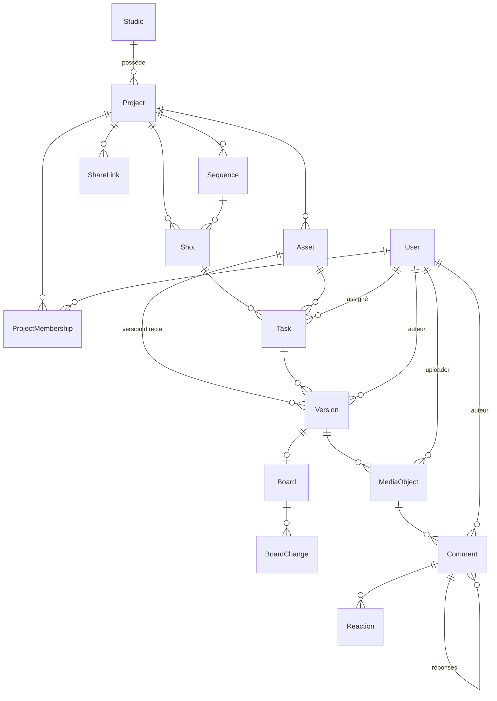

# Sous-phase 8.2 — Modèle de données pipeline (ERD)

> Schéma : [`backend/prisma/schema.prisma`](../../backend/prisma/schema.prisma).
> Le modèle de données complet a été posé en 8.1 ; la 8.2 ajoute les **routes CRUD**
> des entités pipeline et documente l'ERD ci-dessous.

## Hiérarchie

```
Studio (singleton)
└── Project
    ├── Sequence (optionnelle)
    │   └── Shot
    │       └── Task ── Version ── MediaObject ── Comment
    ├── Shot (rattaché direct au projet si pas de séquence)
    └── Asset (réutilisable)
        ├── Task ── Version ── MediaObject ── Comment
        └── Version ── MediaObject ── Comment   (version directe d'asset)
```

- Une **Task** appartient à un **Shot** *ou* un **Asset** (XOR).
- Une **Version** appartient à une **Task** *ou* un **Asset** (XOR).
- Un **Comment** référence un **MediaObject** (modèle unifié, tous types de média).
- Toute autorisation se résout au **Project** via les résolveurs de [`lib/pipeline.ts`](../../backend/src/lib/pipeline.ts).

## Diagramme (Mermaid)



## Enums clés

| Enum | Valeurs |
|------|---------|
| `Role` | ADMIN, SUPERVISOR, ARTIST, CLIENT |
| `ProjectStatus` | ACTIVE, ON_HOLD, COMPLETED, ARCHIVED |
| `AssetType` | CHARACTER, PROP, ENVIRONMENT, VEHICLE, FX, OTHER |
| `TaskType` | MODELING, RIGGING, ANIMATION, FX, LIGHTING, COMPOSITING, LOOKDEV, LAYOUT, OTHER |
| `TaskStatus` | TODO, IN_PROGRESS, PENDING_REVIEW, APPROVED, REJECTED, RETAKE |
| `VersionStatus` | DRAFT, REVIEW, PUBLISHED |
| `MediaKind` | VIDEO, IMAGE, MODEL_3D, SPLAT |
| `MediaStatus` | UPLOADING, PROCESSING, READY, FAILED |
| `SharePermission` | VIEW, COMMENT |

## Contraintes d'unicité

- `Project (studioId, slug)` · `Sequence (projectId, code)` · `Shot (projectId, code)`
- `Asset (projectId, name)` · `ProjectMembership (userId, projectId)` · `Reaction (commentId, userId, emoji)`

## RBAC des routes pipeline (8.2)

| Action | Rôles autorisés |
|--------|-----------------|
| Lecture (Séquence/Shot/Asset/Task/Version) | Tout membre du projet (ADMIN/SUPERVISOR globaux) |
| Créer/éditer/supprimer Séquence, Shot, Asset | ADMIN, SUPERVISOR |
| Créer/supprimer Task, assigner | ADMIN, SUPERVISOR |
| Changer le statut d'une Task | ADMIN, SUPERVISOR, ou **l'assigné** (statut uniquement) |
| Créer une Version | ARTIST, SUPERVISOR, ADMIN (pas CLIENT) |
| Éditer/supprimer une Version | Auteur ou SUPERVISOR/ADMIN |
| **Publier** une Version (status PUBLISHED) | SUPERVISOR, ADMIN uniquement |
